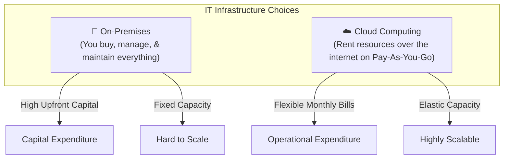
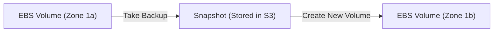
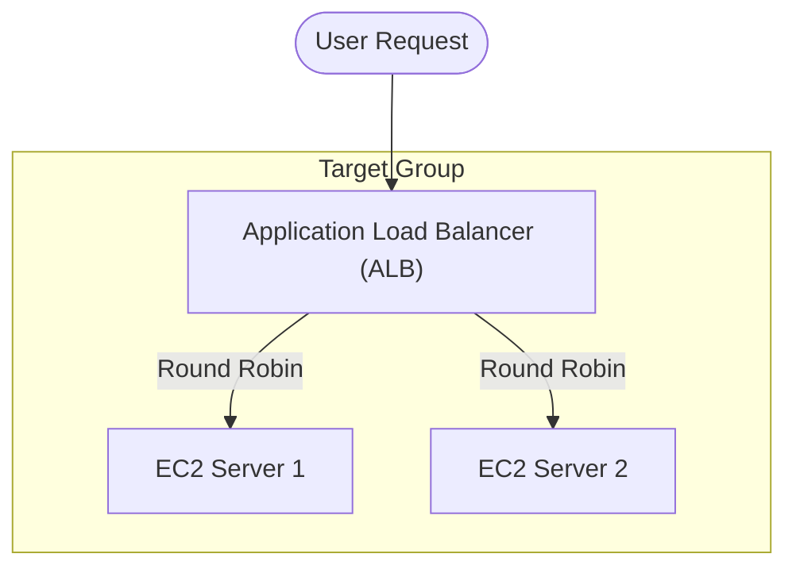
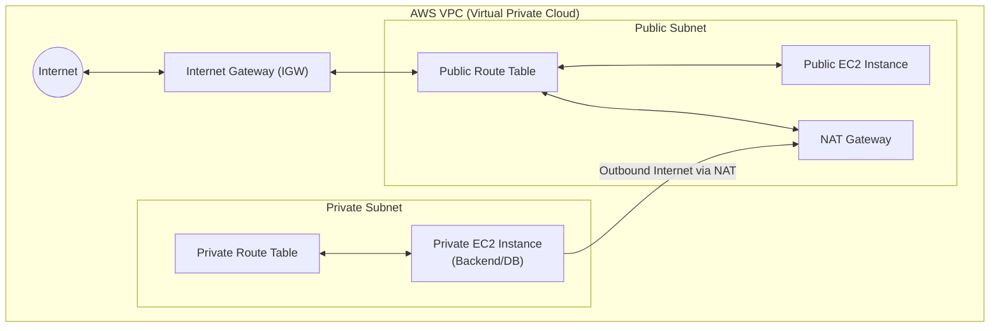

# Comprehensive Guide to AWS & DevOps

This guide provides a structured overview of DevOps practices, IT infrastructure, Cloud Computing, and detailed deep-dives into various Amazon Web Services (AWS).

---

## 1. Introduction to DevOps

**DevOps** is a combination of **Dev** (Development) and **Ops** (Operations). It is a culture, set of practices, and tools aimed at bridging the gap between development and operations teams, enabling faster, more reliable, and continuous software delivery.

### Main Goals of DevOps:
- Faster software delivery.
- Automation of processes (build, test, deploy).
- Improved team collaboration.
- Continuous Integration and Continuous Deployment (CI/CD).
- Higher software quality with rapid recovery from failures.

### Key DevOps Practices:

| Practice | Description |
|---|---|
| 🔄 CI/CD | Automate code integration, testing, and deployment. |
| 📦 Infrastructure as Code (IaC) | Define and manage infrastructure using code (e.g., Terraform, Ansible). |
| 🧪 Automated Testing | Run tests automatically to catch bugs early. |
| 📈 Monitoring & Logging | Track performance, get alerts, and troubleshoot. |
| 🐳 Containerization | Use Docker/Kubernetes to package and run apps anywhere. |

---

## 2. IT Infrastructure & Cloud Computing

**IT Infrastructure** is the foundational physical and virtual resources needed to run and manage IT services (Machines, Network, Power, Storage, Backup, Security).

### On-Premises vs. Cloud Computing

### Cloud Service Models (IaaS, PaaS, SaaS)

- **IaaS (e.g., AWS EC2):** Raw infrastructure. You manage the OS and everything above.
- **PaaS (e.g., Elastic Beanstalk):** Ready-made platform environments. You just bring your code.
- **SaaS (e.g., Google Drive, Zoom):** Ready-to-use application delivered over the internet.

---

## 3. Overview of AWS Cloud

Launched in 2006, Amazon Web Services (AWS) is the world's most popular cloud provider with a vast global infrastructure.

### Global Infrastructure:
- **Regions:** Geographic areas (e.g., `us-east-1` N. Virginia, `ap-south-1` Mumbai).
- **Availability Zones (AZs):** Distinct data centers within a region, designed for redundancy and high availability.

### Popular AWS Services grouped by purpose:
- **Compute:** EC2, Elastic Beanstalk, Lambda, ECS, EKS.
- **Storage:** S3, EFS.
- **Database:** RDS, DynamoDB.
- **Security:** IAM.
- **Networking:** VPC, Route 53.
- **Monitoring:** CloudWatch, SNS.

---

## 4. Compute: Elastic Compute Cloud (EC2)

EC2 allows you to create resizable virtual machines (VMs) in the cloud. You pay hourly based on compute capacity.

### Key Concepts:
- **AMI (Amazon Machine Image):** Pre-configured template containing the OS and software.
- **Key Pairs (.pem):** Public/Private keys used for secure SSH/RDP logins.
- **Security Groups:** Virtual firewalls managing inbound/outbound traffic (e.g., Port 22 SSH, 80 HTTP, 3389 RDP).
- **User Data:** A startup script (bash/cloud-init) that runs automatically on the first boot of the instance. Ideal for auto-installing web servers.

### Types of IPs in AWS:
- **Private IP:** Fixed inside a VPC, used for internal EC2 communication.
- **Public IP:** Dynamic, changes upon instance restart.
- **Elastic IP (EIP):** Static public IP allocated to your account. Remains unchanged even after restarts.

---

## 5. Storage: Elastic Block Store (EBS)

EBS acts as a hard disk attached to your EC2 instance. It is **Availability Zone (AZ) specific**.

### Types of EBS Volumes:
1. **General Purpose SSD (gp2/gp3):** Best for boot volumes and general workloads.
2. **Provisioned IOPS SSD (io1/io2):** High performance for mission-critical databases.
3. **Throughput Optimized HDD (st1):** Large sequential workloads like big data.
4. **Cold HDD (sc1):** Infrequent data access like backups.

### EBS Snapshots:
- A Snapshot is a backup of an EBS volume stored in S3.
- Snapshots are **Region-specific**. They can be copied across regions for Disaster Recovery.

*Note: You use **Lifecycle Manager** to automate snapshot creation and retention.*

---

## 6. High Availability: Load Balancer & Auto Scaling

### Application Load Balancer (ALB)
Distributes incoming traffic across multiple servers (targets), preventing any single server from overloading, and improving availability.

### Auto Scaling
Automatically adjusts the number of functional EC2 instances based on user load to meet desired capacity, minimizing costs when load is low and ensuring performance when load is high.

---

## 7. Storage: Simple Storage Service (S3)

AWS S3 provides unlimited object storage with maximum file size up to 5 TB per object.

### Key Features:
- **Buckets:** Containers for objects. Bucket names must be **globally unique**.
- **Static Website Hosting:** S3 can host static HTML/CSS/JS websites without requiring EC2.
- **S3 Versioning:** Can maintain multiple versions of the same file.
- **S3 Object Lock:** Prevents deletion/modification for compliance (WORM - Write Once Read Many).
- **Transfer Acceleration:** Speeds up uploads over long distances using CloudFront edge locations.

### S3 Storage Classes:
| Need | Recommended Class |
|---|---|
| Frequent use, low latency | S3 Standard |
| Changing access patterns | S3 Intelligent-Tiering |
| Backups, infrequent access | S3 Standard-IA / S3 One Zone-IA |
| Rarely used, long-term archival | S3 Glacier Flexible Retrieval / Deep Archive |

---

## 8. IAM (Identity and Access Management)

IAM securely controls access to AWS resources. 

- **Root Account:** Unrestricted access. Should be protected with MFA and never used for daily tasks.
- **IAM Users:** Individual team members or apps.
- **IAM Groups:** Collection of users sharing identical permission policies.
- **IAM Roles:** Assumed by services (like an EC2 instance needing S3 access) rather than humans. Uses temporary credentials.
- **Policies:** JSON documents defining precise permissions.

---

## 9. Relational Database Service (RDS)

RDS is a managed relational database service (MySQL, PostgreSQL, Oracle, etc.). AWS handles OS patching, backups, and failovers. 

- Security Groups must allow database traffic (e.g., Port `3306` for MySQL).
- Connection via SQL clients or App Code (JDBC) using the provided **RDS Endpoint**.

---

## 10. Compute: Elastic Beanstalk (PaaS)

Elastic Beanstalk handles the entire deployment architecture for your application. You upload the code (e.g., Python, Java JAR), and Beanstalk securely provisions the EC2 instances, ALB, and Auto Scaling rules. 

> *Note: While the service itself is free, you pay for the underlying resources it provisions.*

---

## 11. Monitoring: CloudWatch & SNS

- **CloudWatch:** Monitors performance (CPU, Memory, Logs) using Custom Metrics and sets Alarms based on thresholds.
- **SNS (Simple Notification Service):** Pub/Sub messaging service. Can send emails or SMS when a CloudWatch Alarm triggers (e.g., Server CPU > 80%).

---

## 12. Networking: Virtual Private Cloud (VPC)

A VPC is your logically isolated private network in AWS.

### VPC Networking Components:
- **CIDR:** Classless Inter-Domain Routing used to allocate a range of IPs to your network.
- **Subnet:** Smaller segmented piece of the VPC.
- **Route Table:** Traffic rules directing network packets.
- **Internet Gateway (IGW):** Gives public subnets direct access to the Internet.
- **NAT Gateway:** Allows resources in private subnets to send outbound requests to the internet (e.g., for updates) while blocking inbound internet requests.

---

## 13. Additional AWS Concepts (Bonus)

Beyond the foundational services, AWS offers powerful modern architectural solutions.

### Serverless Computing (AWS Lambda)
Serverless computing allows you to build and run applications and services without thinking about servers. 
- **AWS Lambda:** You just upload your code (Python, Node.js, Java, etc.), and Lambda takes care of everything required to run and scale your code with high availability.
- **Billing:** You only pay for the compute time you consume—there is no charge when your code is not running. It pays per millisecond of execution.

### Containerization (ECS & EKS)
Containers package code and its dependencies together so the application runs quickly and reliably from one computing environment to another (e.g., Docker).
- **Amazon ECS (Elastic Container Service):** A highly scalable, fast, container management service that makes it easy to stop, start, and manage Docker containers on a cluster.
- **Amazon EKS (Elastic Kubernetes Service):** A managed service that makes it easy to run Kubernetes on AWS without needing to stand up or maintain your own Kubernetes control plane.

### Infrastructure as Code (AWS CloudFormation)
Infrastructure as Code (IaC) is the process of managing and provisioning cloud resources through machine-readable definition files, rather than physical hardware configuration or interactive configuration tools.
- **AWS CloudFormation:** Allows you to use a simple text file (JSON or YAML) to model and provision all the resources needed for your applications across all regions and accounts in an automated and secure manner.

### The AWS Well-Architected Framework
AWS created a framework to help cloud architects build secure, high-performing, resilient, and efficient infrastructure for their applications. It is based on Six Pillars:
1. **Operational Excellence:** Running and monitoring systems to deliver business value.
2. **Security:** Protecting information, systems, and assets.
3. **Reliability:** Ensuring a workload performs its intended function correctly and consistently.
4. **Performance Efficiency:** Using compute resources efficiently to meet system requirements.
5. **Cost Optimization:** Avoiding unnecessary costs and paying only for what you need.
6. **Sustainability:** Minimizing the environmental impacts of running cloud workloads.
