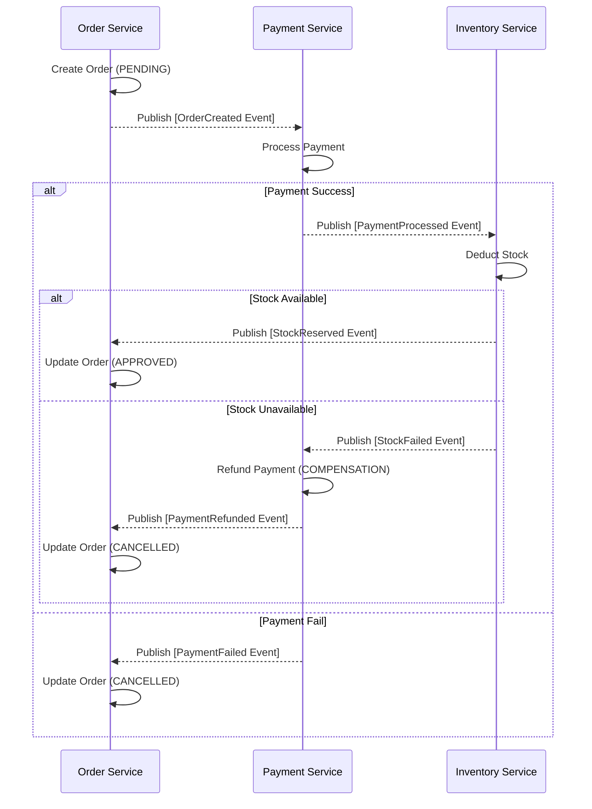
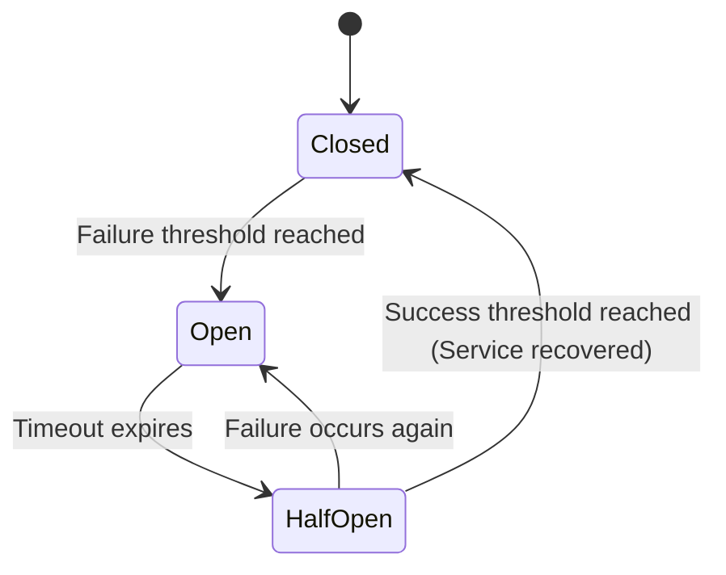
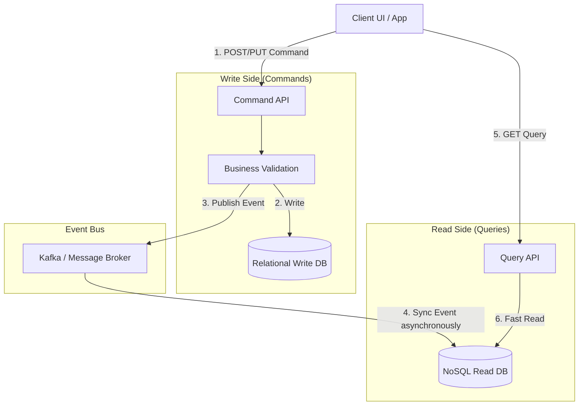
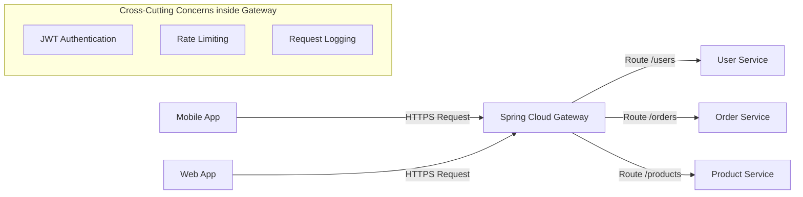
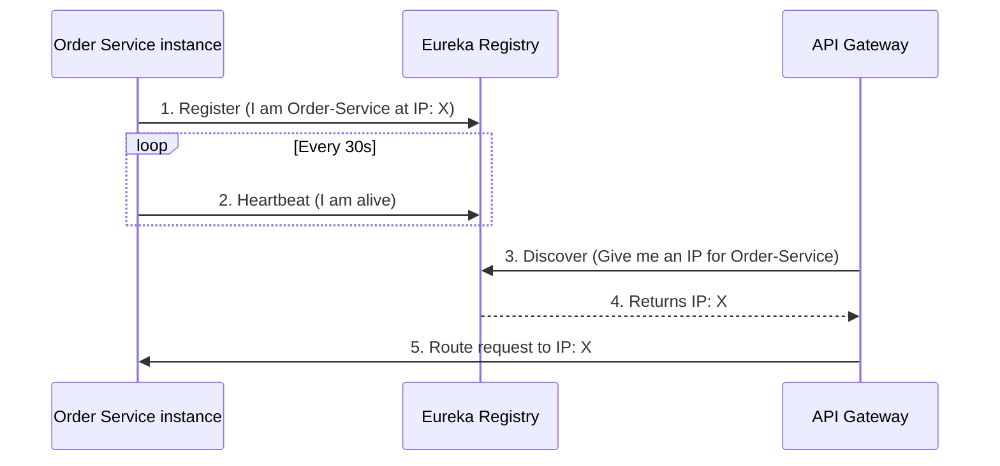
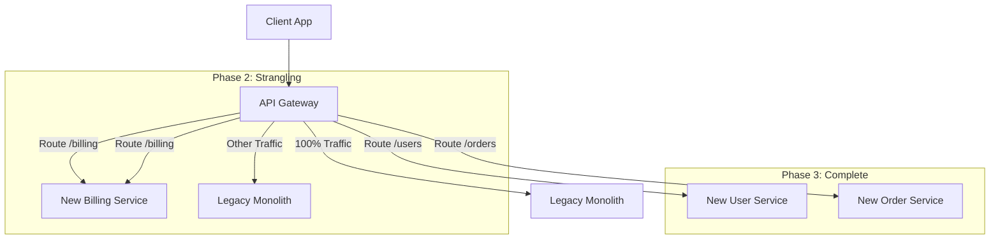
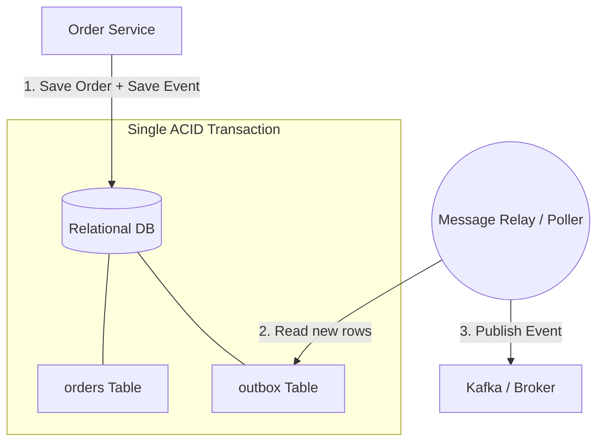

# Microservice Design Patterns in Spring Boot

Designing a microservices architecture introduces complex challenges, particularly around distributed data management, network resilience, and system communication. To solve these problems, we use established **Microservice Design Patterns**.

This guide covers the most critical patterns used in Spring Boot ecosystems, including their internal workings, real-world examples, and visual diagrams.

---

## 1. Saga Pattern (Distributed Transactions)

**Problem:** In a monolithic application, managing a transaction is simple: use an ACID database transaction. In microservices, a business workflow (like an e-commerce checkout) often spans multiple independent services, each with its own database. We cannot use traditional database transactions across different microservices.

**Solution:** The **Saga Pattern**. A saga is a sequence of local transactions. Each local transaction updates the database and publishes a message/event to trigger the next local transaction in the saga. If a local transaction fails, the saga executes a series of **compensating transactions** to undo the changes made by the preceding transactions.

There are two primary ways to implement a Saga:
1. **Choreography:** Services subscribe to each other's events and act independently. There is no central controller.
2. **Orchestration:** An orchestrator (a central coordinator service) tells the participating services what local transactions to execute.

### Internal Working: Choreography Saga
1. **Order Service** creates an Order (status `PENDING`) and publishes an `OrderCreated` event.
2. **Payment Service** listens, charges the customer, and publishes `PaymentProcessed`.
3. **Inventory Service** listens, reserves stock, and publishes `StockReserved`.
4. **Order Service** listens to `StockReserved` and updates Order to `APPROVED`.
*Failure:* If `Inventory Service` fails to reserve stock, it publishes `StockFailed`. `Payment Service` listens and refunds the money (compensating transaction). `Order Service` listens and marks the order as `CANCELLED`.

### Mermaid Diagram: Saga (Choreography)



### Spring Boot Example
In Spring Boot, Sagas are typically implemented using a message broker like **Apache Kafka** or frameworks like **Axon Framework**.

```java
// Event Listener in Payment Service
@Service
public class PaymentService {
    
    @KafkaListener(topics = "order-created-events")
    public void processPayment(OrderCreatedEvent event) {
        try {
            // charge customer
            kafkaTemplate.send("payment-processed-events", new PaymentProcessedEvent(event.getOrderId()));
        } catch (Exception e) {
            // Insufficient funds
            kafkaTemplate.send("payment-failed-events", new PaymentFailedEvent(event.getOrderId()));
        }
    }
}
```

---

## 2. Circuit Breaker Pattern

**Problem:** Microservices communicate over a network, and networks fail. If Service A calls Service B, and Service B is down or extremely slow, Service A's threads will block waiting for a response. Eventually, Service A runs out of threads and crashes. This causes a **cascading failure** across the entire system.

**Solution:** The **Circuit Breaker Pattern**. It acts as an electrical circuit breaker. It monitors for failures. If failures reach a certain threshold, the circuit trips (opens), and subsequent calls immediately fail or return a fallback, preventing the downstream service from being overloaded and saving the calling service's resources.

### Internal Working (States)
1. **CLOSED:** Everything operates normally. Requests pass through.
2. **OPEN:** The failure threshold (e.g., 50% of requests fail within 10 seconds) is reached. Requests are rejected immediately without attempting a network call. A "fallback" method may be called instead.
3. **HALF-OPEN:** After a timeout period, the circuit lets a limited number of requests pass through to test if the downstream service has recovered. If they succeed, it goes to CLOSED. If they fail, it goes back to OPEN.

### Mermaid Diagram: Circuit Breaker States



### Spring Boot Example (Resilience4j)
Spring Boot heavily uses **Resilience4j** for this pattern.

```java
@Service
public class ProductService {

    // If inventory service fails, the circuit opens and fallbackMethod is called
    @CircuitBreaker(name = "inventoryService", fallbackMethod = "defaultInventory")
    public int getInventory(String productId) {
        return restTemplate.getForObject("http://inventory-service/api/stock/" + productId, Integer.class);
    }

    // Fallback method must have the same signature + Throwable
    public int defaultInventory(String productId, Throwable t) {
        return 0; // Return zero stock if the service is down
    }
}
```

---

## 3. CQRS (Command Query Responsibility Segregation)

**Problem:** In traditional CRUD models, the same data model is used to read and write database records. In microservices, a read operation might require complex joins from multiple services, while a write operation might require high-throughput validation. Using the same model drastically limits scaling.

**Solution:** **CQRS** separates the read operations (Queries) from the write operations (Commands). 
- **Commands** (Create, Update, Delete) mutate state and do not return data.
- **Queries** (Read) read state and do not mutate it.

Usually, CQRS is paired with **Event Sourcing**, where every command generates an Event, which is then used to asynchronously populate a Read Database optimized purely for fast querying (e.g., MongoDB or Elasticsearch).

### Internal Working
1. Client sends a Command (e.g., `UpdateUserProfileCommand`).
2. The Command Service processes it in a relational DB (Write DB) and publishes a `UserProfileUpdatedEvent` to a message broker (Kafka).
3. The Query Service listens to this event and updates a NoSQL database (Read DB) optimized for fast UI lookups.
4. When a client requests the user profile, it hits the Query Service, which fetches data instantly from the optimized Read DB without touching the Write DB.

### Mermaid Diagram: CQRS Architecture



---

## 4. API Gateway Pattern

**Problem:** A client application (like a mobile app) often needs to consume data from 10 different microservices. If the client calls each service directly:
- The client must know the IP address of every service.
- The client makes multiple network roundtrips, degrading mobile performance.
- Security (JWT validation), rate limiting, and CORS must be implemented in *every* microservice.

**Solution:** The **API Gateway Pattern**. It acts as a reverse proxy, routing requests from clients to the appropriate backend microservices.

### Internal Working
1. The API Gateway acts as the single entry point.
2. It handles cross-cutting concerns: SSL termination, Authentication (JWT), Rate Limiting, and CORS.
3. It routes the request to the correct internal microservice using Spring Cloud Gateway's routing rules.
4. It can aggregate responses (fetch data from Service A and Service B, combine it, and send it to the client in a single response).

### Mermaid Diagram: API Gateway



### Spring Boot Example (Spring Cloud Gateway)
Instead of code, the Gateway is often configured purely via `application.yml`:

```yaml
spring:
  cloud:
    gateway:
      routes:
        - id: order_service
          uri: lb://order-service # LB means use Load Balancer to find the service
          predicates:
            - Path=/api/orders/**
          filters:
            - AddRequestHeader=X-Gateway-Request, true
            # This handles rate limiting natively
            - RequestRateLimiter=my-rate-limiter 
```

---

## 5. Service Registry and Discovery Pattern

**Problem:** Because microservices are deployed dynamically in the cloud (like Kubernetes), their IP addresses change constantly. Service A cannot hardcode the IP address of Service B.

**Solution:** **Service Discovery**. A central "phone book" where microservices register themselves on startup.

### Internal Working (Spring Cloud Netflix Eureka)
1. A central server runs as the **Eureka Server**.
2. When an instance of `Order Service` starts, it registers its IP address and port with Eureka (e.g., `Order-Service: 192.168.1.5:8080`).
3. `Order Service` sends "heartbeats" to Eureka every 30 seconds to say "I'm still alive".
4. When `Gateway` wants to call `Order Service`, it asks Eureka for the IP. Eureka provides it, and the Gateway uses client-side load balancing to call the service.

### Mermaid Diagram: Service Registry



---

## 6. Strangler Fig Pattern

**Problem:** You have a massive, legacy monolith application, and you want to migrate it to microservices. Doing a "big bang" rewrite (rewriting everything at once and swapping it out overnight) is incredibly risky and often fails.

**Solution:** The **Strangler Fig Pattern**. You gradually create a new microservice architecture around the edges of the old monolith. An API Gateway sits in front of both. Over time, you route specific features (endpoints) to the new microservices instead of the monolith. Eventually, the microservices "strangle" the monolith until it can be turned off completely.

### Internal Working
1. An **API Gateway** acts as the front door for all client traffic.
2. Initially, 100% of traffic is routed to the Monolith.
3. You build a new Microservice (e.g., `Billing Service`).
4. You configure the API Gateway to route `/api/billing` traffic to the new Microservice, while all other traffic still goes to the Monolith.
5. You repeat this for `User Service`, `Order Service`, etc., until no traffic goes to the Monolith.

### Mermaid Diagram: Strangler Fig Migration



---

## 7. Bulkhead Pattern

**Problem:** In a ship, if the hull breaches, the entire ship floods and sinks. To prevent this, ships use walled sections called "bulkheads." If one section floods, the water is contained. In microservices, if Service A uses the same connection pool to connect to Service B and Service C, and Service B becomes slow, Service A will exhaust all its threads waiting for B. Consequently, Service A can no longer call Service C either, even if C is perfectly healthy.

**Solution:** The **Bulkhead Pattern**. You allocate a limited number of resources (like thread pools or connection limits) for each downstream service. If the "bulkhead" for Service B fills up, requests to B fail instantly, but the threads reserved for Service C remain completely unaffected.

### Internal Working
1. Instead of one shared thread pool of 100 threads, Service A creates two pools: 50 threads for calling Service B, and 50 threads for calling Service C.
2. Service B experiences an outage and responses take 30 seconds.
3. The 50 threads reserved for Service B are quickly exhausted. Subsequent calls to B throw a `BulkheadFullException`.
4. However, calls to Service C use the other 50 threads, meaning that part of the application functions perfectly normally.

### Spring Boot Example (Resilience4j)
```java
@Service
public class OrderService {

    // Limits max concurrent calls to 20. 21st call will be rejected immediately.
    @Bulkhead(name = "paymentServiceBulkhead", type = Bulkhead.Type.SEMAPHORE)
    public String processPayment() {
        return restTemplate.getForObject("http://payment-service/pay", String.class);
    }
}
```

---

## 8. Transactional Outbox Pattern

**Problem:** In the Saga or CQRS pattern, a service needs to do two things: Update its database AND publish an event to Kafka. What if the database update succeeds, but the Kafka broker goes down before the event is published? The system becomes permanently inconsistent. You cannot wrap a Database and Kafka in a single ACID transaction.

**Solution:** The **Transactional Outbox Pattern**. The service updates its main database table AND inserts a record into an `outbox` table *in the exact same database transaction*. A separate, reliable process (like Debezium or a polling job) reads the `outbox` table and safely pushes the messages to Kafka.

### Internal Working
1. Begin Database Transaction.
2. Insert Order into `orders` table.
3. Insert Event JSON into `outbox` table.
4. Commit Database Transaction (Both succeed, or both fail).
5. Asynchronously, a Message Relay (like Debezium) trails the database log, reads the new `outbox` row, and publishes it to Kafka.

### Mermaid Diagram: Outbox Pattern



---

## 9. Retry Pattern

**Problem:** Microservice communications are prone to transient (temporary) failures like momentary network blips, temporary database locks, or brief service restarts. Failing a massive business workflow because of a 1-second network hiccup is poor user experience.

**Solution:** The **Retry Pattern**. Automatically retry a failed operation transparently. This is usually paired with **Exponential Backoff** (wait 1s, then 2s, then 4s) to avoid hammering a struggling service.

### Internal Working
1. Request sent to Service B.
2. Timeout occurs (Transient Failure).
3. Wait 1 second.
4. Retry request.
5. Succeeds. Return to client as if nothing happened.

### Spring Boot Example (Resilience4j)
```java
@Service
public class EmailService {

    // Retry max 3 times. Wait 2 seconds between retries.
    @Retry(name = "emailService", fallbackMethod = "logFailure")
    public void sendEmail(String to) {
        restTemplate.postForObject("http://email-provider/send", to, Void.class);
    }

    public void logFailure(String to, Exception e) {
        System.out.println("Email failed permanently after 3 retries.");
    }
}
```

---

## Summary of Patterns Used Together
In a modern Spring Boot Microservice architecture:
1. **Eureka** keeps track of where services live.
2. **Spring Cloud Gateway** receives client requests and uses Eureka to route them.
3. **Resilience4j** (Circuit Breaker) ensures that if a service crashes, the Gateway stops sending traffic to it.
4. **Saga** creates distributed consistency when an order updates multiple services.
5. **CQRS** allows extremely fast data reads separated from heavy writing operations.
