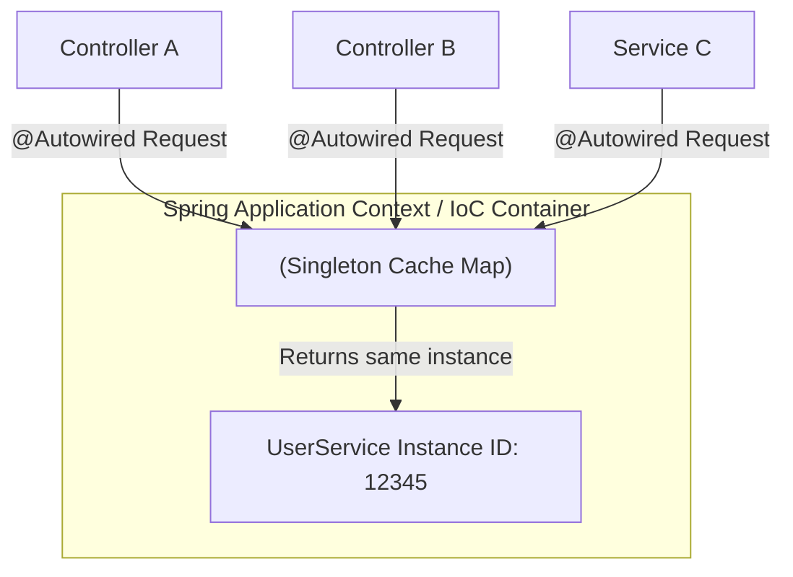
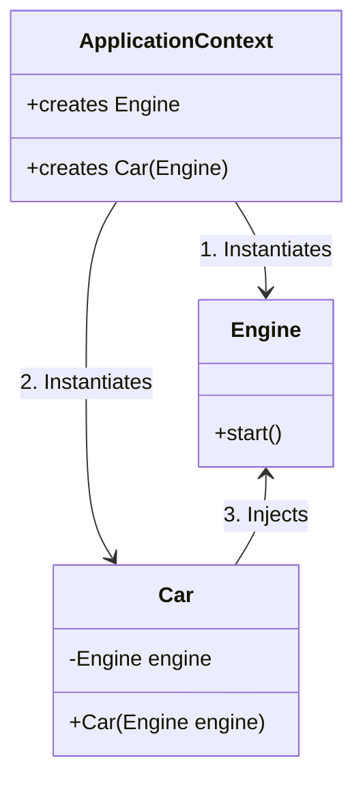
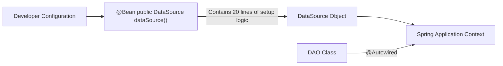
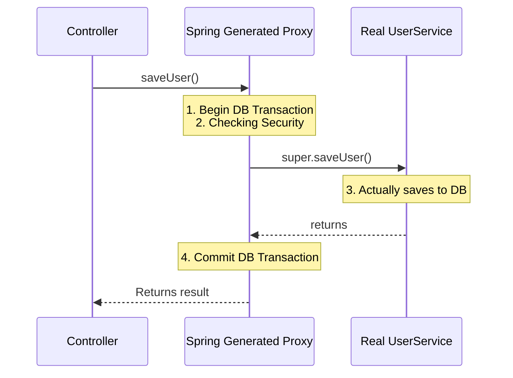
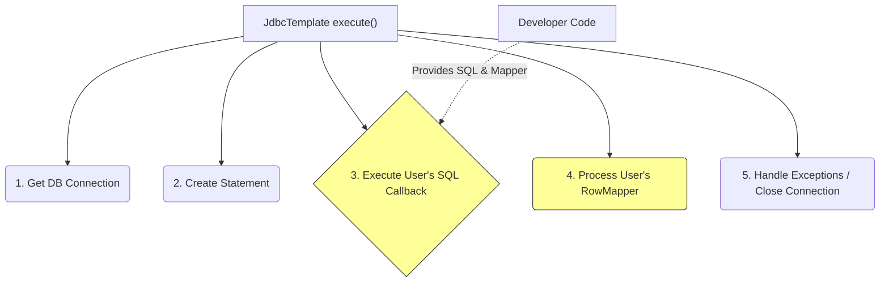
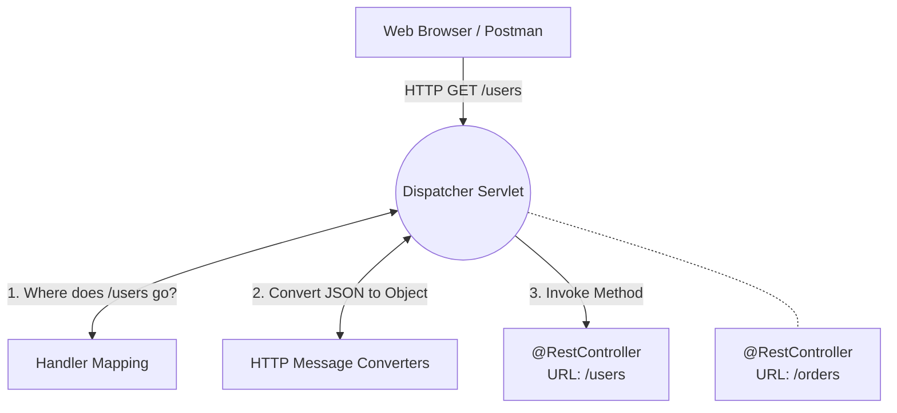

# Core Design Patterns in Spring / Spring Boot

Spring Boot is built upon a solid foundation of classic software design patterns. Understanding these patterns is critical to understanding how Spring works internally, making you a better Java developer.

This guide explains the core design patterns implemented heavily throughout the Spring Framework.

---

## 1. Singleton Pattern

**Problem:** You have a class (like a database connection pool or a service class) that takes significant resources to create. You want to ensure that only *one* instance of this class exists in the entire application, and you want a global point of access to it.

**Solution:** The **Singleton Pattern**.
In Spring, the Singleton pattern is heavily used. By default, every single bean managed by the Spring IoC container is a Singleton. Spring creates exactly one instance of that bean per application context.

### Internal Working
Unlike the traditional "Gang of Four" Singleton (which uses private constructors and static `getInstance()` methods), Spring's Singletons are "Container Singletons". The Java class itself is a normal class, but the Spring Container (`ApplicationContext`) enforces that it only creates one object from it and caches it in a ConcurrentHashMap.
When another class asks for that bean, Spring pulls the existing instance from the cache map instead of creating a new one.

### Mermaid Diagram: Spring Singleton



### Spring Boot Example
```java
// By default, this is a Singleton. Only ONE instance is created by Spring.
@Service 
public class PaymentService {
    // Shared state. All threads hit this exact same instance!
    private int paymentCount = 0; 
    
    public void process() {
        paymentCount++; 
    }
}
```

---

## 2. Dependency Injection (DI) / Inversion of Control (IoC)

**Problem:** In traditional programming, objects create their own dependencies using the `new` keyword (e.g., `Car` creates its own `Engine`). This makes objects tightly coupled. You cannot easily test the `Car` with a "Fake Engine" because it is hardcoded to build a real one.

**Solution:** **Inversion of Control (IoC) via Dependency Injection (DI)**.
Instead of the `Car` building its own `Engine`, you *inject* the `Engine` into the `Car` from the outside (usually via its constructor). Control over the creation of objects is "inverted" – handed over from your classes to a central container (Spring Context).

### Internal Working
1. When Spring starts, it scans your code for annotations like `@Component`, `@Service`, or `@Bean`.
2. It looks at the dependencies (constructors or `@Autowired` fields).
3. It figures out the correct order to create them in (Dependency Graph). It creates the `Engine` first, then creates the `Car`, passing the `Engine` to the `Car`'s constructor.

### Mermaid Diagram: Dependency Injection



### Spring Boot Example
```java
@Component
public class V8Engine implements Engine { /* ... */ }

@Service
public class Car {
    private final Engine engine;

    // Spring sees this and INJECTS the V8Engine automatically. The Car doesn't build it.
    @Autowired
    public Car(Engine engine) {
        this.engine = engine;
    }
}
```

---

## 3. Factory Pattern

**Problem:** The logic required to create a complex object is spreading throughout your application. Whenever you want to create the object, you have to write 20 lines of configuration code.

**Solution:** The **Factory Pattern**. You create a specialized class or method whose sole responsibility is to manufacture objects.

### Internal Working in Spring
Spring IS a massive factory. The core interfaces `BeanFactory` and `ApplicationContext` implement the Factory pattern.
Additionally, when you use the `@Bean` annotation inside an `@Configuration` class, you are implementing the **Factory Method** pattern. You write the complex creation logic once, and Spring calls that "factory method" to get the object and put it in its container.

### Mermaid Diagram: Factory Method



### Spring Boot Example
```java
@Configuration
public class DatabaseConfig {

    // This is a Factory Method. Spring calls this ONCE to manufacture the DataSource.
    @Bean
    public DataSource myCustomDataSource() {
        HikariDataSource ds = new HikariDataSource();
        ds.setJdbcUrl("jdbc:mysql://localhost:3306/db");
        ds.setUsername("admin");
        ds.setPassword("secret");
        ds.setMaximumPoolSize(10);
        return ds; // Handing the manufactured object to Spring
    }
}
```

---

## 4. Proxy Pattern

**Problem:** You have a class that saves data to a database. You suddenly need to add a database transaction start/commit around the method, log how long it took, and verify if the user has authorization to run it. If you put all this logic inside the service class, you violate the Single Responsibility Principle.

**Solution:** The **Proxy Pattern**. You create a "proxy" (a wrapper) around the real object. The client talks to the proxy. The proxy handles the transaction/logging, then delegates the actual save operation to the real object.

### Internal Working in Spring
This is the heart of **Spring AOP (Aspect Oriented Programming)**. When you use annotations like `@Transactional`, `@Cacheable`, or `@Async`, Spring does **NOT** give the client your actual class.
During startup, Spring uses libraries (like CGLIB or JDK Dynamic Proxies) to generate a subclass/proxy of your service dynamically. The container gives the client this Proxy instead.

### Mermaid Diagram: Spring Proxy



### Spring Boot Example
```java
@Service
public class UserService {
    
    // Spring intercepts calls to this method via a Proxy
    @Transactional 
    public void saveUser(User user) {
        // Real business logic
        repository.save(user);
    }
}
```

---

## 5. Template Method Pattern

**Problem:** You have an algorithm with several steps. While the overall sequence of steps is fixed, some of the specific steps need to be customizable by different clients.

**Solution:** The **Template Method Pattern**. You define the skeleton of an algorithm in a base class (or class), deferring some steps to subclasses or callback methods.

### Internal Working in Spring
Spring uses this extensively in its "Template" classes: `JdbcTemplate`, `RestTemplate`, `JmsTemplate`, `KafkaTemplate`.
For instance, in `JdbcTemplate`, Spring handles the repetitive boilerplate (the "template" of opening connections, creating statements, executing queries, catching SQLExceptions, and closing connections), while you simply provide the SQL string and a mapper (the "customizable steps").

### Mermaid Diagram: Template Method



### Spring Boot Example
```java
@Repository
public class UserRepository {
    @Autowired
    private JdbcTemplate jdbcTemplate;

    public User getUser(int id) {
        // Spring handles the template (connections, exceptions). 
        // We only provide the SQL and MapRow implementation.
        return jdbcTemplate.queryForObject(
            "SELECT * FROM users WHERE id = ?",
            (rs, rowNum) -> new User(rs.getInt("id"), rs.getString("name")),
            id
        );
    }
}
```

---

## 6. Front Controller Pattern

**Problem:** In a web application, handling HTTP requests involves common tasks: security checks, parsing HTTP headers, finding the correct method to execute, mapping JSON to objects, and handling errors. If every endpoint implemented this manually, the code would be a mess of duplication.

**Solution:** The **Front Controller Pattern**. You define a single, centralized entry point (one Servlet) that receives **all** incoming HTTP requests. It handles the common tasks, then routes the request to the appropriate, specific handler (your Controller methods).

### Internal Working in Spring MVC
In Spring Web, this is the `DispatcherServlet`.
All incoming HTTP requests hit the `DispatcherServlet` first. It uses `HandlerMappings` to figure out which of your `@RestController` methods should handle the URL. It uses `MessageConverters` to convert the incoming JSON into your Java objects. Then, it invokes your method.

### Mermaid Diagram: DispatcherServlet (Front Controller)



### Spring Boot Example
As a developer, you don't write the Front Controller. Spring Boot handles it automatically under the hood when you include `spring-boot-starter-web`. You just write the designated endpoints:

```java
@RestController
public class UserController {

    // The Front Controller (DispatcherServlet) figures out how to route
    // HTTP traffic here and converting the request/response payload!
    @GetMapping("/users/{id}")
    public User getUser(@PathVariable int id) {
        return new User(id, "John");
    }
}
```
