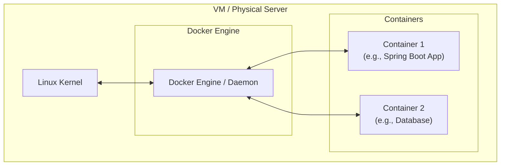
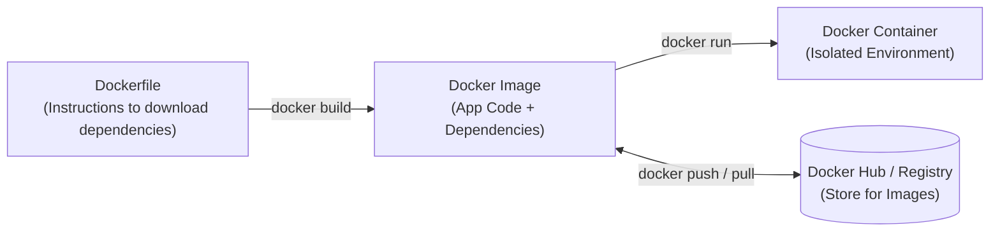

# Comprehensive Guide to Docker

## 1. Introduction to Docker

**Docker** is a platform that uses containerization technology to resolve software compatibility issues. It helps you install and run your applications consistently across different computing environments without worrying about the underlying operating system setup.

### Key Benefits:
- **Consistent Execution:** Packages the application with its dependencies ensuring it runs the same way anywhere.
- **Easy Deployment:** Deploy the same application to multiple servers for load balancing without manually installing technology stacks (like Java 17, Angular 18, etc.) on each machine.
- **Simplified Upgrades:** Software upgrades can be easily deployed across multiple machines.

### Important Notes on Docker Engine:
- Docker Engine acts as a **bridge** between the container and the Host OS.
- Containers **don’t have their own kernel**; they share the host’s kernel (making them lightweight compared to traditional VMs).
- Docker Engine **manages** containers but does not create them (it runs and controls them).

---

## 2. Docker Architecture & Containerization Workflow



### What is Containerization?
Containerization packages an application along with its dependencies (libraries, configuration files, etc.) ensuring that it runs consistently across different computing environments.

### The Docker Workflow (Dockerfile → Image → Container)



- **Dockerfile:** A text document containing instructions to create a Docker Image.
- **Docker Image:** An immutable application package with all its dependencies.
- **Docker Registry:** A hub (like Docker Hub) to store and share Docker images.
- **Docker Container:** An isolated environment created from a Docker Image to run the application.

---

## 3. Installing Docker

### For Amazon Linux VM
```bash
sudo yum update -y 
sudo yum install docker -y
sudo service docker start
sudo usermod -aG docker ec2-user
# Logout and login again for group changes to take effect
exit
```

### For Ubuntu VM
```bash
sudo apt update
curl -fsSL get.docker.com | /bin/bash
sudo usermod -aG docker ubuntu 
# Logout and login again for group changes to take effect
exit
```

### Verify Installation
```bash
docker -v
```

---

## 4. Important Docker Commands

| Command | Action | Example |
|---|---|---|
| `docker pull` | Download a Docker image from Docker Hub | `docker pull hello-world` |
| `docker run` | Create and run a container from an image | `docker run [image-name]` |
| `docker ps` | Display currently running containers | `docker ps` |
| `docker ps -a` | Display all containers (running and stopped) | `docker ps -a` |
| `docker stop` | Stop a running container | `docker stop [container-id]` |
| `docker start` | Start a stopped container | `docker start [container-id]` |
| `docker rm` | Remove a stopped container | `docker rm [container-id]` |
| `docker rmi` | Remove an image | `docker rmi [image-id]` |
| `docker system prune -a` | Remove all stopped containers and unused images | `docker system prune -a` |

---

## 5. Port Mapping and Accessing Applications

By default, network traffic cannot access containers from the outside world. **Port mapping** connects a port on the Host VM to a port inside the container.

### Syntax
```bash
docker run -p <host-port>:<container-port> <image-name>
```

### Examples
1. **Running in foreground:**
   ```bash
   docker run -p 9090:9090 pankajsiracademy:latest
   ```
2. **Running in background (Detached mode `-d`):**
   ```bash
   docker run -d -p 9090:9090 pankajsiracademy:latest
   ```

*(You navigate to: `http://<Public-IP-of-Linux-VM>:9090`)*

> **Security Note:** You must enable an Inbound rule in your AWS Security Group mapping to the `host-port` (e.g., Custom TCP 9090 from IPv4 Anywhere `0.0.0.0/0`).
> If multiple containers are running on the same VM, each needs a unique `host-port`.

---

## 6. Real-World Installation Comparisons

### 6.1 Installing Jenkins (With vs Without Docker)

**With Docker (1 Command):**
```bash
docker run -d -p 8080:8080 jenkins/jenkins
```

**Without Docker (Manual Process):**
1. Create Ubuntu VM (t2.medium). Enable Port 8080.
2. Install JDK 17.
3. Add Jenkins GPG keys and setup repository.
4. Run `apt-get update` & `apt-get install jenkins`.
5. Enable and Start the Jenkins systemd service.
6. Cat the initial admin password.

### 6.2 Other Popular Tools via Docker
- **SonarQube:**
  ```bash
  docker run -d --name sonarqube -p 9000:9000 -p 9092:9092 sonarqube:lts-community
  ```
- **Nexus Repository:**
  ```bash
  docker run -d -p 8081:8081 --name nexus sonatype/nexus3
  ```

---

## 7. Writing a Dockerfile

A `Dockerfile` contains sequential instructions to build an image. Instructions (like `FROM`, `CMD`, `RUN`) are case-sensitive and preferred in UPPERCASE.

### Key Instructions:

| Keyword | Description | Example |
|---|---|---|
| `FROM` | **MUST be the first line**. Specifies the Base Image environment. | `FROM openjdk:17` |
| `MAINTAINER` / `LABEL` | Specifies the author/maintainer (MAINTAINER is deprecated). | `LABEL maintainer="psa@example.com"` |
| `RUN` | Executes bash commands **during the Image build process**. If multiple exist, they run sequentially. | `RUN mvn clean package` |
| `CMD` | Defines the **default command** that runs when a container **starts**. Only the last `CMD` is executed. | `CMD ["java", "-jar", "app.jar"]` |
| `ENTRYPOINT` | Alternative to `CMD`. The key difference is it **cannot be easily overridden** from the command line. | `ENTRYPOINT ["java", "-jar", "app.jar"]` |
| `COPY` | Copies files/folders from the Host Machine (Source) to the Container (Destination). | `COPY target/app.jar /usr/app/` |
| `ADD` | Like `COPY`, but it can also auto-extract `.tar` files. *(Misconception: It cannot reliably download from HTTP URLs.)* | `ADD target/app.jar /usr/app/` |
| `WORKDIR` | Sets the working directory inside the container (like `cd`). Creates the folder if it doesn't exist. | `WORKDIR /usr/app/` |
| `EXPOSE` | Documentation instruction specifying which port the application runs on. It does *not* actually publish the port to the host. | `EXPOSE 8080` |

---

## 8. Practical: Dockerizing a Spring Boot Application

Spring Boot applications are typically packaged as executable `.jar` files with embedded Tomcat servers running on default port `8080`.

### Step 1: Create the `Dockerfile`

Create a file named `Dockerfile` in the root of your project:
```dockerfile
FROM openjdk:17

# Copy the jar file to the container
COPY target/demo-app.jar /usr/app/

# Set working directory
WORKDIR /usr/app/

# Document the port
EXPOSE 8080

# Command to run when container starts
ENTRYPOINT ["java", "-jar", "demo-app.jar"]
```

### Step 2: Build and Run

1. **Clone Repo & Build Jar (On Host Linux VM):**
   ```bash
   git clone <repo-url>
   cd <app-name>
   mvn clean package
   ```
2. **Build the Docker Image:**
   ```bash
   # Dot (.) means the Dockerfile is in the current directory
   docker build -t psait/pankajsiracademy:prod-v1 .
   ```
3. **Verify the Image:**
   ```bash
   docker images
   ```
4. **Run the Container:**
   ```bash
   docker run -d -p 8080:8080 --name psa psait/pankajsiracademy:prod-v1
   ```
5. **Check Container Status & Logs:**
   ```bash
   docker ps
   docker logs <container-id>
   ```
6. **Access App:**
   Open `http://<public-ip>:8080/` in a web browser.

---

## 9. Pushing Images to Docker Hub

1. **Login to Docker Hub via CLI:**
   ```bash
   docker login
   # Enter your docker hub username and password
   ```
2. **Push the Image:**
   ```bash
   # Make sure the image is tagged with your username/repository:tag
   docker push psait/pankajsiracademy:prod-v1
   ```

---

## 10. Docker Compose (Multi-Container Applications)

**Docker Compose** is a tool that allows you to define and run multi-container Docker applications. Instead of running multiple `docker run` commands manually, you configure your application's services, networks, and volumes in a single YAML file (`docker-compose.yml`), and then start them all with one command.

### Key Benefits:
- **Simplified Setup:** Spin up your entire stack (e.g., Frontend, Backend, Database) simultaneously.
- **Portability:** Developers can share the `docker-compose.yml` file, ensuring everyone runs the exact same environment.
- **Isolated Environments:** Compose sets up a default network so all containers in the file can communicate with each other using their service names as hostnames.

### Example `docker-compose.yml` (Spring Boot + MySQL)

```yaml
version: '3.8'

services:
  # Database Service
  mysql-db:
    image: mysql:8.0
    container_name: mysqldb_container
    environment:
      MYSQL_ROOT_PASSWORD: rootpassword
      MYSQL_DATABASE: myappdb
    ports:
      - "3306:3306"
    volumes:
      - db_data:/var/lib/mysql

  # Spring Boot Application Service
  backend-app:
    image: psait/pankajsiracademy:prod-v1
    container_name: springboot_app
    ports:
      - "8080:8080"
    depends_on:
      - mysql-db
    environment:
      - SPRING_DATASOURCE_URL=jdbc:mysql://mysql-db:3306/myappdb

volumes:
  db_data:
```

### Important Docker Compose Commands

| Command | Action |
|---|---|
| `docker-compose up` | Builds, (re)creates, starts, and attaches to containers for a service. |
| `docker-compose up -d` | Starts the containers in the background (detached mode). |
| `docker-compose down` | Stops containers and removes containers, networks, volumes, and images created by `up`. |
| `docker-compose ps` | Lists running containers managed by the current Compose file. |
| `docker-compose logs` | Views output from containers managed by Compose. |
| `docker-compose build` | Rebuilds the images defined in the `docker-compose.yml` file without starting them. |
