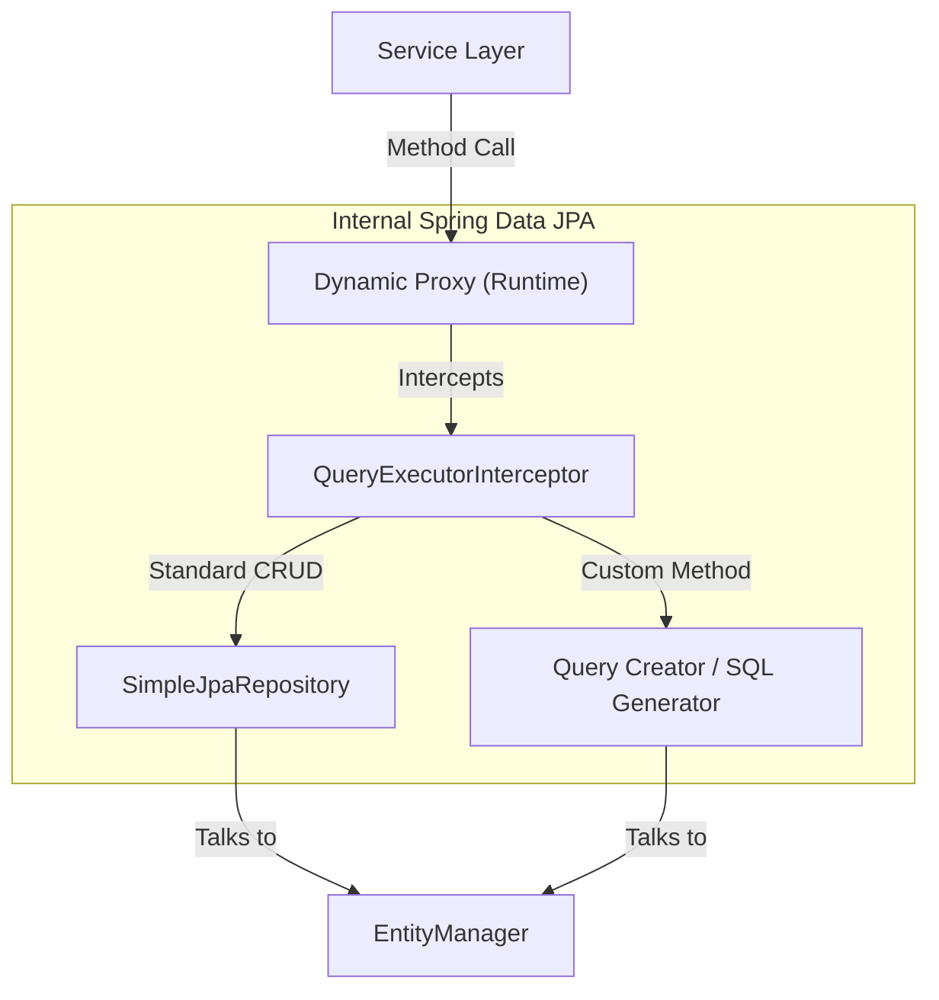
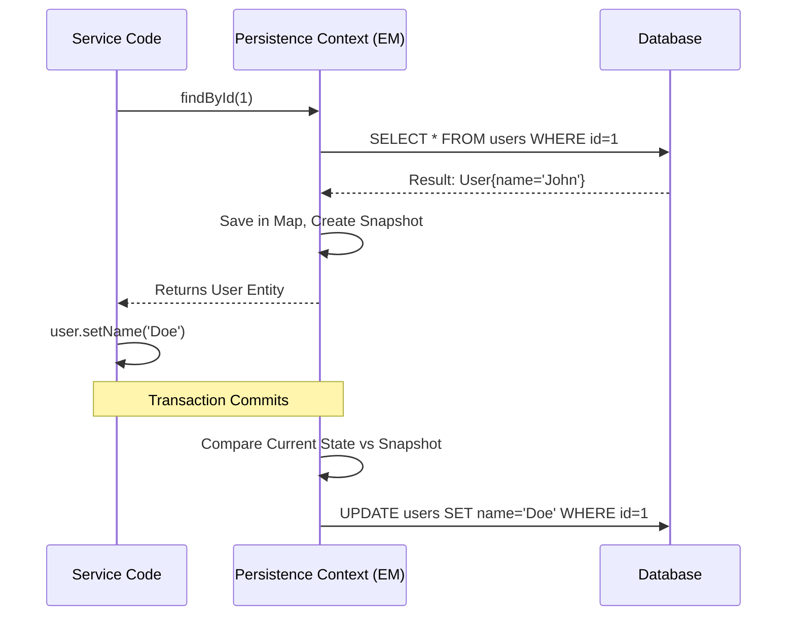

# JPA Secrets & Internal Workings in Spring Boot

In Spring Boot, **Spring Data JPA** is often treated as "magic." You write an interface, and suddenly database records are fetched. This guide reveals the "secrets" of how that magic works internally, how to optimize it, and how to avoid common pitfalls.

---

## 1. The Dynamic Proxy Secret: How Interaces Become Classes

**The Mystery:** You define an interface extending `JpaRepository`, but you never write an implementation class. Yet, at runtime, Spring gives you a working object. How?

**The Secret:** **JDK Dynamic Proxies**.
When the Spring Application Context starts, it scans for interfaces extending `Repository`. For each one, it uses a `ProxyFactory` to create a hidden implementation class in memory.

### Internal Working
1. Spring generates a Proxy subclass of your interface at runtime.
2. When you call `repository.save(user)`, the Proxy intercepts the call.
3. It delegates the work to a hidden class called `SimpleJpaRepository` (which contains the actual logic for `save`, `findById`, etc.).
4. If it's a custom method like `findByEmail`, Spring parses the method name and generates the SQL query on the fly.

### Mermaid Diagram: Repository Proxy



---

## 2. The Persistence Context (The First-Level Cache)

**The Mystery:** If you fetch the same User object twice in the same `@Transactional` method, Hibernate only goes to the database once. Why?

**The Secret:** **The Persistence Context**.
The `EntityManager` maintains a "Persistence Context," which is basically a map of all entities fetched during the current transaction. This acts as a **First-Level Cache**.

### Internal Working: Dirty Checking
When an object is in the Persistence Context, Hibernate keeps a "snapshot" of it. When the transaction commits, Hibernate compares the current state of the object with the snapshot. If they differ, it automatically generates an `UPDATE` statement. **You don't even need to call `repository.save()` if you modified a managed object inside a transaction!**

### Mermaid Diagram: Persistence Context Lifecycle



---

## 3. The N+1 Problem: The Performance Killer

**The Mystery:** You fetch 100 `Orders`. Each order has one `Customer`. When you loop through the orders and print `order.getCustomer().getName()`, your logs show **101 SQL queries** (1 for orders + 100 for each customer). This is the N+1 problem.

**The Secret:** **Entity Graphs & Join Fetching**.
By default, `@OneToMany` is Lazy and `@ManyToOne` is Eager (but still fetches separately). To fix this, you must tell JPA to fetch the relationship in the **same** SQL join.

### Example: Fixing N+1 with Entity Graphs
```java
public interface OrderRepository extends JpaRepository<Order, Long> {

    // ✅ "Secret" Fix: This forces a single JOIN query!
    @EntityGraph(attributePaths = {"customer"})
    List<Order> findAll();
}
```

---

## 4. Derived Query Method Parsing

**The Secret:** Spring Data JPA uses a **Regex Parser** on your method names.
When you write `findByFirstNameAndLastName(String fn, String ln)`, Spring:
1. Strips the prefix `findBy`.
2. Splits the remaining string by `And`, `Or`, `Between`, etc.
3. Maps `FirstName` and `LastName` to your entity fields.
4. Generates a JPQL query internal: `SELECT u FROM User u WHERE u.firstName = ?1 AND u.lastName = ?2`.

---

## 5. Transaction Management: The Proxy Trap

**The Mystery:** You have two methods in the same class. `methodA()` (no transaction) calls `methodB()` (with `@Transactional`). The transaction **fails to start**. Why?

**The Secret:** **Self-Invocation**.
As explained in the Proxy pattern, `@Transactional` works by creating a Proxy around the class.
1. If an **external** class calls `methodB()`, it goes through the Proxy, and the transaction starts.
2. If `methodA()` calls `methodB()` internally (`this.methodB()`), it bypasses the Proxy and calls the real method directly. The transaction logic is never triggered.

---

## 6. Pros and Cons of JPA

### ✅ Pros
1. **Dramatic Productivity:** Eliminates thousands of lines of JDBC boilerplate.
2. **Database Agnostic:** Write JPQL once; it runs on MySQL, Postgres, Oracle, etc.
3. **Dirty Checking:** No need for manual updates; the system tracks changes.
4. **First-Level Cache:** Prevents duplicate queries within the same request.

### ❌ Cons
1. **Steep Learning Curve:** "Easy to start, hard to master." You must understand Hibernate internals to prevent performance issues.
2. **Hidden Performance Issues:** N+1 problems can crash a production database if not monitored.
3. **Overhead:** Reflection and proxy generation add a small startup time and memory cost.
4. **Leaky Abstraction:** Sometimes you still need Native SQL for complex reporting or bulk updates.

---

## 7. Summary Checklist for Senior Developers
- [ ] Use `FetchType.LAZY` for almost everything.
- [ ] Use `@EntityGraph` or `JOIN FETCH` to solve N+1 problems.
- [ ] Only use `@Transactional` on public methods called from outside.
- [ ] Use a Profiler (or `show-sql: true`) to see what Hibernate is actually doing!
