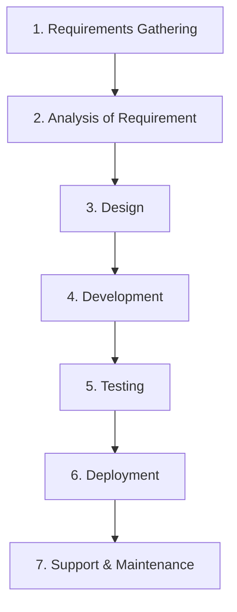
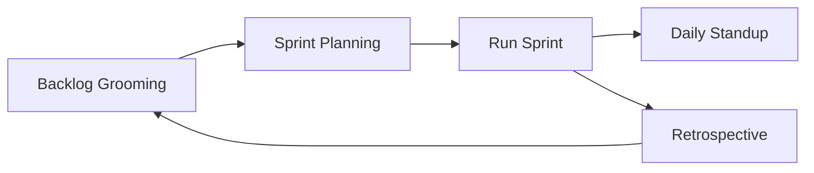

# Comprehensive Guide to SDLC, Agile & Jira

## 1. What is SDLC? (Software Development Life Cycle)

**SDLC** stands for Software Development Life Cycle. It represents the structured phases involved in software project execution, providing a systematic approach to building quality software.

### SDLC Phases

1. **Requirements Gathering / Collection:** Understanding what the client needs.
2. **Analysis:** Detailed evaluation of requirements for feasibility.
3. **Design:** Creating architecture and wireframes based on requirements.
4. **Development:** The actual coding phase.
5. **Testing:** Verifying the software against the requirements to ensure there are no bugs.
6. **Deployment:** Releasing the software to production.
7. **Support:** Post-deployment maintenance and bug fixing.

---

## 2. Agile Methodology & Terminology

Agile is an iterative framework for SDLC that emphasizes flexibility, continuous improvement, and rapid delivery.

### The Agile Sprint Cycle

### Key Agile Terminologies

1. **Backlog:** The master list of all pending user stories, tasks, and bug fixes that need to be completed.
2. **Backlog Grooming (Refinement):** A meeting to discuss user stories in detail, break down large stories, assign story points, and define clear acceptance criteria. Attended by PO, Scrum Master, Devs, and Testers.
3. **User Story:** A task representing a piece of functionality from the user's perspective. *(Format: "As a [user], I want [action], so that [benefit]")*.
4. **Story Points:** Used to estimate the *effort and complexity* required to complete a story. *(e.g., 1 day = 3 points, 2 days = 6 points)*. Note: Point duration scales vary by team.
5. **Sprint Planning:** Selecting stories from the backlog to commit to for the upcoming Sprint.
6. **Sprint:** A fixed timebox (usually 2 to 4 weeks) where the team works on the selected stories to deliver functional features.
7. **Daily Standup (Scrum Call):** A short daily meeting covering:
   - What did I work on yesterday?
   - What will I plan to do today?
   - Are there any blockers?
8. **Retrospective:** A meeting at the end of the Sprint to discuss:
   - What went well?
   - What went wrong?
   - Lessons learned.
   - Actionable ideas for the next Sprint.

---

## 3. Practical Jira Examples

**Jira** (developed by Atlassian) is a premium project management and bug-tracking software explicitly tailored for Agile development methodologies.

### User Story Example (New Feature)

**Issue Type:** User Story  
**Summary:** User should be able to log in to the application  
**Priority:** High  
**Status:** Backlog  
**Assignee:** Developer A  

**Description:**  
As a registered user, I want to log in using my email and password so that I can access my account and personalized features.

**Acceptance Criteria:**  
- [x] The login page should have fields for email and password.  
- [x] Users should be able to enter their credentials and click the Login button.  
- [x] The system should validate the credentials against the database.  
- [x] If credentials are correct, redirect to the dashboard.  
- [x] If credentials are incorrect, display an error message.  
- [x] Login should work on both desktop and mobile devices.  

**Technical Details:**  
- Use JWT Authentication.  
- Implement `POST /api/login`.  

---

### Bug Example (Defect)

**Issue Key:** BUG-101  
**Issue Type:** Bug  
**Summary:** Login button not working on mobile  
**Priority:** High  
**Status:** Backlog  
**Assignee:** Developer A  

**Steps to Reproduce:**  
1. Open the application on an Android/iOS device.
2. Navigate to the login screen.
3. Enter credentials and tap "Login".

**Expected Result:** User is logged in successfully.  
**Actual Result:** The login button is unresponsive.  
**Labels:** UI, Mobile, Login-Issue  

---

## 4. Professional Communication Templates

In professional DevOps/Agile environments, clear email communication is critical.

### Template 1: Git Repository Creation Request

**To:** mmt.devops@fnf.com  
**CC:** mmt.development@fnf.com  
**Subject:** MMT Project | Request for Git Repository Creation 

**Body:**  
Hi Team,

Hope you’re doing well.

As part of the MMT project development, we need a Git repository for source code integration. Kindly create the repository and share the URL with us at your earliest convenience.

@mike - Please review and approve this request.

Looking forward to your confirmation.

Best Regards,  
Pankaj

---

### Template 2: Scrum Call Missing Update

**To:** mike.k@fnf.com  
**CC:** mmt.development@fnf.com  
**Subject:** Pankaj | Scrum Call Update 

**Body:**  
Hi Mike,

Hope you're doing well.

I won’t be able to attend today’s Scrum call due to a personal emergency. Below is my current work status:

- **Story-5:** Jenkins Pipeline setup (**In Progress**)
- **Expected Completion:** 3rd March 2025
- **Blockers:** No blockers/challenges at the moment.

Please let me know if any further details are required.

Best Regards,  
Pankaj
