# 📡 MCP (Model Context Protocol) Servers — Comprehensive Guide

> **Version:** 2025-11-25 (Latest Stable) | **Author:** Technical Documentation | **Last Updated:** March 2026

---

## 📑 Table of Contents

1. [Introduction & Overview](#1-introduction--overview)
2. [MCP Fundamentals](#2-mcp-fundamentals)
3. [Architecture Overview (High-Level)](#3-architecture-overview-high-level)
4. [In-Depth Architecture Analysis (Detailed)](#4-in-depth-architecture-analysis-detailed)
5. [Internal Working Mechanisms](#5-internal-working-mechanisms)
6. [Problems MCP Servers Solve](#6-problems-mcp-servers-solve)
7. [Real-World Implementation Example](#7-real-world-implementation-example)
8. [A2A (Agent-to-Agent) Protocol Deep Dive](#8-a2a-agent-to-agent-protocol-deep-dive)
9. [Building Your Own MCP Server](#9-building-your-own-mcp-server)
10. [Advanced Concepts](#10-advanced-concepts)
11. [Multi-Server Collaboration in Action — Spring Boot EMS Example](#11-multi-server-collaboration-in-action--spring-boot-ems-example)
12. [Best Practices & Patterns](#12-best-practices--patterns)
13. [Troubleshooting Guide](#13-troubleshooting-guide)
14. [Conclusion & Future Directions](#14-conclusion--future-directions)

---

## 1. Introduction & Overview

### What is MCP?

**MCP** stands for **Model Context Protocol** — an open standard introduced by **Anthropic** in **November 2024** that standardizes how AI applications (like Claude, ChatGPT, Cursor, etc.) connect to external data sources, tools, and systems.

> 💡 **Simple Analogy:** Think of MCP as the **USB-C port for AI**. Just as USB-C provides a single, universal connector for charging, data transfer, and video output across all devices — MCP provides a single, universal protocol for AI models to interact with any external tool, database, API, or service.

### Why Was MCP Created?

Before MCP, every AI application had to build **custom integrations** for every data source:

| Without MCP | With MCP |
|---|---|
| Custom connector for GitHub | One universal protocol |
| Custom connector for Slack | connects to everything |
| Custom connector for databases | Plug-and-play architecture |
| N×M integration problem | N+M integration solution |

### The MCP Ecosystem

MCP has been adopted by major players including:

- **AI Providers:** Anthropic (Claude), OpenAI, Google DeepMind
- **Dev Tools:** Cursor, Zed, Replit, Codeium, Sourcegraph, VS Code
- **Enterprises:** Block, Apollo, Salesforce, SAP
- **Foundation:** Donated to the **Agentic AI Foundation** for open governance

### Key Specification Versions

| Version | Date | Key Changes |
|---|---|---|
| `2024-11-05` | Nov 2024 | Initial stable release |
| `2025-06-18` | Jun 2025 | OAuth 2.0, structured JSON output, elicitation |
| `2025-11-25` | Nov 2025 | OpenID Connect, icons, incremental consent, Tasks *(Latest Stable)* |

---

## 2. MCP Fundamentals

### Core Concepts

MCP is built around **three fundamental primitives** that servers expose to clients:

```
┌──────────────────────────────────────────────────┐
│                  MCP PRIMITIVES                  │
├──────────────┬───────────────┬────────────────────┤
│   🔧 Tools   │  📁 Resources │   💬 Prompts      │
│              │               │                    │
│  Executable  │  Read-only    │  Pre-defined       │
│  functions   │  data access  │  templates         │
│              │               │                    │
│  Model-      │  Application- │  User-             │
│  controlled  │  controlled   │  controlled        │
├──────────────┼───────────────┼────────────────────┤
│  "Do things" │ "Read things" │ "Say things"       │
└──────────────┴───────────────┴────────────────────┘
```

#### 🔧 Tools — *"Functions the AI Can Call"*

> **Analogy:** Tools are like apps on your smartphone. Each tool performs a specific action — sending a message, looking up information, or running a calculation.

- **Model-controlled:** The LLM decides when to invoke them
- **Side effects:** Can modify state (create files, send emails, update databases)
- **Schema-defined:** Each tool has a name, description, and JSON Schema for inputs
- **Examples:** `create_github_issue`, `query_database`, `send_email`

#### 📁 Resources — *"Data the AI Can Read"*

> **Analogy:** Resources are like files in a filing cabinet. The AI can open and read them, but accessing them doesn't change anything.

- **Application-controlled:** The host app decides how/when to expose them
- **Read-only:** No side effects (like HTTP GET)
- **URI-based:** Identified by URIs (e.g., `file:///path/to/doc.txt`)
- **Examples:** File contents, database records, API responses, live system data

#### 💬 Prompts — *"Templates for AI Interactions"*

> **Analogy:** Prompts are like recipe cards. They provide structured instructions that guide the AI through specific workflows.

- **User-controlled:** Users explicitly select them (e.g., via slash commands)
- **Parameterized:** Accept dynamic arguments
- **Composable:** Can include embedded resources and multi-step workflows
- **Examples:** `/summarize-document`, `/code-review`, `/generate-report`

### Protocol Foundation

MCP is built on top of **JSON-RPC 2.0**, a lightweight remote procedure call protocol:

```json
// Request
{
  "jsonrpc": "2.0",
  "id": 1,
  "method": "tools/list",
  "params": {}
}

// Response
{
  "jsonrpc": "2.0",
  "id": 1,
  "result": {
    "tools": [
      {
        "name": "get_weather",
        "description": "Get current weather for a city",
        "inputSchema": {
          "type": "object",
          "properties": {
            "city": { "type": "string" }
          },
          "required": ["city"]
        }
      }
    ]
  }
}
```

### Transport Mechanisms

MCP supports multiple transport layers:

| Transport | Use Case | How It Works |
|---|---|---|
| **stdio** | Local tools, CLI apps | Client spawns server as subprocess; messages via stdin/stdout |
| **Streamable HTTP** | Remote/cloud servers | HTTP POST + optional SSE for streaming |
| **HTTP + SSE** *(legacy)* | Web-based servers | SSE for server→client, POST for client→server |

---

## 3. Architecture Overview (High-Level)

### 3.1 MCP Ecosystem Overview

> This diagram shows the **bird's eye view** of the MCP ecosystem — ideal for understanding what the major pieces are and how they connect.

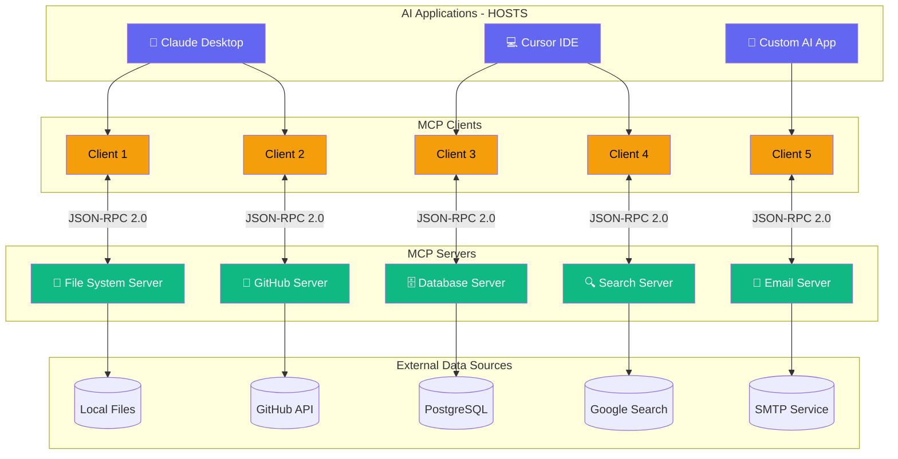
```mermaid
graph TB
    subgraph "AI Applications - HOSTS"
        H1["🤖 Claude Desktop"]
        H2["💻 Cursor IDE"]
        H3["📝 Custom AI App"]
    end

    subgraph "MCP Clients"
        C1["Client 1"]
        C2["Client 2"]
        C3["Client 3"]
        C4["Client 4"]
        C5["Client 5"]
    end

    subgraph "MCP Servers"
        S1["📂 File System Server"]
        S2["🐙 GitHub Server"]
        S3["🗄️ Database Server"]
        S4["🔍 Search Server"]
        S5["📧 Email Server"]
    end

    subgraph "External Data Sources"
        D1[("Local Files")]
        D2[("GitHub API")]
        D3[("PostgreSQL")]
        D4[("Google Search")]
        D5[("SMTP Service")]
    end

    H1 --> C1 & C2
    H2 --> C3 & C4
    H3 --> C5

    C1 <-->|"JSON-RPC 2.0"| S1
    C2 <-->|"JSON-RPC 2.0"| S2
    C3 <-->|"JSON-RPC 2.0"| S3
    C4 <-->|"JSON-RPC 2.0"| S4
    C5 <-->|"JSON-RPC 2.0"| S5

    S1 --> D1
    S2 --> D2
    S3 --> D3
    S4 --> D4
    S5 --> D5

    style H1 fill:#6366f1,color:#fff
    style H2 fill:#6366f1,color:#fff
    style H3 fill:#6366f1,color:#fff
    style C1 fill:#f59e0b,color:#000
    style C2 fill:#f59e0b,color:#000
    style C3 fill:#f59e0b,color:#000
    style C4 fill:#f59e0b,color:#000
    style C5 fill:#f59e0b,color:#000
    style S1 fill:#10b981,color:#fff
    style S2 fill:#10b981,color:#fff
    style S3 fill:#10b981,color:#fff
    style S4 fill:#10b981,color:#fff
    style S5 fill:#10b981,color:#fff
```

### 3.2 Host-Client-Server Relationship

> **Key Insight:** The **Host** is the AI application the user interacts with. The Host manages one or more **Clients**, and each Client maintains an isolated **1:1 connection** with a single **Server**.

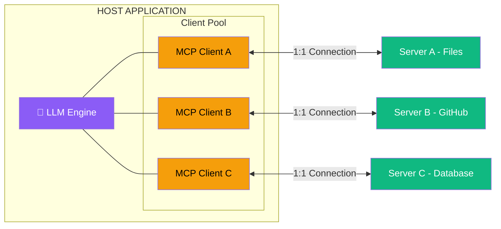
```mermaid
graph LR
    subgraph "HOST APPLICATION"
        direction TB
        LLM["🧠 LLM Engine"]
        subgraph "Client Pool"
            C1["MCP Client A"]
            C2["MCP Client B"]
            C3["MCP Client C"]
        end
        LLM --- C1 & C2 & C3
    end

    C1 <-->|"1:1 Connection"| S1["Server A - Files"]
    C2 <-->|"1:1 Connection"| S2["Server B - GitHub"]
    C3 <-->|"1:1 Connection"| S3["Server C - Database"]

    style LLM fill:#8b5cf6,color:#fff
    style C1 fill:#f59e0b,color:#000
    style C2 fill:#f59e0b,color:#000
    style C3 fill:#f59e0b,color:#000
    style S1 fill:#10b981,color:#fff
    style S2 fill:#10b981,color:#fff
    style S3 fill:#10b981,color:#fff
```

### 3.3 High-Level Data Flow

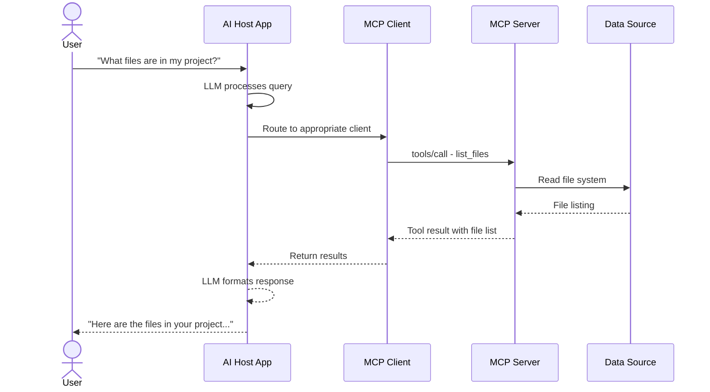
```mermaid
sequenceDiagram
    actor User
    participant Host as AI Host App
    participant Client as MCP Client
    participant Server as MCP Server
    participant DS as Data Source

    User->>Host: "What files are in my project?"
    Host->>Host: LLM processes query
    Host->>Client: Route to appropriate client
    Client->>Server: tools/call - list_files
    Server->>DS: Read file system
    DS-->>Server: File listing
    Server-->>Client: Tool result with file list
    Client-->>Host: Return results
    Host-->>Host: LLM formats response
    Host-->>User: "Here are the files in your project..."
```

### 3.4 Deployment Architecture

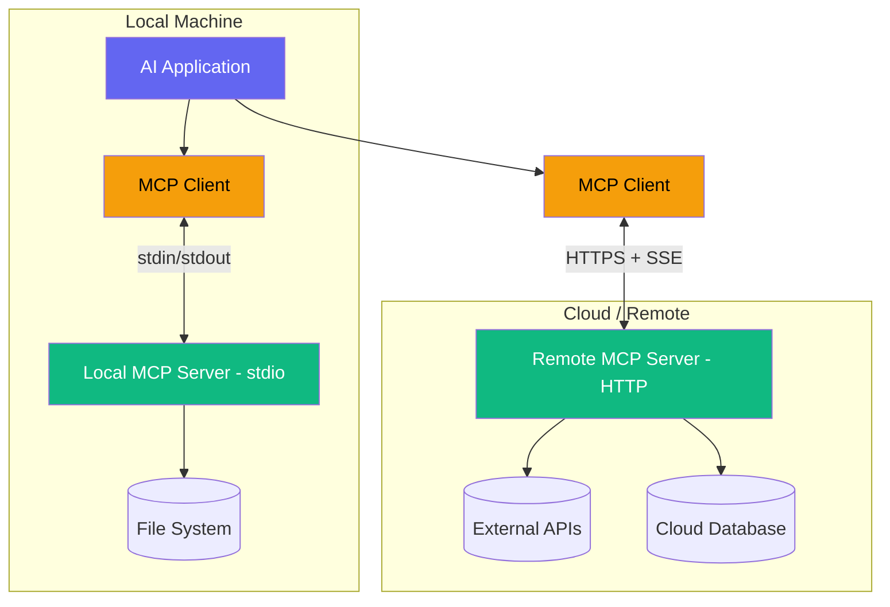
```mermaid
graph TB
    subgraph "Local Machine"
        App["AI Application"]
        LC1["MCP Client"]
        LS1["Local MCP Server - stdio"]
        FS[("File System")]

        App --> LC1
        LC1 <-->|"stdin/stdout"| LS1
        LS1 --> FS
    end

    subgraph "Cloud / Remote"
        RS1["Remote MCP Server - HTTP"]
        API[("External APIs")]
        DB[("Cloud Database")]

        RS1 --> API
        RS1 --> DB
    end

    LC2["MCP Client"]
    App --> LC2
    LC2 <-->|"HTTPS + SSE"| RS1

    style App fill:#6366f1,color:#fff
    style LS1 fill:#10b981,color:#fff
    style RS1 fill:#10b981,color:#fff
    style LC1 fill:#f59e0b,color:#000
    style LC2 fill:#f59e0b,color:#000
```

---

## 4. In-Depth Architecture Analysis (Detailed)

### 4.1 Detailed Internal Architecture

> This diagram shows the **granular breakdown** of every internal component — ideal for developers and architects implementing MCP.

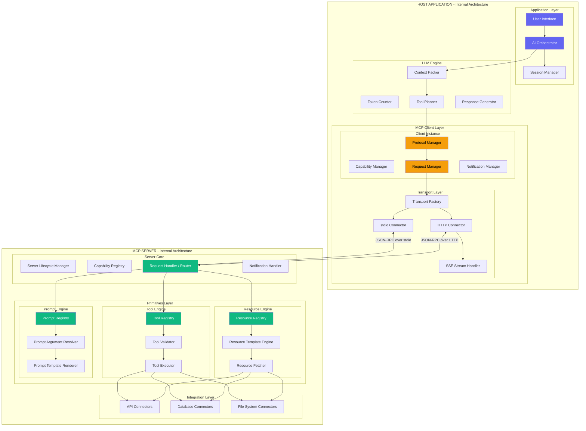
```mermaid
graph TB
    subgraph "HOST APPLICATION - Internal Architecture"
        direction TB

        subgraph "Application Layer"
            UI["User Interface"]
            AO["AI Orchestrator"]
            SM["Session Manager"]
        end

        subgraph "LLM Engine"
            TC["Token Counter"]
            CP["Context Packer"]
            TP["Tool Planner"]
            RG["Response Generator"]
        end

        subgraph "MCP Client Layer"
            direction TB
            subgraph "Client Instance"
                PM["Protocol Manager"]
                CM["Capability Manager"]
                RM["Request Manager"]
                NM["Notification Manager"]
            end

            subgraph "Transport Layer"
                TF["Transport Factory"]
                SC["stdio Connector"]
                HC["HTTP Connector"]
                SS["SSE Stream Handler"]
            end
        end
    end

    subgraph "MCP SERVER - Internal Architecture"
        direction TB

        subgraph "Server Core"
            SL["Server Lifecycle Manager"]
            CR["Capability Registry"]
            RH["Request Handler / Router"]
            NH["Notification Handler"]
        end

        subgraph "Primitives Layer"
            subgraph "Tool Engine"
                TR["Tool Registry"]
                TV["Tool Validator"]
                TE["Tool Executor"]
            end

            subgraph "Resource Engine"
                RR["Resource Registry"]
                RT["Resource Template Engine"]
                RF["Resource Fetcher"]
            end

            subgraph "Prompt Engine"
                PR["Prompt Registry"]
                PA["Prompt Argument Resolver"]
                PT["Prompt Template Renderer"]
            end
        end

        subgraph "Integration Layer"
            AC["API Connectors"]
            DC["Database Connectors"]
            FC["File System Connectors"]
        end
    end

    UI --> AO
    AO --> SM
    AO --> CP
    CP --> TP
    TP --> PM
    PM --> RM
    RM --> TF
    TF --> SC & HC
    HC --> SS

    SC <-->|"JSON-RPC over stdio"| RH
    HC <-->|"JSON-RPC over HTTP"| RH

    RH --> TR & RR & PR
    TR --> TV --> TE
    RR --> RT --> RF
    PR --> PA --> PT
    TE --> AC & DC & FC
    RF --> AC & DC & FC

    style UI fill:#6366f1,color:#fff
    style AO fill:#6366f1,color:#fff
    style PM fill:#f59e0b,color:#000
    style RM fill:#f59e0b,color:#000
    style RH fill:#10b981,color:#fff
    style TR fill:#10b981,color:#fff
    style RR fill:#10b981,color:#fff
    style PR fill:#10b981,color:#fff
```

### 4.2 Layer-by-Layer Breakdown

#### Layer 1: Transport Layer

The transport layer handles raw communication between clients and servers.

| Component | Responsibility |
|---|---|
| **Transport Factory** | Selects appropriate transport based on server config |
| **stdio Connector** | Spawns server process, pipes stdin/stdout |
| **HTTP Connector** | Manages HTTP POST requests to server endpoints |
| **SSE Stream Handler** | Handles Server-Sent Events for real-time streaming |

**Message Framing (stdio):**

```
Content-Length: 85\r\n
\r\n
{"jsonrpc":"2.0","id":1,"method":"initialize","params":{"capabilities":{}}}
```

**Message Framing (Streamable HTTP):**

```http
POST /mcp HTTP/1.1
Content-Type: application/json

{"jsonrpc":"2.0","id":1,"method":"tools/list","params":{}}
```

#### Layer 2: Protocol Layer

Handles JSON-RPC 2.0 message encoding/decoding, request/response correlation, and notification routing.

**Message Types:**

| Type | Direction | Has `id` | Example |
|---|---|---|---|
| **Request** | Client → Server | ✅ Yes | `tools/call`, `resources/read` |
| **Response** | Server → Client | ✅ Yes | Result or error |
| **Notification** | Either direction | ❌ No | `notifications/tools/list_changed` |

#### Layer 3: Application Layer

Contains the business logic — tool execution, resource fetching, prompt rendering, and capability negotiation.

### 4.3 Protocol Stack Deep Dive

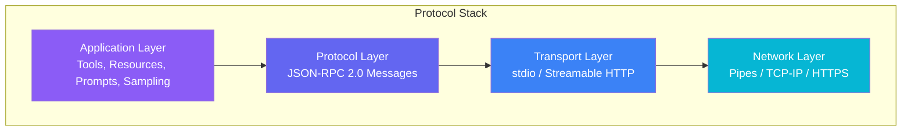
```mermaid
graph TB
    subgraph "Protocol Stack"
        L4["Application Layer<br/>Tools, Resources, Prompts, Sampling"]
        L3["Protocol Layer<br/>JSON-RPC 2.0 Messages"]
        L2["Transport Layer<br/>stdio / Streamable HTTP"]
        L1["Network Layer<br/>Pipes / TCP-IP / HTTPS"]
    end

    L4 --> L3 --> L2 --> L1

    style L4 fill:#8b5cf6,color:#fff
    style L3 fill:#6366f1,color:#fff
    style L2 fill:#3b82f6,color:#fff
    style L1 fill:#06b6d4,color:#fff
```

### 4.4 State Machine — Connection Lifecycle

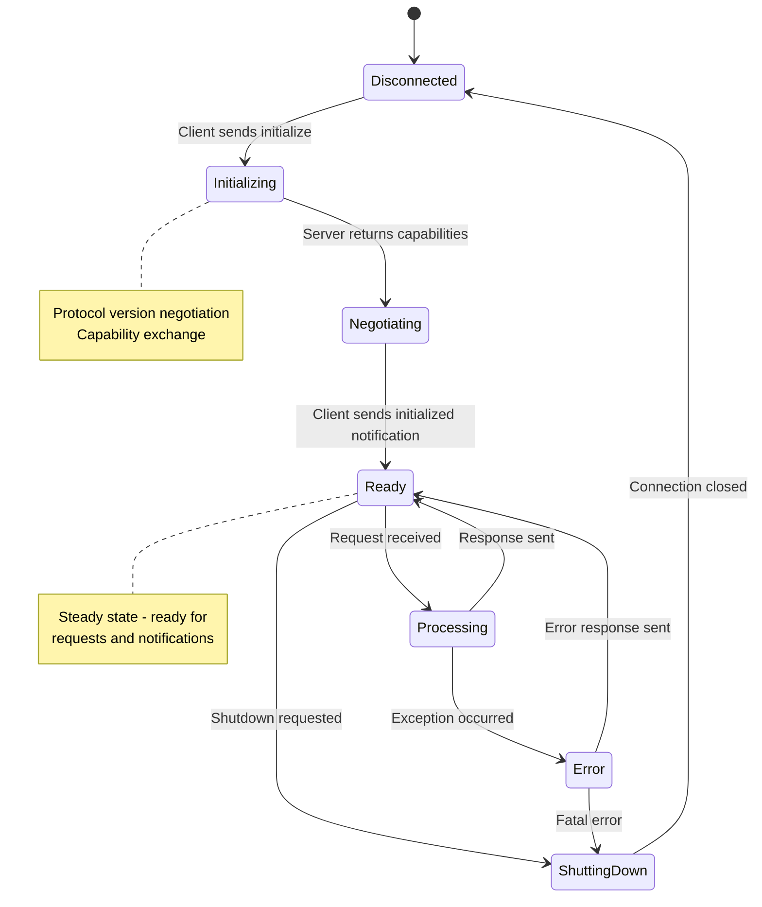
```mermaid
stateDiagram-v2
    [*] --> Disconnected

    Disconnected --> Initializing: Client sends initialize
    Initializing --> Negotiating: Server returns capabilities
    Negotiating --> Ready: Client sends initialized notification
    Ready --> Processing: Request received
    Processing --> Ready: Response sent
    Ready --> ShuttingDown: Shutdown requested
    ShuttingDown --> Disconnected: Connection closed

    Processing --> Error: Exception occurred
    Error --> Ready: Error response sent
    Error --> ShuttingDown: Fatal error

    note right of Initializing
        Protocol version negotiation
        Capability exchange
    end note

    note right of Ready
        Steady state - ready for
        requests and notifications
    end note
```

---

## 5. Internal Working Mechanisms

### 5.1 Connection Establishment (Handshake)

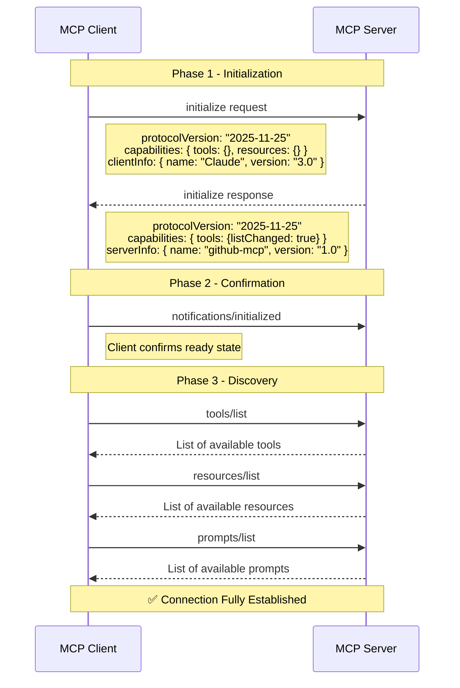
```mermaid
sequenceDiagram
    participant C as MCP Client
    participant S as MCP Server

    Note over C,S: Phase 1 - Initialization
    C->>S: initialize request
    Note right of C: protocolVersion: "2025-11-25"<br/>capabilities: { tools: {}, resources: {} }<br/>clientInfo: { name: "Claude", version: "3.0" }

    S-->>C: initialize response
    Note left of S: protocolVersion: "2025-11-25"<br/>capabilities: { tools: {listChanged: true} }<br/>serverInfo: { name: "github-mcp", version: "1.0" }

    Note over C,S: Phase 2 - Confirmation
    C->>S: notifications/initialized
    Note right of C: Client confirms ready state

    Note over C,S: Phase 3 - Discovery
    C->>S: tools/list
    S-->>C: List of available tools

    C->>S: resources/list
    S-->>C: List of available resources

    C->>S: prompts/list
    S-->>C: List of available prompts

    Note over C,S: ✅ Connection Fully Established
```

### 5.2 Tool Discovery & Execution Flow

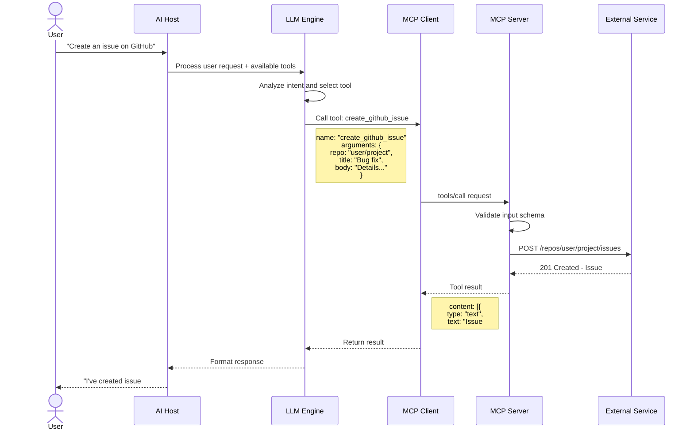
```mermaid
sequenceDiagram
    actor User
    participant Host as AI Host
    participant LLM as LLM Engine
    participant Client as MCP Client
    participant Server as MCP Server
    participant Ext as External Service

    User->>Host: "Create an issue on GitHub"

    Host->>LLM: Process user request + available tools
    LLM->>LLM: Analyze intent and select tool

    LLM->>Client: Call tool: create_github_issue
    Note right of LLM: name: "create_github_issue"<br/>arguments: {<br/>  repo: "user/project",<br/>  title: "Bug fix",<br/>  body: "Details..."<br/>}

    Client->>Server: tools/call request
    Server->>Server: Validate input schema
    Server->>Ext: POST /repos/user/project/issues
    Ext-->>Server: 201 Created - Issue #42
    Server-->>Client: Tool result
    Note left of Server: content: [{<br/>  type: "text",<br/>  text: "Issue #42 created"<br/>}]

    Client-->>LLM: Return result
    LLM-->>Host: Format response
    Host-->>User: "I've created issue #42 on GitHub!"
```

### 5.3 Resource Access Pattern

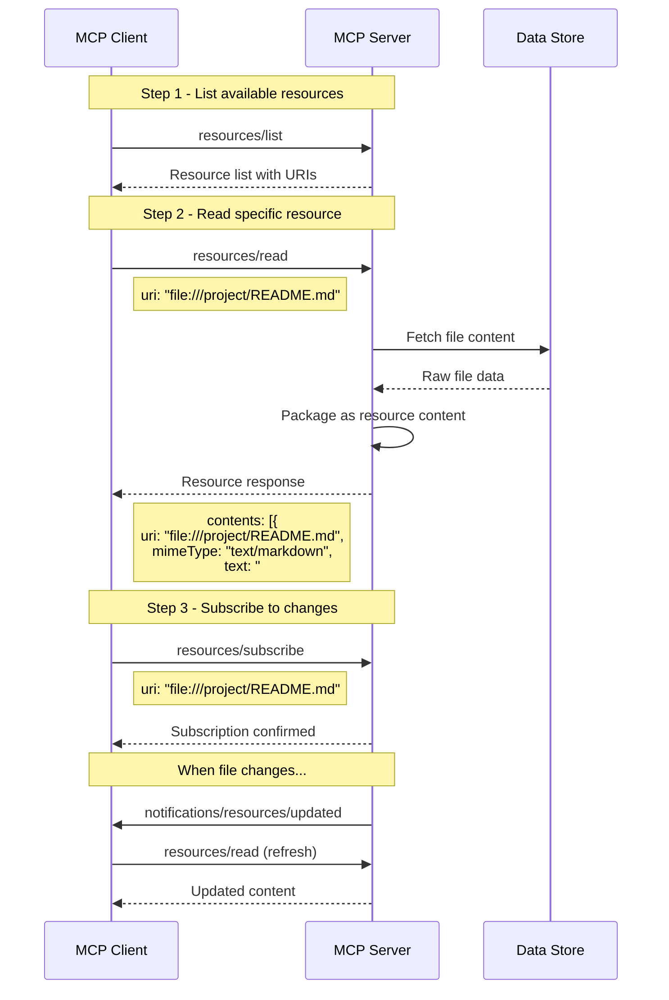
```mermaid
sequenceDiagram
    participant Client as MCP Client
    participant Server as MCP Server
    participant Store as Data Store

    Note over Client,Server: Step 1 - List available resources
    Client->>Server: resources/list
    Server-->>Client: Resource list with URIs

    Note over Client,Server: Step 2 - Read specific resource
    Client->>Server: resources/read
    Note right of Client: uri: "file:///project/README.md"

    Server->>Store: Fetch file content
    Store-->>Server: Raw file data
    Server->>Server: Package as resource content
    Server-->>Client: Resource response
    Note left of Server: contents: [{<br/>  uri: "file:///project/README.md",<br/>  mimeType: "text/markdown",<br/>  text: "# My Project..."<br/>}]

    Note over Client,Server: Step 3 - Subscribe to changes
    Client->>Server: resources/subscribe
    Note right of Client: uri: "file:///project/README.md"
    Server-->>Client: Subscription confirmed

    Note over Client,Server: When file changes...
    Server->>Client: notifications/resources/updated
    Client->>Server: resources/read (refresh)
    Server-->>Client: Updated content
```

### 5.4 Capability Negotiation

During initialization, both client and server declare their capabilities:

**Client Capabilities:**

```json
{
  "capabilities": {
    "roots": { "listChanged": true },
    "sampling": {},
    "experimental": {}
  }
}
```

**Server Capabilities:**

```json
{
  "capabilities": {
    "tools": { "listChanged": true },
    "resources": { "subscribe": true, "listChanged": true },
    "prompts": { "listChanged": true },
    "logging": {}
  }
}
```

> 💡 **Key Rule:** A server should ONLY use features that the client declared support for, and vice versa. This ensures forward/backward compatibility.

---

## 6. Problems MCP Servers Solve

### The N×M Integration Problem

**Before MCP:**

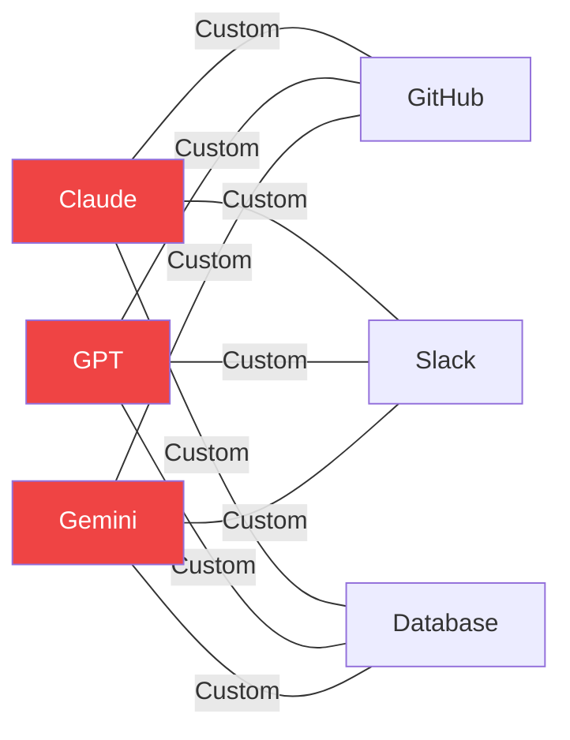
```mermaid
graph LR
    A1["Claude"] ---|"Custom"| S1["GitHub"]
    A1 ---|"Custom"| S2["Slack"]
    A1 ---|"Custom"| S3["Database"]
    A2["GPT"] ---|"Custom"| S1
    A2 ---|"Custom"| S2
    A2 ---|"Custom"| S3
    A3["Gemini"] ---|"Custom"| S1
    A3 ---|"Custom"| S2
    A3 ---|"Custom"| S3

    style A1 fill:#ef4444,color:#fff
    style A2 fill:#ef4444,color:#fff
    style A3 fill:#ef4444,color:#fff
```

> ❌ **3 AI apps × 3 services = 9 custom integrations** — and this grows exponentially!

**After MCP:**

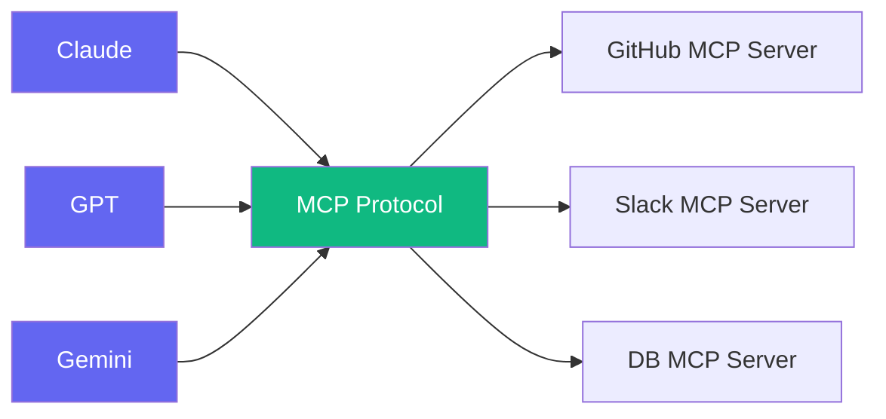
```mermaid
graph LR
    A1["Claude"] --> P["MCP Protocol"]
    A2["GPT"] --> P
    A3["Gemini"] --> P
    P --> S1["GitHub MCP Server"]
    P --> S2["Slack MCP Server"]
    P --> S3["DB MCP Server"]

    style P fill:#10b981,color:#fff
    style A1 fill:#6366f1,color:#fff
    style A2 fill:#6366f1,color:#fff
    style A3 fill:#6366f1,color:#fff
```

> ✅ **3 AI apps + 3 MCP servers = 6 implementations** — linear growth!

### Problems Solved — Summary Table

| Problem | Before MCP | With MCP |
|---|---|---|
| **Integration Complexity** | N×M custom connectors | N+M standardized connections |
| **Data Silos** | AI trapped behind information silos | Universal access to any data source |
| **Vendor Lock-in** | Tied to one AI provider's plugin system | Open standard, works with any AI |
| **Security Fragmentation** | Every integration has its own auth | Consistent OAuth 2.0 / security model |
| **Tool Discovery** | Manually coded tool availability | Dynamic discovery via protocol |
| **Context Loss** | AI loses context between tool calls | Persistent sessions with state |
| **Maintenance Burden** | Update every integration separately | Update the server once, all clients benefit |

### Comparison with Alternatives

| Feature | MCP | OpenAI Plugins | LangChain Tools | Custom REST APIs |
|---|---|---|---|---|
| **Open Standard** | ✅ Yes | ❌ Proprietary | ❌ Framework-specific | ❌ Custom |
| **Bi-directional** | ✅ Yes | ❌ One-way | ⚠️ Limited | ❌ One-way |
| **Dynamic Discovery** | ✅ Built-in | ⚠️ Via manifest | ⚠️ Via code | ❌ Manual |
| **Stateful Sessions** | ✅ Yes | ❌ Stateless | ⚠️ Depends | ❌ Stateless |
| **Multi-provider** | ✅ Any AI | ❌ OpenAI only | ⚠️ LangChain only | ✅ Any |
| **Streaming** | ✅ SSE | ⚠️ Limited | ⚠️ Framework | ⚠️ Custom |

---

## 7. Real-World Implementation Example

### Scenario: Using Claude to Interact with a GitHub Repository via MCP

> Imagine you're a developer using **Claude Desktop** and you want to ask: *"Summarize the latest pull requests on my project and create an issue for the failing CI pipeline."*

Here's exactly what happens behind the scenes, step by step.

### Step 1: Setup & Configuration

The user configures Claude Desktop to connect to the GitHub MCP server by editing the config file:

```json
// claude_desktop_config.json
{
  "mcpServers": {
    "github": {
      "command": "npx",
      "args": ["-y", "@modelcontextprotocol/server-github"],
      "env": {
        "GITHUB_PERSONAL_ACCESS_TOKEN": "ghp_xxxxxxxxxxxx"
      }
    }
  }
}
```

> 💡 This tells Claude: *"When you need GitHub, spawn this MCP server process and talk to it via stdio."*

### Step 2: Connection Establishment

When Claude Desktop starts, it launches the GitHub MCP server:

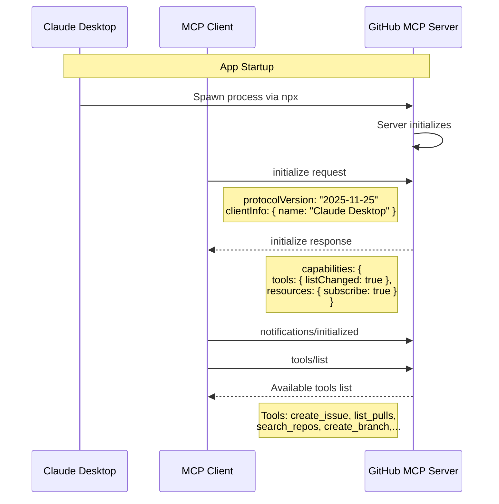
```mermaid
sequenceDiagram
    participant Claude as Claude Desktop
    participant Client as MCP Client
    participant GH as GitHub MCP Server

    Note over Claude,GH: App Startup
    Claude->>GH: Spawn process via npx
    GH->>GH: Server initializes

    Client->>GH: initialize request
    Note right of Client: protocolVersion: "2025-11-25"<br/>clientInfo: { name: "Claude Desktop" }

    GH-->>Client: initialize response
    Note left of GH: capabilities: {<br/>  tools: { listChanged: true },<br/>  resources: { subscribe: true }<br/>}

    Client->>GH: notifications/initialized
    Client->>GH: tools/list
    GH-->>Client: Available tools list
    Note left of GH: Tools: create_issue, list_pulls,<br/>search_repos, create_branch,...
```

### Step 3: User Sends Request

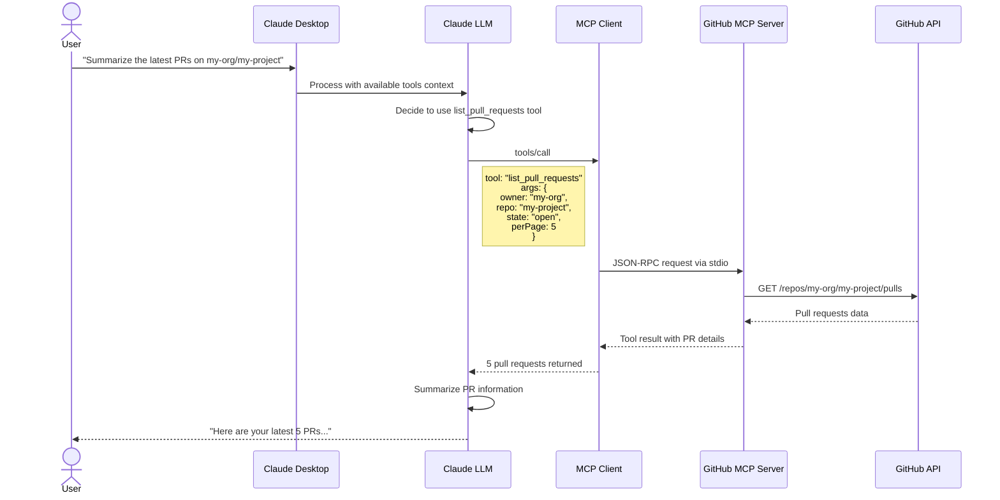
```mermaid
sequenceDiagram
    actor User
    participant Claude as Claude Desktop
    participant LLM as Claude LLM
    participant Client as MCP Client
    participant GH as GitHub MCP Server
    participant API as GitHub API

    User->>Claude: "Summarize the latest PRs on my-org/my-project"

    Claude->>LLM: Process with available tools context
    LLM->>LLM: Decide to use list_pull_requests tool

    LLM->>Client: tools/call
    Note right of LLM: tool: "list_pull_requests"<br/>args: {<br/>  owner: "my-org",<br/>  repo: "my-project",<br/>  state: "open",<br/>  perPage: 5<br/>}

    Client->>GH: JSON-RPC request via stdio
    GH->>API: GET /repos/my-org/my-project/pulls
    API-->>GH: Pull requests data
    GH-->>Client: Tool result with PR details

    Client-->>LLM: 5 pull requests returned
    LLM->>LLM: Summarize PR information
    LLM-->>User: "Here are your latest 5 PRs..."
```

### Step 4: Chained Action — Creating an Issue

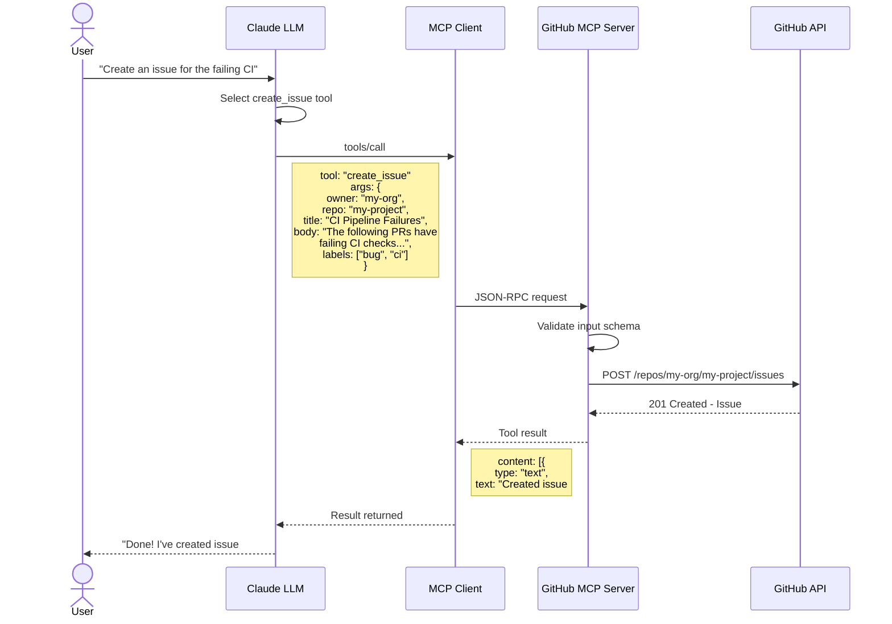
```mermaid
sequenceDiagram
    actor User
    participant LLM as Claude LLM
    participant Client as MCP Client
    participant GH as GitHub MCP Server
    participant API as GitHub API

    User->>LLM: "Create an issue for the failing CI"

    LLM->>LLM: Select create_issue tool
    LLM->>Client: tools/call
    Note right of LLM: tool: "create_issue"<br/>args: {<br/>  owner: "my-org",<br/>  repo: "my-project",<br/>  title: "CI Pipeline Failures",<br/>  body: "The following PRs have<br/>  failing CI checks...",<br/>  labels: ["bug", "ci"]<br/>}

    Client->>GH: JSON-RPC request
    GH->>GH: Validate input schema
    GH->>API: POST /repos/my-org/my-project/issues
    API-->>GH: 201 Created - Issue #127

    GH-->>Client: Tool result
    Note left of GH: content: [{<br/>  type: "text",<br/>  text: "Created issue #127:<br/>  CI Pipeline Failures"<br/>}]

    Client-->>LLM: Result returned
    LLM-->>User: "Done! I've created issue #127"
```

### Step 5: Error Handling

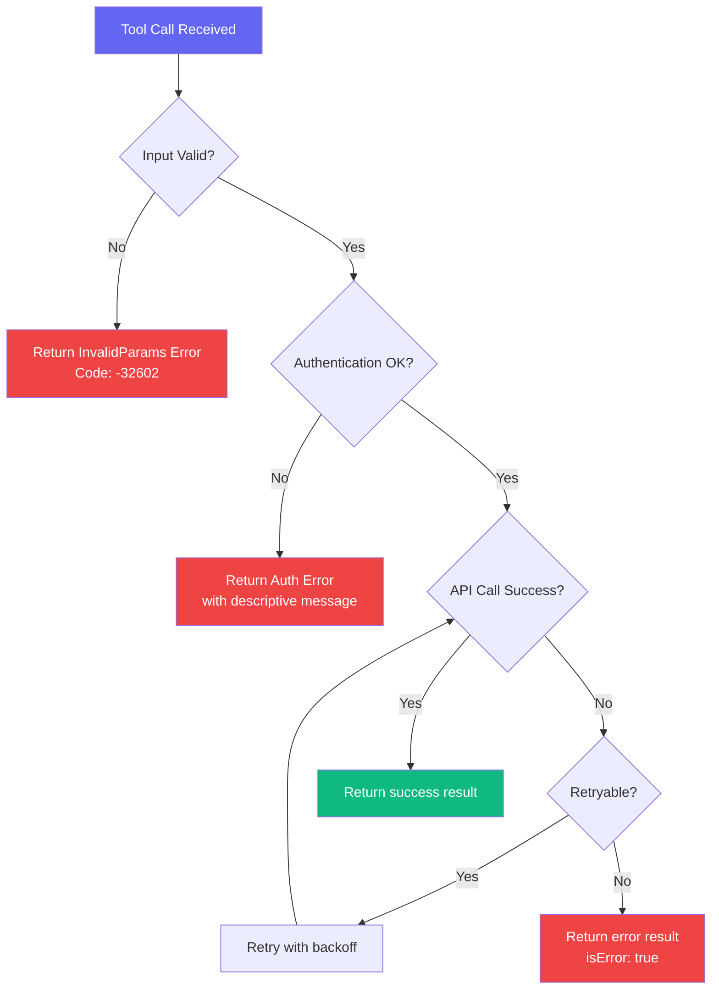
```mermaid
graph TD
    A["Tool Call Received"] --> B{"Input Valid?"}
    B -->|"No"| C["Return InvalidParams Error<br/>Code: -32602"]
    B -->|"Yes"| D{"Authentication OK?"}
    D -->|"No"| E["Return Auth Error<br/>with descriptive message"]
    D -->|"Yes"| F{"API Call Success?"}
    F -->|"No"| G{"Retryable?"}
    G -->|"Yes"| H["Retry with backoff"]
    G -->|"No"| I["Return error result<br/>isError: true"]
    F -->|"Yes"| J["Return success result"]
    H --> F

    style A fill:#6366f1,color:#fff
    style J fill:#10b981,color:#fff
    style C fill:#ef4444,color:#fff
    style E fill:#ef4444,color:#fff
    style I fill:#ef4444,color:#fff
```

---

## 8. A2A (Agent-to-Agent) Protocol Deep Dive

### What is A2A?

**A2A** stands for **Agent-to-Agent** — an open protocol launched by **Google** at **Cloud Next (April 2025)** that enables AI agents to communicate and collaborate with each other, regardless of their underlying frameworks or providers.

> 💡 **Analogy:** If MCP is like giving an AI agent **hands** to use tools, A2A is like giving agents **walkie-talkies** to talk to each other.

### MCP vs A2A: Complementary Protocols

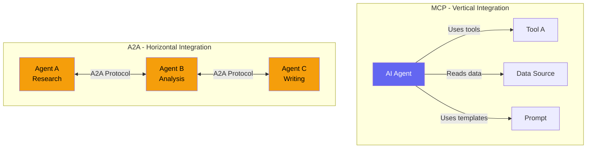
```mermaid
graph TB
    subgraph "MCP - Vertical Integration"
        Agent1["AI Agent"] -->|"Uses tools"| Tool1["Tool A"]
        Agent1 -->|"Reads data"| Data1["Data Source"]
        Agent1 -->|"Uses templates"| Prompt1["Prompt"]
    end

    subgraph "A2A - Horizontal Integration"
        AgentA["Agent A<br/>Research"] <-->|"A2A Protocol"| AgentB["Agent B<br/>Analysis"]
        AgentB <-->|"A2A Protocol"| AgentC["Agent C<br/>Writing"]
    end

    style Agent1 fill:#6366f1,color:#fff
    style AgentA fill:#f59e0b,color:#000
    style AgentB fill:#f59e0b,color:#000
    style AgentC fill:#f59e0b,color:#000
```

| Aspect | MCP | A2A |
|---|---|---|
| **Purpose** | Connect agents to **tools & data** | Connect **agents to agents** |
| **Direction** | Vertical (agent ↔ resources) | Horizontal (agent ↔ agent) |
| **Analogy** | USB-C port | Walkie-talkie network |
| **Created by** | Anthropic | Google |
| **Transport** | JSON-RPC over stdio/HTTP | JSON-RPC over HTTP/SSE |
| **Discovery** | Tool/resource listing | Agent Cards |

### A2A Core Concepts

#### Agent Card — *"Digital Business Card"*

Every A2A-compliant agent publishes a JSON file describing its capabilities:

```json
// /.well-known/agent.json
{
  "name": "Research Agent",
  "description": "Finds and summarizes academic papers",
  "url": "https://research-agent.example.com",
  "version": "1.0.0",
  "capabilities": {
    "streaming": true,
    "pushNotifications": true
  },
  "skills": [
    {
      "id": "paper_search",
      "name": "Academic Paper Search",
      "description": "Search and summarize research papers"
    }
  ],
  "authentication": {
    "schemes": ["Bearer"]
  }
}
```

#### Tasks — *"Units of Work"*

A2A interactions revolve around **Tasks** with defined lifecycle:

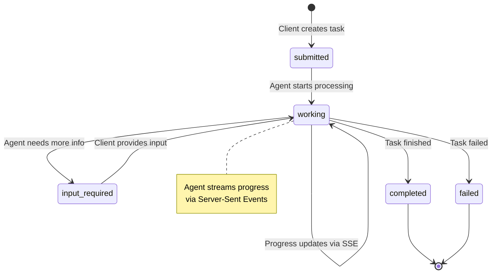
```mermaid
stateDiagram-v2
    [*] --> submitted: Client creates task
    submitted --> working: Agent starts processing
    working --> working: Progress updates via SSE
    working --> input_required: Agent needs more info
    input_required --> working: Client provides input
    working --> completed: Task finished
    working --> failed: Task failed
    completed --> [*]
    failed --> [*]

    note right of working
        Agent streams progress
        via Server-Sent Events
    end note
```

### A2A Communication Flow

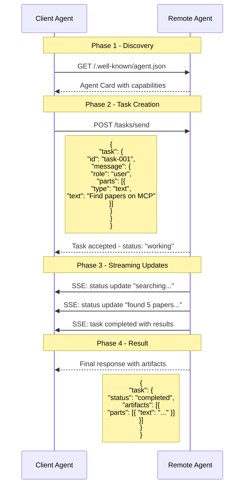
```mermaid
sequenceDiagram
    participant CA as Client Agent
    participant RA as Remote Agent

    Note over CA,RA: Phase 1 - Discovery
    CA->>RA: GET /.well-known/agent.json
    RA-->>CA: Agent Card with capabilities

    Note over CA,RA: Phase 2 - Task Creation
    CA->>RA: POST /tasks/send
    Note right of CA: {<br/>  "task": {<br/>    "id": "task-001",<br/>    "message": {<br/>      "role": "user",<br/>      "parts": [{<br/>        "type": "text",<br/>        "text": "Find papers on MCP"<br/>      }]<br/>    }<br/>  }<br/>}

    RA-->>CA: Task accepted - status: "working"

    Note over CA,RA: Phase 3 - Streaming Updates
    RA->>CA: SSE: status update "searching..."
    RA->>CA: SSE: status update "found 5 papers..."
    RA->>CA: SSE: task completed with results

    Note over CA,RA: Phase 4 - Result
    RA-->>CA: Final response with artifacts
    Note left of RA: {<br/>  "task": {<br/>    "status": "completed",<br/>    "artifacts": [{<br/>      "parts": [{ "text": "..." }]<br/>    }]<br/>  }<br/>}
```

### Multi-Agent Collaboration

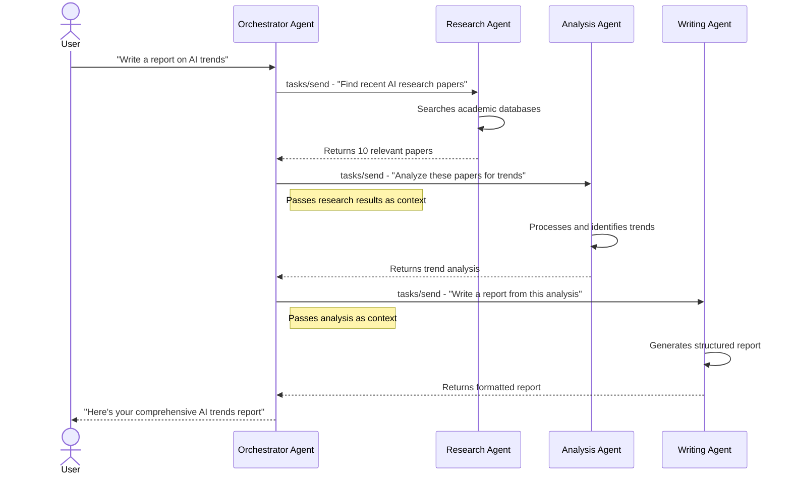
```mermaid
sequenceDiagram
    actor User
    participant OA as Orchestrator Agent
    participant RA as Research Agent
    participant AA as Analysis Agent
    participant WA as Writing Agent

    User->>OA: "Write a report on AI trends"

    OA->>RA: tasks/send - "Find recent AI research papers"
    RA->>RA: Searches academic databases
    RA-->>OA: Returns 10 relevant papers

    OA->>AA: tasks/send - "Analyze these papers for trends"
    Note right of OA: Passes research results as context
    AA->>AA: Processes and identifies trends
    AA-->>OA: Returns trend analysis

    OA->>WA: tasks/send - "Write a report from this analysis"
    Note right of OA: Passes analysis as context
    WA->>WA: Generates structured report
    WA-->>OA: Returns formatted report

    OA-->>User: "Here's your comprehensive AI trends report"
```

### A2A + MCP: Working Together

```mermaid
graph TB
    subgraph "Agent A - Research"
        A["Research Agent"]
        A -->|"MCP"| T1["Google Scholar MCP Server"]
        A -->|"MCP"| T2["arXiv MCP Server"]
    end

    subgraph "Agent B - Data Analysis"
        B["Analysis Agent"]
        B -->|"MCP"| T3["Python MCP Server"]
        B -->|"MCP"| T4["Database MCP Server"]
    end

    subgraph "Agent C - Report Writer"
        C["Writing Agent"]
        C -->|"MCP"| T5["Google Docs MCP Server"]
    end

    A <-->|"A2A"| B
    B <-->|"A2A"| C
    A <-->|"A2A"| C

    style A fill:#6366f1,color:#fff
    style B fill:#6366f1,color:#fff
    style C fill:#6366f1,color:#fff
    style T1 fill:#10b981,color:#fff
    style T2 fill:#10b981,color:#fff
    style T3 fill:#10b981,color:#fff
    style T4 fill:#10b981,color:#fff
    style T5 fill:#10b981,color:#fff
```

> 📌 **Key Takeaway:** MCP gives each agent its **tools** (vertical). A2A lets agents **collaborate** (horizontal). Together, they enable a complete multi-agent AI ecosystem.

---

## 9. Building Your Own MCP Server

### TypeScript Example — Weather MCP Server

#### Step 1: Project Setup

```bash
mkdir weather-mcp-server && cd weather-mcp-server
npm init -y
npm install @modelcontextprotocol/sdk zod
npm install -D typescript @types/node
npx tsc --init
```

#### Step 2: Implement the Server

```typescript
// src/index.ts
import { McpServer } from "@modelcontextprotocol/sdk/server/mcp.js";
import { StdioServerTransport } from "@modelcontextprotocol/sdk/server/stdio.js";
import { z } from "zod";

// Create server instance
const server = new McpServer({
  name: "weather-server",
  version: "1.0.0",
  capabilities: {
    tools: {},
    resources: {},
  },
});

// Register a Tool
server.tool(
  "get_weather",                          // Tool name
  "Get current weather for a city",       // Description
  {                                       // Input schema (Zod)
    city: z.string().describe("City name"),
    units: z.enum(["celsius", "fahrenheit"]).default("celsius"),
  },
  async ({ city, units }) => {            // Handler function
    // In production, call a real weather API
    const temp = units === "celsius" ? "22°C" : "72°F";
    return {
      content: [
        {
          type: "text",
          text: `Weather in ${city}: ${temp}, Partly Cloudy`,
        },
      ],
    };
  }
);

// Register a Resource
server.resource(
  "weather-api-docs",
  "docs://weather/api",
  async (uri) => ({
    contents: [
      {
        uri: uri.href,
        mimeType: "text/markdown",
        text: "# Weather API\nThis server provides weather data...",
      },
    ],
  })
);

// Register a Prompt
server.prompt(
  "weather-report",
  { city: z.string() },
  ({ city }) => ({
    messages: [
      {
        role: "user",
        content: {
          type: "text",
          text: `Generate a detailed weather report for ${city}.`,
        },
      },
    ],
  })
);

// Start the server
async function main() {
  const transport = new StdioServerTransport();
  await server.connect(transport);
  console.error("Weather MCP Server running on stdio");
}

main().catch(console.error);
```

#### Step 3: Configure with Claude Desktop

```json
{
  "mcpServers": {
    "weather": {
      "command": "node",
      "args": ["./dist/index.js"]
    }
  }
}
```

### Python Example — Using FastMCP

```python
# server.py
from mcp.server.fastmcp import FastMCP

mcp = FastMCP("weather-server")

@mcp.tool()
def get_weather(city: str, units: str = "celsius") -> str:
    """Get current weather for a city."""
    temp = "22°C" if units == "celsius" else "72°F"
    return f"Weather in {city}: {temp}, Partly Cloudy"

@mcp.resource("docs://weather/api")
def weather_docs() -> str:
    """Weather API documentation."""
    return "# Weather API\nThis server provides weather data..."

@mcp.prompt()
def weather_report(city: str) -> str:
    """Generate a weather report prompt."""
    return f"Generate a detailed weather report for {city}."

if __name__ == "__main__":
    mcp.run(transport="stdio")
```

---

## 10. Advanced Concepts

### Sampling — Server-Initiated LLM Calls

> **What it is:** Sampling allows MCP servers to request LLM completions *through* the client, enabling sophisticated agentic behaviors while keeping the human in the loop.

```mermaid
sequenceDiagram
    participant S as MCP Server
    participant C as MCP Client
    participant LLM as LLM
    participant U as User

    S->>C: sampling/createMessage request
    Note right of S: messages: [...],<br/>maxTokens: 500

    C->>U: Review sampling request?
    U-->>C: Approved

    C->>LLM: Generate completion
    LLM-->>C: LLM response
    C->>U: Review response?
    U-->>C: Approved

    C-->>S: sampling result
    S->>S: Use LLM output in workflow
```

### Roots — Workspace Boundaries

Roots define which files/directories the client has granted the server access to:

```json
{
  "roots": [
    { "uri": "file:///home/user/project", "name": "My Project" },
    { "uri": "file:///home/user/docs",    "name": "Documentation" }
  ]
}
```

### OAuth 2.0 Authentication Flow (Remote Servers)

```mermaid
sequenceDiagram
    participant C as MCP Client
    participant S as MCP Server
    participant Auth as Auth Server

    C->>S: Initial request (no token)
    S-->>C: 401 Unauthorized + Auth metadata

    C->>Auth: Authorization request
    Auth-->>C: Authorization code

    C->>Auth: Exchange code for token
    Auth-->>C: Access token + refresh token

    C->>S: Request with Bearer token
    S->>S: Validate token
    S-->>C: Authorized response
```

### Elicitation — Server Asks User for Input

```json
// Server sends elicitation request to client
{
  "method": "elicitation/create",
  "params": {
    "message": "Which database should I connect to?",
    "requestedSchema": {
      "type": "object",
      "properties": {
        "database": {
          "type": "string",
          "enum": ["production", "staging", "development"]
        }
      }
    }
  }
}
```

---

## 11. Multi-Server Collaboration in Action — Spring Boot EMS Example

### How Multiple MCP Servers Work Together

> 💡 **Core Concept:** In real-world AI-assisted development, the AI Host (like Claude or Cursor) doesn't rely on just one MCP server. It connects to **multiple specialized servers simultaneously**, each responsible for a different domain. The **AI orchestrates** across all of them, combining results from different servers into a single, coherent output for the user.

> **Analogy:** Think of it like a **movie production**. The director (AI Host/LLM) coordinates the cinematographer (File System server), the script writer (Code Generation server), the costume designer (Database server), and the editor (Testing server). Each specialist does their job independently, but the director combines all their work into the final movie.

### The Multi-Server Architecture

```mermaid
graph TB
    subgraph "AI Host - Cursor IDE"
        LLM["🧠 LLM Orchestrator"]
        CTX["📋 Context Aggregator"]
        LLM <--> CTX
    end

    subgraph "MCP Client Pool"
        C1["Client 1"]
        C2["Client 2"]
        C3["Client 3"]
        C4["Client 4"]
        C5["Client 5"]
        C6["Client 6"]
    end

    subgraph "Specialized MCP Servers"
        S1["📂 File System Server<br/>Read/Write project files"]
        S2["🐙 GitHub Server<br/>Repos, PRs, Issues"]
        S3["🗄️ Database Server<br/>PostgreSQL operations"]
        S4["🧪 Testing Server<br/>Run JUnit, integration tests"]
        S5["🔍 Web Search Server<br/>Docs, Stack Overflow"]
        S6["🐳 Docker Server<br/>Containers, deployment"]
    end

    CTX --> C1 & C2 & C3 & C4 & C5 & C6
    C1 <--> S1
    C2 <--> S2
    C3 <--> S3
    C4 <--> S4
    C5 <--> S5
    C6 <--> S6

    style LLM fill:#8b5cf6,color:#fff
    style CTX fill:#6366f1,color:#fff
    style S1 fill:#10b981,color:#fff
    style S2 fill:#10b981,color:#fff
    style S3 fill:#10b981,color:#fff
    style S4 fill:#10b981,color:#fff
    style S5 fill:#10b981,color:#fff
    style S6 fill:#10b981,color:#fff
    style C1 fill:#f59e0b,color:#000
    style C2 fill:#f59e0b,color:#000
    style C3 fill:#f59e0b,color:#000
    style C4 fill:#f59e0b,color:#000
    style C5 fill:#f59e0b,color:#000
    style C6 fill:#f59e0b,color:#000
```

### How the LLM Combines Results from Multiple Servers

The key to multi-server collaboration is the **LLM's context window**. Here's how it works:

```
┌─────────────────────────────────────────────────────────────────────┐
│                    LLM's CONTEXT WINDOW                           │
├─────────────────────────────────────────────────────────────────────┤
│                                                                     │
│  📥 Input from User:                                                │
│  "Build an Employee Management System in Spring Boot"               │
│                                                                     │
│  🔧 Available Tools (discovered from ALL connected MCP servers):    │
│  ├── [File System]  read_file, write_file, list_directory           │
│  ├── [GitHub]       create_repo, create_branch, commit_files        │
│  ├── [Database]     execute_query, create_table, list_tables        │
│  ├── [Testing]      run_tests, check_coverage, lint_code            │
│  ├── [Web Search]   search_docs, search_stackoverflow               │
│  └── [Docker]       build_image, run_container, docker_compose      │
│                                                                     │
│  🧠 LLM Decision: Plan multi-step workflow using tools from         │
│     DIFFERENT servers in sequence, combining each result             │
│     into context for the next step.                                  │
│                                                                     │
└─────────────────────────────────────────────────────────────────────┘
```

> 📌 **Critical Insight:** The LLM sees **all tools from all servers** as a flat list. It doesn't care which server a tool belongs to. It simply picks the **best tool for each sub-task**, calls it, feeds the result into context, and calls the next tool. The **MCP clients handle routing** each call to the correct server transparently.

---

### 🏗️ Complete Example: Building a Spring Boot Employee Management System

> **Scenario:** A developer asks their AI coding assistant: *"Build a complete Employee Management System using Spring Boot with CRUD operations, PostgreSQL database, JUnit tests, and Docker deployment."*

Here's how **6 MCP servers** collaborate across the full development lifecycle:

---

#### Phase 1: 📋 Planning & Research

**Servers involved:** 🔍 Web Search Server + 📂 File System Server

```mermaid
sequenceDiagram
    actor Dev as Developer
    participant LLM as LLM Orchestrator
    participant WS as 🔍 Web Search Server
    participant FS as 📂 File System Server

    Dev->>LLM: "Build an Employee Management System<br/>in Spring Boot with PostgreSQL"

    Note over LLM: Step 1 - Research best practices
    LLM->>WS: search_docs
    Note right of LLM: query: "Spring Boot 3.x REST API<br/>best practices project structure"
    WS-->>LLM: Spring Boot conventions,<br/>recommended folder structure,<br/>dependency versions

    LLM->>WS: search_docs
    Note right of LLM: query: "Spring Data JPA PostgreSQL<br/>Employee CRUD example"
    WS-->>LLM: JPA entity patterns,<br/>repository patterns, DTO design

    Note over LLM: Step 2 - Create project plan
    LLM->>LLM: Combines search results into a plan

    LLM->>FS: write_file
    Note right of LLM: path: "PROJECT_PLAN.md"<br/>content: Architecture decisions,<br/>tech stack, folder structure,<br/>API endpoints list
    FS-->>LLM: File created successfully

    LLM-->>Dev: "Here's the project plan.<br/>I'll now start building it."
```

**What the LLM combined:**
- ✅ Spring Boot best practices from web search → used to decide project structure
- ✅ JPA patterns from web search → used to plan entity design
- ✅ Combined both into a structured plan → saved to file system

---

#### Phase 2: 🏛️ Design & Project Setup

**Servers involved:** 📂 File System Server + 🐙 GitHub Server + 🗄️ Database Server

```mermaid
sequenceDiagram
    participant LLM as LLM Orchestrator
    participant GH as 🐙 GitHub Server
    participant FS as 📂 File System Server
    participant DB as 🗄️ Database Server

    Note over LLM: Step 1 - Create repo and project scaffold
    LLM->>GH: create_repository
    Note right of LLM: name: "employee-management-system"<br/>description: "Spring Boot EMS"<br/>private: true
    GH-->>LLM: Repo created at<br/>github.com/dev/employee-management-system

    Note over LLM: Step 2 - Generate Spring Boot project files
    LLM->>FS: write_file - pom.xml
    Note right of LLM: Spring Boot 3.2, JPA, PostgreSQL,<br/>Lombok, Validation, Test dependencies
    FS-->>LLM: ✅ pom.xml created

    LLM->>FS: write_file - application.yml
    Note right of LLM: DB connection config,<br/>JPA hibernate settings,<br/>server port: 8080
    FS-->>LLM: ✅ application.yml created

    LLM->>FS: write_file - Employee.java
    Note right of LLM: @Entity, @Table, fields:<br/>id, name, email, department,<br/>salary, joiningDate
    FS-->>LLM: ✅ Entity created

    Note over LLM: Step 3 - Setup database
    LLM->>DB: execute_query
    Note right of LLM: CREATE DATABASE employee_db;
    DB-->>LLM: ✅ Database created

    LLM->>DB: execute_query
    Note right of LLM: CREATE TABLE employees (
    Note right of LLM: id BIGSERIAL PRIMARY KEY,
    Note right of LLM: name VARCHAR(100),
    Note right of LLM: email VARCHAR(100) UNIQUE, ...);
    DB-->>LLM: ✅ Table created
```

**What the LLM combined:**
- ✅ GitHub server → created remote repository
- ✅ File System server → scaffolded all project files with correct Spring Boot structure
- ✅ Database server → created the actual PostgreSQL database and schema
- 🔗 The DB connection details in `application.yml` **match** the database created via DB server

---

#### Phase 3: 💻 Development — Building the Application

**Servers involved:** 📂 File System Server + 🔍 Web Search Server

```mermaid
sequenceDiagram
    participant LLM as LLM Orchestrator
    participant FS as 📂 File System Server
    participant WS as 🔍 Web Search Server

    Note over LLM: Builds the full Spring Boot application layer by layer

    Note over LLM,FS: Layer 1 - Repository
    LLM->>FS: write_file - EmployeeRepository.java
    Note right of LLM: extends JpaRepository<br/>Custom query methods:<br/>findByEmail, findByDepartment
    FS-->>LLM: ✅ Repository created

    Note over LLM,FS: Layer 2 - Service
    LLM->>FS: write_file - EmployeeService.java
    Note right of LLM: Business logic: CRUD,<br/>validation, DTO mapping,<br/>exception handling
    FS-->>LLM: ✅ Service created

    Note over LLM,WS: Layer 3 - Handle uncertainty
    LLM->>WS: search_docs
    Note right of LLM: "Spring Boot global exception<br/>handler @RestControllerAdvice"
    WS-->>LLM: Exception handling patterns,<br/>error response structure

    LLM->>FS: write_file - GlobalExceptionHandler.java
    Note right of LLM: Uses patterns from search result<br/>@RestControllerAdvice,<br/>custom error responses
    FS-->>LLM: ✅ Exception handler created

    Note over LLM,FS: Layer 4 - Controller
    LLM->>FS: write_file - EmployeeController.java
    Note right of LLM: REST endpoints:<br/>GET /api/employees<br/>GET /api/employees/{id}<br/>POST /api/employees<br/>PUT /api/employees/{id}<br/>DELETE /api/employees/{id}
    FS-->>LLM: ✅ Controller created

    Note over LLM,FS: Layer 5 - DTOs and Mapper
    LLM->>FS: write_file - EmployeeDTO.java
    FS-->>LLM: ✅ DTO created
    LLM->>FS: write_file - EmployeeMapper.java
    FS-->>LLM: ✅ Mapper created
```

**What the LLM combined:**
- ✅ File System server → wrote all Java source files in correct package hierarchy
- ✅ Web Search server → resolved uncertainty about exception handling patterns
- 🔗 Each layer **references** the previous (Controller uses Service, Service uses Repository)
- 🔗 The LLM carries context from one tool call to the next, ensuring consistency

---

#### Phase 4: 🧪 Testing

**Servers involved:** 📂 File System Server + 🧪 Testing Server + 🗄️ Database Server

```mermaid
sequenceDiagram
    participant LLM as LLM Orchestrator
    participant FS as 📂 File System Server
    participant TS as 🧪 Testing Server
    participant DB as 🗄️ Database Server

    Note over LLM: Step 1 - Write test files
    LLM->>FS: write_file - EmployeeServiceTest.java
    Note right of LLM: @SpringBootTest, @MockBean<br/>Tests: create, findAll, findById,<br/>update, delete, notFound
    FS-->>LLM: ✅ Service tests written

    LLM->>FS: write_file - EmployeeControllerTest.java
    Note right of LLM: @WebMvcTest, MockMvc<br/>Tests: POST/GET/PUT/DELETE<br/>validation errors, 404 handling
    FS-->>LLM: ✅ Controller tests written

    Note over LLM: Step 2 - Prepare test database
    LLM->>DB: execute_query
    Note right of LLM: CREATE DATABASE employee_db_test;
    DB-->>LLM: ✅ Test database created

    Note over LLM: Step 3 - Run tests
    LLM->>TS: run_tests
    Note right of LLM: command: "mvn test"<br/>workingDir: "/project"
    TS-->>LLM: Test Results:<br/>12 tests run, 10 passed, 2 failed

    Note over LLM: Step 4 - Fix failures based on test output
    LLM->>LLM: Analyze failure messages:
    Note over LLM: "Expected 200 but got 400"<br/>→ Missing @Valid annotation

    LLM->>FS: read_file - EmployeeController.java
    FS-->>LLM: Current controller code

    LLM->>FS: write_file - EmployeeController.java
    Note right of LLM: Added @Valid to @RequestBody
    FS-->>LLM: ✅ Controller updated

    Note over LLM: Step 5 - Re-run tests
    LLM->>TS: run_tests
    Note right of LLM: command: "mvn test"
    TS-->>LLM: ✅ 12/12 tests passed!

    LLM->>TS: check_coverage
    TS-->>LLM: Code coverage: 87%
```

**What the LLM combined:**
- ✅ File System server → wrote test files matching the source code structure it created earlier
- ✅ Database server → created isolated test database
- ✅ Testing server → ran tests and reported failures
- ✅ File System server → read failing code, fixed it, wrote back
- ✅ Testing server → re-ran and confirmed all pass
- 🔗 **The feedback loop** (test → fail → fix → re-test) uses 3 servers in coordination

---

#### Phase 5: 🐳 Deployment & Delivery

**Servers involved:** 📂 File System Server + 🐳 Docker Server + 🐙 GitHub Server

```mermaid
sequenceDiagram
    participant LLM as LLM Orchestrator
    participant FS as 📂 File System Server
    participant DK as 🐳 Docker Server
    participant GH as 🐙 GitHub Server

    Note over LLM: Step 1 - Create Docker files
    LLM->>FS: write_file - Dockerfile
    Note right of LLM: FROM eclipse-temurin:17<br/>COPY target/*.jar app.jar<br/>EXPOSE 8080<br/>ENTRYPOINT java -jar app.jar
    FS-->>LLM: ✅ Dockerfile created

    LLM->>FS: write_file - docker-compose.yml
    Note right of LLM: services:<br/>  app: build: .<br/>    ports: 8080:8080<br/>    depends_on: db<br/>  db: image: postgres:15<br/>    environment: credentials
    FS-->>LLM: ✅ docker-compose.yml created

    Note over LLM: Step 2 - Build and test container
    LLM->>DK: build_image
    Note right of LLM: tag: "ems-app:1.0"<br/>context: "/project"
    DK-->>LLM: ✅ Image built successfully

    LLM->>DK: docker_compose_up
    Note right of LLM: file: "docker-compose.yml"<br/>detached: true
    DK-->>LLM: ✅ Services started<br/>App: localhost:8080<br/>DB: localhost:5432

    Note over LLM: Step 3 - Commit and push everything
    LLM->>GH: create_branch
    Note right of LLM: branch: "feature/initial-setup"
    GH-->>LLM: ✅ Branch created

    LLM->>GH: commit_files
    Note right of LLM: All project files<br/>message: "feat: Complete EMS with<br/>CRUD, tests, and Docker"
    GH-->>LLM: ✅ Committed and pushed

    LLM->>GH: create_pull_request
    Note right of LLM: title: "Employee Management System"<br/>base: main, head: feature/initial-setup
    GH-->>LLM: ✅ PR #1 created
```

**What the LLM combined:**
- ✅ File System server → created Dockerfile referencing the built Spring Boot JAR
- ✅ Docker server → built image and started containers
- ✅ GitHub server → created branch, committed everything, opened PR
- 🔗 Docker config **matches** the `application.yml` DB settings created in Phase 2

---

### 🔄 The Complete Multi-Server Orchestration Flow

> This diagram shows the **end-to-end flow** of how all 6 servers contributed across all 5 phases:

```mermaid
graph TB
    subgraph "Phase 1: Planning"
        P1A["🔍 Web Search<br/>Research best practices"]
        P1B["📂 File System<br/>Save project plan"]
        P1A -->|"Results feed into"| P1B
    end

    subgraph "Phase 2: Design"
        P2A["🐙 GitHub<br/>Create repository"]
        P2B["📂 File System<br/>Scaffold project files"]
        P2C["🗄️ Database<br/>Create DB and tables"]
        P2A --> P2B
        P2B -->|"DB config matches"| P2C
    end

    subgraph "Phase 3: Development"
        P3A["🔍 Web Search<br/>Resolve uncertainties"]
        P3B["📂 File System<br/>Write all source code"]
        P3A -->|"Patterns inform"| P3B
    end

    subgraph "Phase 4: Testing"
        P4A["📂 File System<br/>Write test files"]
        P4B["🗄️ Database<br/>Create test DB"]
        P4C["🧪 Testing<br/>Run tests"]
        P4D["📂 File System<br/>Fix failing code"]
        P4E["🧪 Testing<br/>Re-run - All pass!"]
        P4A --> P4C
        P4B --> P4C
        P4C -->|"Failures"| P4D
        P4D --> P4E
    end

    subgraph "Phase 5: Deployment"
        P5A["📂 File System<br/>Docker files"]
        P5B["🐳 Docker<br/>Build and run"]
        P5C["🐙 GitHub<br/>Commit, PR"]
        P5A --> P5B --> P5C
    end

    P1B ==>|"Plan informs"| P2A
    P2C ==>|"Schema informs"| P3B
    P3B ==>|"Code tested by"| P4A
    P4E ==>|"Passing code deployed"| P5A

    style P1A fill:#3b82f6,color:#fff
    style P1B fill:#10b981,color:#fff
    style P2A fill:#f59e0b,color:#000
    style P2B fill:#10b981,color:#fff
    style P2C fill:#8b5cf6,color:#fff
    style P3A fill:#3b82f6,color:#fff
    style P3B fill:#10b981,color:#fff
    style P4A fill:#10b981,color:#fff
    style P4B fill:#8b5cf6,color:#fff
    style P4C fill:#ef4444,color:#fff
    style P4D fill:#10b981,color:#fff
    style P4E fill:#22c55e,color:#fff
    style P5A fill:#10b981,color:#fff
    style P5B fill:#06b6d4,color:#fff
    style P5C fill:#f59e0b,color:#000
```

### 📊 Server Contribution Summary

| MCP Server | Phase 1<br/>Planning | Phase 2<br/>Design | Phase 3<br/>Development | Phase 4<br/>Testing | Phase 5<br/>Deployment | Total Calls |
|---|:---:|:---:|:---:|:---:|:---:|:---:|
| 📂 **File System** | ✅ | ✅✅ | ✅✅✅✅ | ✅✅✅ | ✅✅ | **12** |
| 🔍 **Web Search** | ✅✅ | — | ✅ | — | — | **3** |
| 🐙 **GitHub** | — | ✅ | — | — | ✅✅✅ | **4** |
| 🗄️ **Database** | — | ✅✅ | — | ✅ | — | **3** |
| 🧪 **Testing** | — | — | — | ✅✅✅ | — | **3** |
| 🐳 **Docker** | — | — | — | — | ✅✅ | **2** |
| | | | | | | **27 total** |

### 🧩 How Results Are Combined Into One Response

The LLM uses a technique called **iterative context accumulation**:

```mermaid
graph LR
    subgraph "Tool Call Chaining"
        direction LR
        T1["Tool Call 1<br/>🔍 search_docs"] --> R1["Result 1<br/>Spring Boot patterns"]
        R1 --> CTX1["Context grows"]
        CTX1 --> T2["Tool Call 2<br/>📂 write_file"] --> R2["Result 2<br/>pom.xml created"]
        R2 --> CTX2["Context grows more"]
        CTX2 --> T3["Tool Call 3<br/>🗄️ create_table"] --> R3["Result 3<br/>DB schema ready"]
        R3 --> CTX3["Full context"]
        CTX3 --> FINAL["🧠 LLM composes<br/>final response"]
    end

    style T1 fill:#3b82f6,color:#fff
    style T2 fill:#10b981,color:#fff
    style T3 fill:#8b5cf6,color:#fff
    style FINAL fill:#6366f1,color:#fff
```

**The process:**

1. **Tool Call 1** returns a result → LLM adds it to its context
2. **Tool Call 2** uses context from Step 1's result → returns new result → context grows
3. **Tool Call 3** uses context from Steps 1+2 → returns result → context grows further
4. After all tool calls, the LLM has the **combined knowledge** from all servers
5. It synthesizes everything into a **single, coherent response** to the user

> 📌 **Key Point:** The user sends **one message** and gets **one response**. They never see the 27 tool calls or 6 different servers. The AI Host abstracts all the complexity — the user just sees the final, polished result.

### Generated Project Structure

After all 5 phases, the complete project built by multiple servers looks like:

```
employee-management-system/
├── pom.xml                                          ← 📂 File System Server
├── Dockerfile                                       ← 📂 File System Server
├── docker-compose.yml                               ← 📂 File System Server
├── PROJECT_PLAN.md                                  ← 📂 File System Server
├── src/
│   ├── main/
│   │   ├── java/com/example/ems/
│   │   │   ├── EmsApplication.java                  ← 📂 File System Server
│   │   │   ├── entity/
│   │   │   │   └── Employee.java                    ← 📂 File System Server
│   │   │   ├── repository/
│   │   │   │   └── EmployeeRepository.java          ← 📂 File System Server
│   │   │   ├── service/
│   │   │   │   └── EmployeeService.java             ← 📂 File System Server
│   │   │   ├── controller/
│   │   │   │   └── EmployeeController.java          ← 📂 File System Server
│   │   │   ├── dto/
│   │   │   │   ├── EmployeeDTO.java                 ← 📂 File System Server
│   │   │   │   └── EmployeeMapper.java              ← 📂 File System Server
│   │   │   └── exception/
│   │   │       └── GlobalExceptionHandler.java      ← 📂+🔍 (code + web patterns)
│   │   └── resources/
│   │       └── application.yml                      ← 📂+🗄️ (config + DB match)
│   └── test/
│       └── java/com/example/ems/
│           ├── EmployeeServiceTest.java             ← 📂+🧪 (written + executed)
│           └── EmployeeControllerTest.java          ← 📂+🧪 (written + executed)
├── .github/                                         ← 🐙 GitHub Server
│   └── (PR #1 created)
└── 🐳 Docker containers running                     ← 🐳 Docker Server
    ├── ems-app:1.0 → localhost:8080
    └── postgres:15  → localhost:5432                ← 🗄️ Database Server
```

> 🎯 **This is the power of multi-server MCP:** Each server is a specialist. The LLM is the project manager. Together, they deliver a complete, tested, deployed application — all from a single user prompt.

---

## 12. Best Practices & Patterns

### Server Design Patterns

#### ✅ Do's

| Practice | Why |
|---|---|
| **Keep tools focused** | One tool = one action. Avoid "god tools" that do everything |
| **Use descriptive names** | `create_github_issue` > `do_thing` — helps the LLM select correctly |
| **Validate inputs strictly** | Use Zod/JSON Schema to validate every input before processing |
| **Return structured errors** | Include `isError: true` with descriptive messages, not stack traces |
| **Implement timeouts** | External APIs can hang — always set request timeouts |
| **Log to stderr** | stdout is reserved for JSON-RPC messages; use stderr for debug logs |
| **Support cancellation** | Handle `notifications/cancelled` for long-running operations |
| **Version your server** | Include semantic versioning in `serverInfo` |

#### ❌ Don'ts

| Anti-Pattern | Why It's Bad |
|---|---|
| **Exposing raw DB queries as tools** | SQL injection risk; expose domain-specific operations instead |
| **Returning huge payloads** | LLM context windows have limits; paginate or summarize |
| **Ignoring capability negotiation** | Using features the client doesn't support causes silent failures |
| **Hardcoding auth credentials** | Use environment variables or OAuth 2.0 flow |
| **Mixing concerns in one server** | One server per domain (GitHub, Slack, DB) keeps things modular |

### Security Best Practices

```
┌─────────────────────────────────────────────────────────┐
│                   SECURITY CHECKLIST                    │
├─────────────────────────────────────────────────────────┤
│ ✅ Use OAuth 2.0 for remote server authentication      │
│ ✅ Validate all tool inputs against schemas             │
│ ✅ Implement rate limiting on tool execution            │
│ ✅ Use TLS/HTTPS for all remote connections             │
│ ✅ Scope file access with Roots                         │
│ ✅ Require human approval for destructive actions       │
│ ✅ Sanitize outputs to prevent prompt injection         │
│ ✅ Audit log all tool invocations                       │
│ ✅ Use least-privilege access for external API tokens   │
│ ✅ Never expose secrets in tool results or error msgs   │
└─────────────────────────────────────────────────────────┘
```

### Performance Patterns

| Pattern | Description |
|---|---|
| **Connection Pooling** | Reuse database/API connections across tool calls |
| **Response Caching** | Cache frequently-read resources with TTL |
| **Lazy Initialization** | Don't connect to external services until first tool call |
| **Batch Operations** | Group related operations to reduce round trips |
| **Streaming Results** | Use SSE for long-running tools to show progress |

---

## 13. Troubleshooting Guide

### Common Issues & Solutions

#### 🔴 Server Won't Connect

```
Symptom: "Could not connect to MCP server"
```

| Check | Solution |
|---|---|
| Is the command path correct? | Verify `command` in config points to valid executable |
| Are dependencies installed? | Run `npm install` or `pip install` in server directory |
| Is Node.js/Python available? | Ensure runtime is in PATH |
| Permission issues? | Check file permissions on the server script |

#### 🔴 Tools Not Appearing

```
Symptom: AI doesn't see or use your tools
```

| Check | Solution |
|---|---|
| `tools/list` returns empty? | Verify tools are registered before `server.connect()` |
| Tool names have spaces? | Use snake_case: `get_weather` not `get weather` |
| Missing descriptions? | Every tool needs a clear description for LLM selection |
| Server crashed silently? | Check stderr output for error messages |

#### 🔴 JSON-RPC Parse Errors

```
Symptom: "Parse error" or "Invalid Request"
```

| Check | Solution |
|---|---|
| stdout pollution? | Ensure no `console.log()` — use `console.error()` instead |
| Encoding issues? | All messages must be UTF-8 encoded |
| Malformed JSON? | Validate JSON structure matches JSON-RPC 2.0 spec |

#### 🔴 Authentication Failures (Remote Servers)

| Check | Solution |
|---|---|
| Token expired? | Implement token refresh logic |
| Wrong OAuth scope? | Verify required scopes match server requirements |
| CORS issues? | Configure proper CORS headers for HTTP transport |

### Debug Workflow

```mermaid
graph TD
    A["Issue Reported"] --> B{"Server Starting?"}
    B -->|"No"| C["Check command path and dependencies"]
    B -->|"Yes"| D{"Initialize succeeds?"}
    D -->|"No"| E["Check protocol version compatibility"]
    D -->|"Yes"| F{"Tools visible?"}
    F -->|"No"| G["Check tool registration and descriptions"]
    F -->|"Yes"| H{"Tool execution works?"}
    H -->|"No"| I["Check input validation and external API connectivity"]
    H -->|"Yes"| J["Issue resolved!"]

    style A fill:#ef4444,color:#fff
    style J fill:#10b981,color:#fff
    style C fill:#f59e0b,color:#000
    style E fill:#f59e0b,color:#000
    style G fill:#f59e0b,color:#000
    style I fill:#f59e0b,color:#000
```

---

## 14. Conclusion & Future Directions

### Key Takeaways

> 📌 **Summary Box — What You've Learned**
>
> 1. **MCP** is an open protocol (the "USB-C for AI") that standardizes how AI connects to tools, data, and services
> 2. It uses a **Host → Client → Server** architecture with **JSON-RPC 2.0** over **stdio** or **HTTP**
> 3. Three primitives: **Tools** (actions), **Resources** (data), **Prompts** (templates)
> 4. Solves the **N×M integration problem** by providing a universal standard
> 5. **A2A** complements MCP — MCP connects agents to tools (vertical), A2A connects agents to agents (horizontal)
> 6. Building an MCP server is straightforward with official **TypeScript** and **Python** SDKs

### The Future of MCP

| Area | Expected Evolution |
|---|---|
| **Wider Adoption** | More AI platforms adopting MCP as the default integration layer |
| **Enterprise Features** | Enhanced audit logging, fine-grained permissions, compliance controls |
| **Multi-modal Support** | Native handling of images, audio, and video in tool results |
| **Edge Computing** | Lightweight MCP servers running on IoT devices and edge nodes |
| **Marketplace/Registry** | Central discovery registry for public MCP servers |
| **A2A Convergence** | Deeper integration between MCP and A2A for seamless agent ecosystems |
| **Standardization** | Potential IETF/W3C standardization of the protocol |

### The MCP + A2A Vision

```mermaid
graph TB
    subgraph "Future AI Ecosystem"
        direction TB

        subgraph "Agent Layer - A2A"
            AG1["Planning Agent"]
            AG2["Execution Agent"]
            AG3["Review Agent"]
            AG1 <-->|"A2A"| AG2
            AG2 <-->|"A2A"| AG3
            AG3 <-->|"A2A"| AG1
        end

        subgraph "Tool Layer - MCP"
            S1["Code Editor Server"]
            S2["CI/CD Server"]
            S3["Monitoring Server"]
            S4["Documentation Server"]
            S5["Database Server"]
            S6["Cloud Infra Server"]
        end

        AG1 -->|"MCP"| S1 & S4
        AG2 -->|"MCP"| S2 & S5 & S6
        AG3 -->|"MCP"| S3 & S4
    end

    style AG1 fill:#6366f1,color:#fff
    style AG2 fill:#6366f1,color:#fff
    style AG3 fill:#6366f1,color:#fff
    style S1 fill:#10b981,color:#fff
    style S2 fill:#10b981,color:#fff
    style S3 fill:#10b981,color:#fff
    style S4 fill:#10b981,color:#fff
    style S5 fill:#10b981,color:#fff
    style S6 fill:#10b981,color:#fff
```

> 🚀 **The future is an ecosystem where agents collaborate via A2A, each empowered with domain-specific tools via MCP — creating intelligent systems that are greater than the sum of their parts.**

---

## 📚 References & Further Reading

| Resource | Link |
|---|---|
| **MCP Official Specification** | [modelcontextprotocol.io](https://modelcontextprotocol.io) |
| **MCP GitHub Repository** | [github.com/modelcontextprotocol](https://github.com/modelcontextprotocol) |
| **A2A Protocol Specification** | [google.github.io/A2A](https://google.github.io/A2A) |
| **MCP TypeScript SDK** | [@modelcontextprotocol/sdk](https://www.npmjs.com/package/@modelcontextprotocol/sdk) |
| **MCP Python SDK** | [mcp (PyPI)](https://pypi.org/project/mcp/) |
| **Anthropic MCP Announcement** | [anthropic.com/news/model-context-protocol](https://www.anthropic.com/news/model-context-protocol) |
| **Google A2A Announcement** | [developers.googleblog.com](https://developers.googleblog.com/en/a2a-a-new-era-of-agent-interoperability/) |

---

> **Document Version:** 1.0 | **Protocol Version:** 2025-11-25 | **Generated:** March 2026
>
> *This document covers MCP specification versions up to 2025-11-25 (Latest Stable). Check the official specification for the most current updates.*

