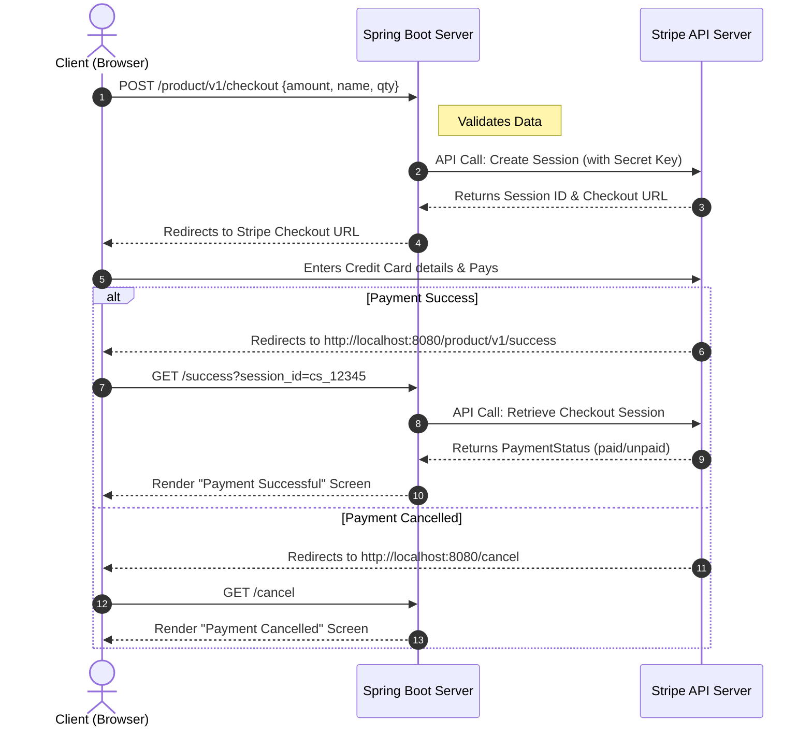

# Stripe Payment Gateway Integration Guide (Spring Boot)

Integrating a payment gateway requires secure handling of monetary transactions, robust API communication, and seamless redirect flows. This guide walks you through integrating the **Stripe Payment Gateway** into a Spring Boot application using the official Stripe Java SDK.

---

## 1. The Payment Flow Architecture

Before writing code, it is crucial to understand the exact redirect flow that occurs when a user initiates a checkout payment using Stripe Checkout Sessions.



---

## 2. Project Setup & Dependencies

To communicate with Stripe's backend, you must utilize their official Java SDK.

### `pom.xml` Injection
```xml
<dependency>
    <groupId>com.stripe</groupId>
    <artifactId>stripe-java</artifactId>
    <version>24.3.0-beta.1</version>
</dependency>
```

### `application.properties`
You must obtain a secret key from your Stripe Developer Dashboard. **Never** hardcode this key directly into your Java classes; always inject it via properties.

```properties
spring.application.name=stripe-payment

# Replace this with your actual Stripe Secret Key (Starts with sk_test_...)
stripe.secretKey=YOUR_STRIPE_SECRET_KEY
```

---

## 3. Data Transfer Objects (DTOs)

Create structured objects to cleanly marshal JSON data moving between your Client React/Angular frontend and your Spring Boot backend.

### 1. `ProductRequest.java` 
(The payload your Frontend sends to your Backend to trigger a purchase)
```java
package com.paymentservice.dto;

import lombok.AllArgsConstructor;
import lombok.Data;
import lombok.NoArgsConstructor;

@Data
@AllArgsConstructor
@NoArgsConstructor
public class ProductRequest {
    private String name;      // ex: "Premium Subscription"
    private Long amount;      // ex: 2000 (Stripe calculates in cents. $20.00 = 2000)
    private Long quantity;    // ex: 1
    private String currency;  // ex: "USD"
}
```

### 2. `StripeResponse.java` 
(The payload your Backend replies to the Frontend containing the crucial redirection URL)
```java
package com.paymentservice.dto;

import lombok.AllArgsConstructor;
import lombok.Builder;
import lombok.Data;
import lombok.NoArgsConstructor;

@Data
@AllArgsConstructor
@NoArgsConstructor
@Builder
public class StripeResponse {
    private String status;
    private String message;
    private String sessionId;   // Needed to verify payment success later
    private String sessionUrl;  // The actual Stripe UI the user must be redirected to
}
```

---

## 4. The Service Layer (`StripeService.java`)

This service isolates all external API communications to Stripe. It builds the Line Item configurations and requests a secure Checkout Session from Stripe.

```java
package com.paymentservice.service;

import com.paymentservice.dto.ProductRequest;
import com.paymentservice.dto.StripeResponse;
import com.stripe.Stripe;
import com.stripe.exception.StripeException;
import com.stripe.model.checkout.Session;
import com.stripe.param.checkout.SessionCreateParams;

import org.springframework.beans.factory.annotation.Value;
import org.springframework.stereotype.Service;

@Service
public class StripeService {

    // Safely injects the Secret Key from application.properties
    @Value("${stripe.secretKey}")
    private String secretKey;

    public StripeResponse checkoutProducts(ProductRequest productRequest) {
        
        // 1. Authenticate your server with the Stripe API
        Stripe.apiKey = secretKey;

        // 2. Define the exact Product Metadata
        SessionCreateParams.LineItem.PriceData.ProductData productData =
                SessionCreateParams.LineItem.PriceData.ProductData.builder()
                        .setName(productRequest.getName())
                        .build();

        // 3. Define the Price details attached to the Product
        SessionCreateParams.LineItem.PriceData priceData =
                SessionCreateParams.LineItem.PriceData.builder()
                        .setCurrency(productRequest.getCurrency() != null ? productRequest.getCurrency() : "USD")
                        .setUnitAmount(productRequest.getAmount())
                        .setProductData(productData)
                        .build();

        // 4. Bundle the Price and Quantity into an actionable Cart Line Item
        SessionCreateParams.LineItem lineItem =
                SessionCreateParams.LineItem.builder()
                        .setQuantity(productRequest.getQuantity())
                        .setPriceData(priceData)
                        .build();

        // 5. Build the master Session configurations defining the redirect loops
        SessionCreateParams params =
                SessionCreateParams.builder()
                        .setMode(SessionCreateParams.Mode.PAYMENT)
                        // Dynamic interpolation: Stripe will replace {CHECKOUT_SESSION_ID} before redirecting the user back
                        .setSuccessUrl("http://localhost:8080/product/v1/success?session_id={CHECKOUT_SESSION_ID}")
                        .setCancelUrl("http://localhost:8080/cancel")
                        .addLineItem(lineItem)
                        .build();
        
        // 6. Execute the API call to Stripe Servers to generate the Session URL
        Session session = null;
        try {
            session = Session.create(params);
        } catch (StripeException e) {
            e.printStackTrace();
            // TODO: In production, throw a custom exception here to be caught by a GlobalExceptionHandler
        }

        // 7. Parse the Stripe Session object and return our custom formatted DTO
        StripeResponse response = new StripeResponse();
        response.setStatus("SUCCESS");
        response.setMessage("Payment session created successfully");
        response.setSessionId(session.getId());
        response.setSessionUrl(session.getUrl());
        
        return response;
    }
}
```

---

## 5. The Controller Layer (`ProductCheckoutController.java`)

This manages your REST endpoints. It receives the localized HTTP triggers from the user's browser, kicks off the Service logic, and catches the return callbacks from Stripe.

```java
package com.paymentservice.controller;

import org.springframework.http.HttpStatus;
import org.springframework.http.ResponseEntity;
import org.springframework.web.bind.annotation.*;

import com.paymentservice.dto.ProductRequest;
import com.paymentservice.dto.StripeResponse;
import com.paymentservice.service.StripeService;
import com.stripe.Stripe;
import com.stripe.exception.StripeException;
import com.stripe.model.checkout.Session;

@RestController
@RequestMapping("/product/v1")
public class ProductCheckoutController {

    private final StripeService stripeService;

    public ProductCheckoutController(StripeService stripeService) {
        this.stripeService = stripeService;
    }

    /**
     * Endpoint 1: Initiates the Checkout flow.
     * The Frontend calls this, receives the response, and executes a `window.location.href = response.sessionUrl;`
     */
    @PostMapping("/checkout")
    public ResponseEntity<StripeResponse> checkoutProducts(@RequestBody ProductRequest productRequest) {
        StripeResponse stripeResponse = stripeService.checkoutProducts(productRequest);
        return ResponseEntity.status(HttpStatus.OK).body(stripeResponse);
    }
    
    /**
     * Endpoint 2: The Success Callback.
     * Stripe redirects the user here IF the credit card clears successfully.
     * We MUST strictly verify this on our backend to prevent users from just manually typing "/success" into their browser.
     */
    @GetMapping("/success")
    public ResponseEntity<String> handleSuccess(@RequestParam("session_id") String sessionId) {
        
        // Reminder: Ensure this is safely grabbed from environment variables in production!
        Stripe.apiKey = "YOUR_STRIPE_SECRET_KEY"; 

        try {
            // Actively reach out to Stripe Server-to-Server to verify this transaction wasn't spoofed
            Session session = Session.retrieve(sessionId);
            String paymentStatus = session.getPaymentStatus();

            if ("paid".equalsIgnoreCase(paymentStatus)) {
                System.out.println("✅ Payment Verification Passed");
                // Normally, you would update your Database here: orderRepository.updateStatus(orderId, "PAID");
                return ResponseEntity.ok("Payment successful and verified!");
            } else {
                System.out.println("❌ Payment Verification Failed: Security Risk");
                return ResponseEntity.status(400).body("Payment not completed");
            }

        } catch (StripeException e) {
            e.printStackTrace();
            return ResponseEntity.status(500).body("Stripe verification error occurred");
        }
    }

    /**
     * Endpoint 3: The Cancel Callback.
     * Stripe redirects the user here if they click the "Back/Cancel" button on the Stripe UI.
     */
    @GetMapping("/cancel")
    public ResponseEntity<String> handleCancel() {
        System.out.println("❌ Payment cancelled by user.");
        return ResponseEntity.ok("Payment cancelled");
    }
}
```
