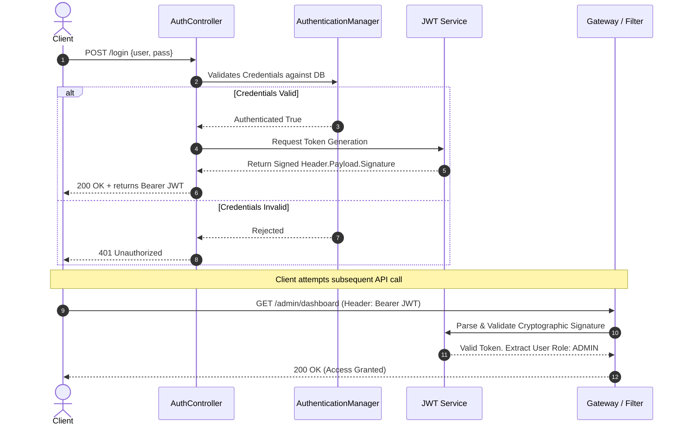

# Comprehensive Guide to Spring Security & JWT Microservices

Securing a Microservices architecture is immensely complex because a single client request can bounce across 5 different APIs. To handle this, we rely heavily on **Spring Security** combined with **JSON Web Tokens (JWT)** for stateless, secure, cross-network authentication.

---

## 1. Core Principles of Spring Security

1. **Authentication:** Proving *who* you are (Username/Password matching).
2. **Authorization:** Defining exactly *what* you can do (Role-Based Access Control).
3. **Protection against Attacks:**
   - **CSRF (Cross-Site Request Forgery):** Blocks attackers from hijacking a user's browser session and firing malicious API calls automatically.
   - **Session Fixation:** Destroys and regenerates an entirely new Session ID upon a successful login, preventing attackers from forcing you into a hijacked session.
   - **Clickjacking:** Prevents malicious websites from rendering your banking/admin pages invisibly via HTML `iframes` to trick users into clicking buttons securely.
   - **Brute Force Defense:** Stopping automated scripts from guessing one million passwords a second via rate-limiting and account lockouts!

---

## 2. Stateless Architecture vs. Stateful Sessions

| Architecture Type | Description |
| :--- | :--- |
| **Stateful (Legacy)** | The Spring Server remembers who you are. It creates a `SessionId` upon login, stores a copy in its RAM, and gives you a cookie copy. Works terribly in Microservices because Server B doesn't share Server A's RAM. |
| **Stateless (Modern/JWT)** | The Spring Server remembers NOTHING. After a successful login, it cryptographically signs a **JWT Token** and hands it to the Client. The Client must attach this token to the Header of every future request. |

### The Anatomy of a JWT
A JWT is separated by periods: `Header.Payload.Signature`

1. **Header:** Dictates the hashing algorithm used `{"alg": "HS256"}`
2. **Payload:** The actual public data (The username, role, and expiration timestamp).
3. **Signature:** The unbreakable cryptographic hash generated using your Server's private configuration Secret Key.

---

## 3. JWT Login & Authorization Flow Architecture



---

## 4. Building the Authentication Service

### 1. `JwtService.java` (The Token Generator/Validator)

**Dependencies required:** `java-jwt` (com.auth0).

```java
import java.util.Date;
import org.springframework.stereotype.Service;
import com.auth0.jwt.JWT;
import com.auth0.jwt.algorithms.Algorithm;

@Service
public class JwtService {

    // Must be kept perfectly hidden in application.properties in production!
    private static final String SECRET_KEY = "my-super-secret-key-that-is-long-enough";
    private static final long EXPIRATION_TIME = 86400000; // 24 Hours in Millis

    public String generateToken(String username, String role) {
        return JWT.create()
            .withSubject(username)
            .withClaim("role", role) // Injects specific auth roles into the token
            .withIssuedAt(new Date())
            .withExpiresAt(new Date(System.currentTimeMillis() + EXPIRATION_TIME))
            .sign(Algorithm.HMAC256(SECRET_KEY)); // Cryptographically seals the token
    }

    public String validateTokenAndRetrieveSubject(String token) {
        // Automatically throws an exception if the signature was tampered with by an attacker
        return JWT.require(Algorithm.HMAC256(SECRET_KEY))
            .build()
            .verify(token)
            .getSubject();
    }
}
```

### 2. `CustomerUserDetailsService.java` (Database Liaison)
Implements Spring Security's native interface so the framework knows *how* to find a user in your custom MySQL/Postgres Database tables.

```java
import org.springframework.beans.factory.annotation.Autowired;
import org.springframework.security.core.authority.SimpleGrantedAuthority;
import org.springframework.security.core.userdetails.UserDetails;
import org.springframework.security.core.userdetails.UserDetailsService;
import org.springframework.security.core.userdetails.UsernameNotFoundException;
import org.springframework.stereotype.Service;

import java.util.Collections;

@Service
public class CustomerUserDetailsService implements UserDetailsService {
    
    @Autowired
    private UserRepository userRepository;

    @Override
    public UserDetails loadUserByUsername(String username) throws UsernameNotFoundException {
        User user = userRepository.findByUsername(username);
        
        // Translates your Custom Entity into a native Spring Security User Object, forcefully injecting their DB Role
        return new org.springframework.security.core.userdetails.User(
            user.getUsername(),
            user.getPassword(),
            Collections.singleton(new SimpleGrantedAuthority(user.getRole()))
        );
    }
}
```

### 3. `JwtFilter.java` (The Gatekeeper)
Fires on **every single incoming HTTP request**. It intercepts the headers, searches for the `Bearer ` string, extracts the token, validates its math, and tells Spring Security "This user is legally allowed to pass."

```java
import jakarta.servlet.FilterChain;
import jakarta.servlet.ServletException;
import jakarta.servlet.http.HttpServletRequest;
import jakarta.servlet.http.HttpServletResponse;
import org.springframework.beans.factory.annotation.Autowired;
import org.springframework.security.authentication.UsernamePasswordAuthenticationToken;
import org.springframework.security.core.context.SecurityContextHolder;
import org.springframework.security.web.authentication.WebAuthenticationDetailsSource;
import org.springframework.stereotype.Component;
import org.springframework.web.filter.OncePerRequestFilter;
import java.io.IOException;

@Component
public class JwtFilter extends OncePerRequestFilter {

    @Autowired
    private JwtService jwtService;

    @Autowired
    private CustomerUserDetailsService userDetailsService;

    @Override
    protected void doFilterInternal(HttpServletRequest request, HttpServletResponse response, FilterChain filterChain) 
        throws ServletException, IOException {

        // 1. Sniff the header
        String authHeader = request.getHeader("Authorization");

        // 2. Validate format
        if (authHeader != null && authHeader.startsWith("Bearer ")) {
            String jwt = authHeader.substring(7);
            
            // 3. Crack open the token to read who is calling
            String username = jwtService.validateTokenAndRetrieveSubject(jwt);

            // 4. Inject them securely into the current Server context
            if (username != null && SecurityContextHolder.getContext().getAuthentication() == null) {
                var userDetails = userDetailsService.loadUserByUsername(username);
                var authToken = new UsernamePasswordAuthenticationToken(userDetails, null, userDetails.getAuthorities());
                authToken.setDetails(new WebAuthenticationDetailsSource().buildDetails(request));
                
                // Officially logs the user into memory for this specific isolated request
                SecurityContextHolder.getContext().setAuthentication(authToken);
            }
        }
        
        // Let the request continue processing towards the Controller
        filterChain.doFilter(request, response);
    }
}
```

### 4. `AppSecurityConfig.java` (The Master Configuration)
Disables legacy security measures (like CSRF, due to our stateless JWT architecture) and dictates exactly what endpoints are public vs protected.

```java
import org.springframework.context.annotation.Bean;
import org.springframework.context.annotation.Configuration;
import org.springframework.security.config.annotation.web.builders.HttpSecurity;
import org.springframework.security.config.annotation.web.configuration.EnableWebSecurity;
import org.springframework.security.config.http.SessionCreationPolicy;
import org.springframework.security.crypto.bcrypt.BCryptPasswordEncoder;
import org.springframework.security.crypto.password.PasswordEncoder;
import org.springframework.security.web.SecurityFilterChain;
import org.springframework.security.web.authentication.UsernamePasswordAuthenticationFilter;

@Configuration
@EnableWebSecurity
public class AppSecurityConfig {
    
    @Autowired
    private JwtFilter jwtFilter;

    // Defines which endpoints can be accessed WITHOUT a JWT
    String[] publicEndpoints = {
        "/api/v1/auth/register",
        "/api/v1/auth/login",
        "/swagger-ui.html",
        "/swagger-ui/**",
        "/v3/api-docs/**"
    };

    @Bean
    public PasswordEncoder getEncoder() {
        return new BCryptPasswordEncoder(); // Irreversible hashing algorithm
    }

    @Bean
    public SecurityFilterChain securityConfig(HttpSecurity http) throws Exception {
        
        http.csrf(csrf -> csrf.disable()) // Disable CSRF since we are strictly using API requests/JWTs
            
            // Enforce Statelessness
            .sessionManagement(session -> session.sessionCreationPolicy(SessionCreationPolicy.STATELESS)) 
            
            .authorizeHttpRequests(req -> {
                req.requestMatchers(publicEndpoints).permitAll() // Anyone can register or login
                   
                   // Role Based Access: Automatically prepends "ROLE_" to this check
                   .requestMatchers("/api/v1/admin/**").hasRole("ADMIN") 
                   
                   .anyRequest().authenticated(); // All other endpoints demand a valid JWT token
            })
            
            // Forces Spring to run our custom JWT Filter BEFORE it ever attempts standard security checks
            .addFilterBefore(jwtFilter, UsernamePasswordAuthenticationFilter.class);
            
        return http.build();
    }
}
```
