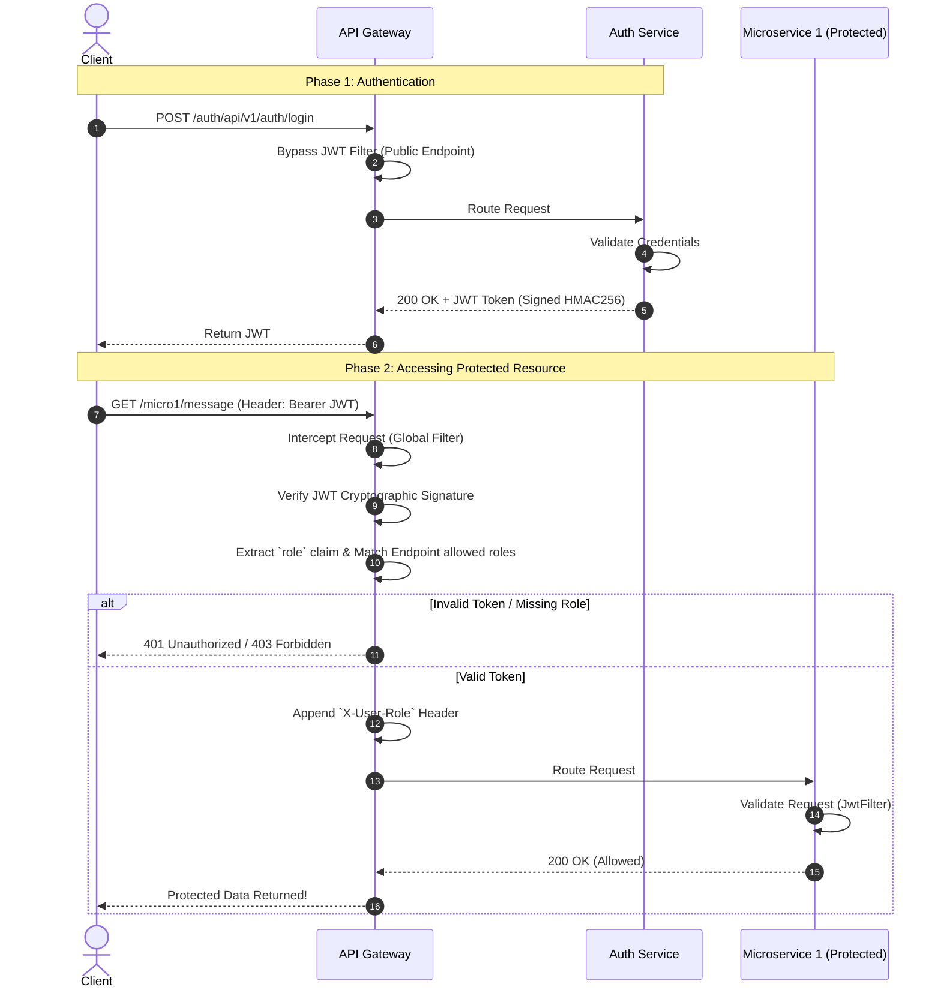

# Spring Security in Microservices Architecture

Implementing Security in a Microservices ecosystem requires a fundamentally different approach compared to monolithic applications. Instead of managing stateful sessions, an **API Gateway** acts as the single entry point, orchestrating requests and validating **JSON Web Tokens (JWT)** before routing traffic to downstream services like Authentication or specific business microservices.

---

## 1. System Architecture Flow

The architecture consists of three main components:
1. **API Gateway (`API-Gate`)**: Validates incoming JWTs globally and routes traffic.
2. **Auth Service (`authservice`)**: Handles User Registration, Authentication, and signed JWT Generation.
3. **Protected Microservice (`microservices-1`)**: The downstream API enforcing strictly authenticated, Role-Based Access interactions.



---

## 2. API Gateway: The Global Gatekeeper

Instead of validating tokens redundantly in every single downstream service, the API Gateway centralizes this process.

### `JwtAuthenticationFilter.java` Breakdown
This filter forces itself (`GlobalFilter`) to execute on every incoming network request.

```java
@Component
public class JwtAuthenticationFilter implements GlobalFilter, Ordered {

    // Must match the secret used by the Auth Service to successfully verify the signature!
    private static final String SECRET_KEY = "secret12345";

    // 1. Define Public APIs
    private static final List<String> openApiEndpoints = List.of(
        "/auth/api/v1/auth/login",
        "/auth/api/v1/auth/register"
    );

    // 2. Map Downstream Route Protection
    private static final Map<String, List<String>> protectedEndpointsWithRoles = Map.of(
        "/micro1/message", List.of("ROLE_ADMIN")
    );

    @Override
    public Mono<Void> filter(ServerWebExchange exchange, GatewayFilterChain chain) {
        String requestPath = exchange.getRequest().getURI().getPath();

        // Let Login/Register pass directly
        if (isPublicEndpoint(requestPath)) {
            return chain.filter(exchange);
        }

        // Validate headers forcefully
        String authHeader = exchange.getRequest().getHeaders().getFirst("Authorization");
        if (authHeader == null || !authHeader.startsWith("Bearer ")) {
            exchange.getResponse().setStatusCode(HttpStatus.UNAUTHORIZED);
            return exchange.getResponse().setComplete();
        }

        String token = authHeader.substring(7);

        try {
            // Verify HMAC256 Integrity
            DecodedJWT jwt = JWT.require(Algorithm.HMAC256(SECRET_KEY)).build().verify(token);

            // Extract the Role
            String role = jwt.getClaim("role").asString();

            // Perform hard-coded Gateway Role checks
            if (!isAuthorized(requestPath, role)) {
                exchange.getResponse().setStatusCode(HttpStatus.FORBIDDEN);
                return exchange.getResponse().setComplete();
            }

            // Propagate the role safely in headers to downstream services
            exchange = exchange.mutate()
                    .request(r -> r.header("X-User-Role", role))
                    .build();

        } catch (JWTVerificationException e) {
            exchange.getResponse().setStatusCode(HttpStatus.UNAUTHORIZED);
            return exchange.getResponse().setComplete();
        }

        return chain.filter(exchange); // Forward to the routed Microservice Component
    }
}
```

### `application.yml` (Gateway Target Routes)
Connects the Gateway paths to the backend registry `uri: lb://[SERVICE_NAME]`

```yaml
spring:
  cloud:
    gateway:
      routes:
        - id: auth-service-app
          uri: lb://AUTHSERVICEAPP
          predicates:
            - Path=/auth/**
          filters:
            - RewritePath=/auth/(?<segment>.*), /${segment}
        
        - id: microservice-api-1
          uri: lb://MICROSERVICES-1
          predicates:
            - Path=/micro1/**
          filters:
            - RewritePath=/micro1/(?<segment>.*), /${segment}
```

---

## 3. The Authentication Service

The Auth Service performs the heavy lifting of interacting with the database and assigning cryptographic trust.

### `JwtService.java`
Uses HMAC256 to hash the `role` and `username` claims into an unbreakable token valid for 24 hours.

```java
import java.util.Date;
import org.springframework.stereotype.Service;
import com.auth0.jwt.JWT;
import com.auth0.jwt.algorithms.Algorithm;

@Service
public class JwtService {

    private static final String SECRET_KEY = "secret12345";
    private static final long EXPIRATION_TIME = 86400000; // 1 day

    public String generateToken(String username, String role) {
        return JWT.create()
            .withSubject(username)
            .withClaim("role", role)
            .withIssuedAt(new Date())
            .withExpiresAt(new Date(System.currentTimeMillis() + EXPIRATION_TIME))
            .sign(Algorithm.HMAC256(SECRET_KEY));
    }
}
```

### `AppSecurityConfig.java` (Auth Service)
Disables CSRF, exposes Public endpoints, configures the `DaoAuthenticationProvider`, and forces the `JwtFilter` into the Spring Web filter map.

```java
@Configuration
@EnableWebSecurity
public class AppSecurityConfig {

    @Autowired
    private JwtFilter filter; // Applies to sub-methods within the auth service itself

    String[] publicEndpoints = {
        "/api/v1/auth/register",
        "/api/v1/auth/login",
        "/v3/api-docs/**",
        "/eureka/**" // Crucial to allow Eureka Heartbeats
    };

    @Bean
    public SecurityFilterChain securityConfig(HttpSecurity http) throws Exception{
        http.authorizeHttpRequests( req -> {
            req.requestMatchers(publicEndpoints).permitAll()
               .requestMatchers("/api/v1/admin/welcome").hasAnyRole("ADMIN","USER")
               .anyRequest().authenticated();			
        })
        .authenticationProvider(authProvider())
        .addFilterBefore(filter, UsernamePasswordAuthenticationFilter.class);
        
        return http.csrf().disable().build(); // Required for strict REST/Stateless microservice designs
    }
}
```

---

## 4. Protected Downstream Services

When a request successfully bypasses the Gateway, the downstream service (`microservices-1`) must also perform validation. Even though the Gateway already processed the JWT, the microservice runs its own `SecurityFilterChain` to prevent unauthorized internal network calls!

### `AppSecurityConfig.java` Sector Check

```java
@Configuration
@EnableWebSecurity
public class AppSecurityConfig {
    
    @Autowired
    private JwtFilter filter; // Redundant microservice-side token validation

    String[] publicEndpoints = {
        "/v3/api-docs/**",
        "/actuator/**", 
        "/eureka/**"
    };

    @Bean
    public SecurityFilterChain securityConfig(HttpSecurity http) throws Exception {
        
        http.authorizeRequests(req -> {
            req.requestMatchers(publicEndpoints).permitAll()
                .anyRequest().authenticated(); // Every standard route requires explicit authentication
        })
        .addFilterBefore(filter, UsernamePasswordAuthenticationFilter.class);
        
        return http.csrf().disable().build();
    }
}
```
