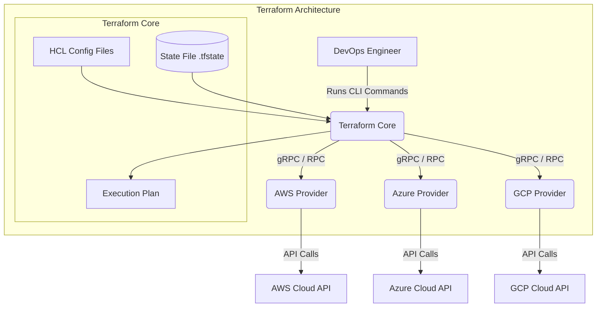
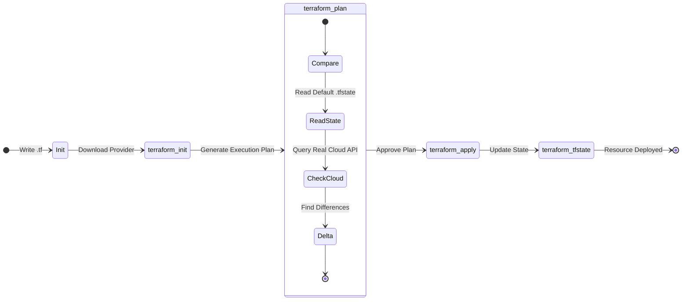
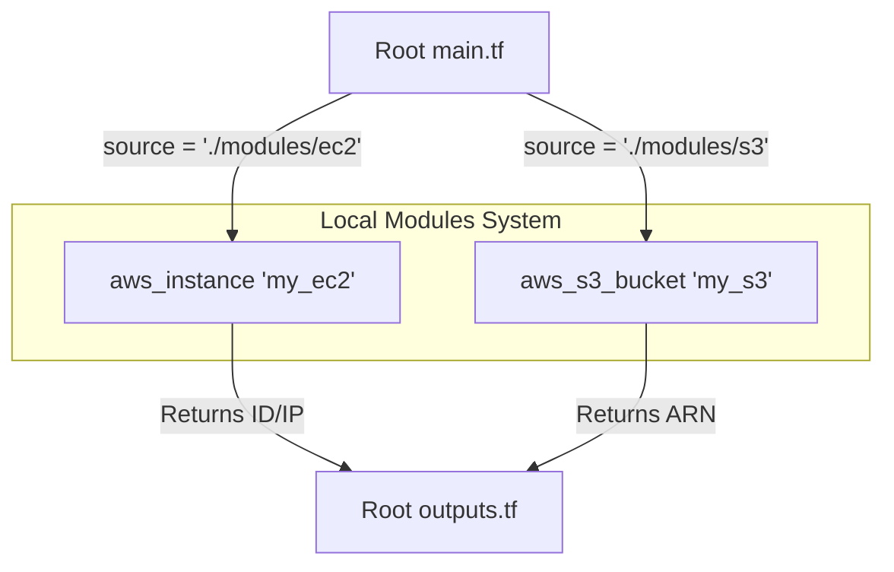

# Comprehensive & In-Depth Guide to Terraform Architecture

Terraform is a profoundly powerful **Infrastructure as Code (IaC)** tool developed by HashiCorp. It uses **HashiCorp Configuration Language (HCL)** to automatically provision, update, and manage infrastructure across dominant cloud platforms (AWS, GCP, Azure) reliably and predictably.

By defining infrastructure as text-based code, organizations can version-control their physical networks, servers, and databases precisely like application source code.

---

## 1. Terraform Core Architecture

Terraform operates using a plugin-based architecture, separating its foundational execution engine from the specific cloud platform implementations.



1. **Terraform Core:** The central engine that reads your `.tf` files, checks the current state (`.tfstate`), and builds the dependency graph to dictate what needs to be created, updated, or destroyed.
2. **Providers:** Executable plugins (downloaded during `terraform init`) that map Terraform's generic instructions to specific Cloud REST APIs.

---

## 2. Syntax Fundamentals

Terraform code is built using **Blocks**. A block is defined by a type, a label, and a body containing strictly typed key-value pairs.

### Provider Declaration
The `provider` block configures the specific cloud API connection.
```hcl
provider "aws" {
  region     = "ap-south-1"
  access_key = "YOUR_ACCESS_KEY"
  secret_key = "YOUR_SECRET_KEY"
}
```

### Resource Blocks
The `resource` block declares a physical infrastructure component to be managed.
```hcl
resource "aws_instance" "vm_1" {
  ami             = "ami-id"               # Abstract Machine Image
  instance_type   = "t2.micro"             # Hardware sizing
  key_name        = "devopssession"        # SSH Access Key
  security_groups = ["default"]            # Firewall rules
  
  tags = {
    Name = "LinuxVM"
  }
}
```

---

## 3. Terraform State Management Lifecycle

State is arguably the most critical component of Terraform. The **State File (`terraform.tfstate`)** serves as the single source of truth mapping your HCL code to real-world cloud resources.



- **Avoid Duplicate Creation:** If `main.tf` asks for 1 server, and 1 server already exists in `.tfstate`, Terraform does nothing.
- **Dependency Mapping:** State tracks implicit dependencies (e.g., an EC2 instance cannot be booted until its underlying VPC Network is created).

---

## 4. Operational Commands Lifecycle

To interact with a script, we run predefined CLI commands sequentially:

1. `terraform init` : Initializes the directory, downloading the necessary provider plugins.
2. `terraform validate` : Strictly syntax-checks your code locally.
3. `terraform fmt` : Handsomely auto-formats your `.tf` scripts for pristine indentation.
4. `terraform plan` : Performs a "Dry-Run" showing exactly what resources will be created/destroyed, saving you from disastrous typos!
5. `terraform apply` : Commits the script to the cloud. *(Append `--auto-approve` to skip the interactive YES prompt).*
6. `terraform destroy` : Nukes all infrastructure natively tracked by this project file.

---

## 5. Variable Operations

Variables allow Terraform scripts to be universally dynamic and highly reusable.

### Input Variables (`variable`)
Input variables feed dynamic values *into* your creation modules.
```hcl
variable "ami" {
    description = "Amazon machine image id"
    default     = "ami-0d682f26195e9ec0f"
    type        = string
}
```

### Output Variables (`output`)
Output variables print important runtime data to the console *after* successful creation (like dynamic IP addresses).
```hcl
output "ec2_vm_public_ip" {
  value = aws_instance.linux_vm.public_ip
}
```

### Iteration & Looping (`count`)
Using the `count` meta-argument to iterate and deploy `locals` arrays simultaneously:
```hcl
locals {
  instances_count = 3
  instances_tags = [
    { Name = "Dev-Server" },
    { Name = "QA-Server" },
    { Name = "UAT-Server" }
  ]
}

resource "aws_instance" "test_ec2_vm" {
  count = locals.instances_count
  tags  = locals.instances_tags[count.index]
}
```

---

## 6. Terraform Modular Architecture

A **Module** acts identically to a mathematical "Function." Instead of writing a massive, unmaintainable `main.tf` file, DevOps engineers abstract infrastructure into independent sub-folders.

### Module Invocation Architecture



### Real-World Folder Example
```text
tcs-project/
├── main.tf           (Root Invoker)
├── provider.tf       (AWS Auth)
├── outputs.tf        (Captures child output values)
└── modules/
    ├── ec2/          (Custom EC2 module builder)
    │   ├── inputs.tf
    │   ├── main.tf
    │   └── outputs.tf
    └── s3/           (Custom S3 module builder)
        ├── inputs.tf
        ├── main.tf
        └── outputs.tf
```

### The Root Level Invoker (`main.tf`)
```hcl
module "my_ec2" {
  source = "./modules/ec2"
}

module "my_s3" {
  source = "./modules/s3"
}

output "test_vm_public_ip" {
  value = module.my_ec2.a1  # Pulling the 'a1' output directly exposed by the EC2 child module!
}
```

---

## 7. Enterprise Workspaces & State Independence

If you want to use the **exact same module code** against 5 completely different AWS Environments (DEV, QA, UAT, PILOT, PROD), you utilize heavily isolated **Workspaces** and separated Input Variable state files.

| Environment | Standard Target Hardware |
| :--- | :--- |
| **Dev** | `t2.micro` |
| **QA / SIT** | `t2.micro` |
| **UAT** | `t2.medium` |
| **Pilot / Staging / Pre-Prod** | `t2.large` |
| **PROD (Production!)** | `t2.xlarge` |

### Supplying Direct Environment Variables
Execute your script by explicitly chaining a specific environmental `.tfvars` equivalent file target:
```bash
terraform apply --var-file=inputs-dev.tf
terraform apply --var-file=inputs-prod.tf
```

### Workspace Operations
Workspaces generate independent isolation layers completely decoupling `terraform.tfstate` files from each other, allowing multiple environments to exist safely without collision.
```bash
terraform workspace list       # Lists all known memory states
terraform workspace new dev    # Instantiates the 'dev' state
terraform workspace select qa  # Switches context strictly to 'qa'
```

---

## 8. Deprecation: Taints & Recreations

Occasionally, a resource (like an EC2 instance) becomes irreversibly corrupted or manually deleted via the AWS console by accident. Your codebase matches state, but the actual cloud target is dead.

### Historical Method (Deprecated)
The old methodology manually "tainted" an index to flag it for brutal internal recreation on the next plan.
```bash
terraform taint aws_instance.example
terraform apply
terraform untaint aws_instance.example # Removed the mark of death
```

### Modern Approach (Best Practice)
Immediately invoke a forced replace bypass explicitly inside your bash request to violently wipe and reinstall the cloud asset.
```bash
terraform apply -replace="aws_instance.example"
```
*You can alternatively manually destroy via `-target="aws_instance.example"` and aggressively apply afterwards.*
