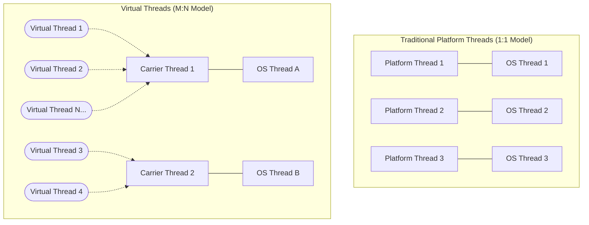
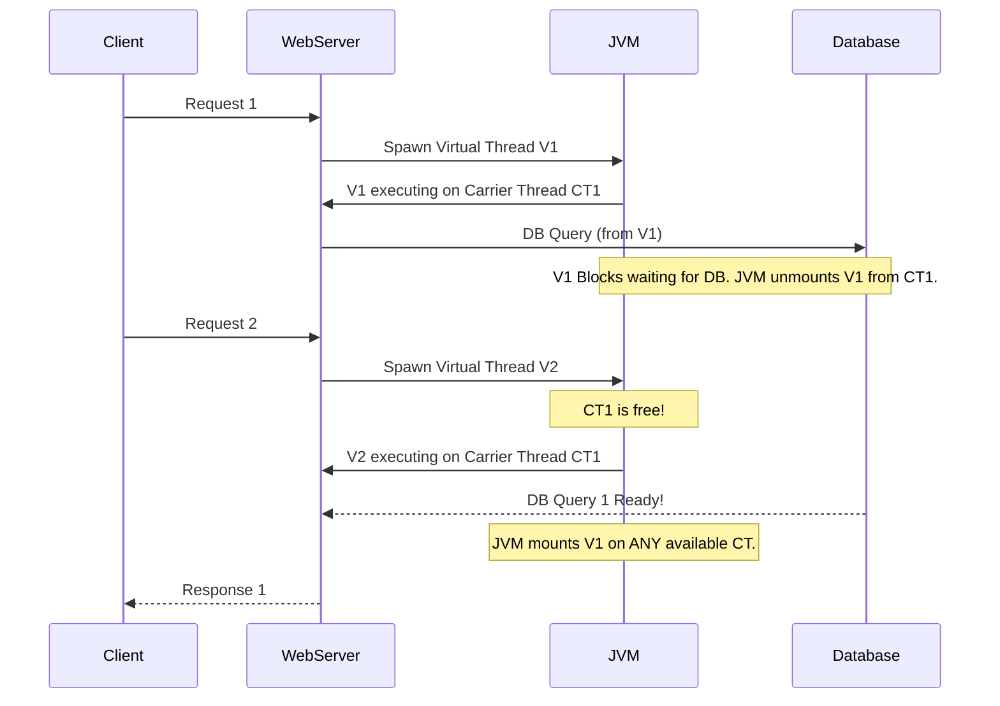
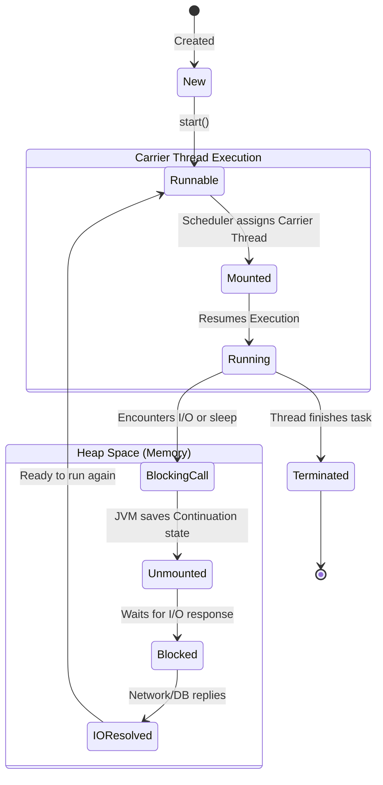

# Virtual Threads in Java

Virtual Threads, introduced as a preview feature in Java 19 and made a permanent feature in Java 21 (Project Loom), are lightweight threads that dramatically reduce the effort of writing, maintaining, and observing high-throughput concurrent applications.

---

## 1. What are Virtual Threads?

Traditionally, Java uses **Platform Threads** (often just called "Threads"), which are essentially wrappers around underlying operating system (OS) threads. OS threads are "heavy" – they take time to create, use substantial memory (typically a few megabytes per thread for the stack), and the OS can only support a limited number of them (typically a few thousand).

**Virtual Threads**, on the other hand, are "lightweight". They are managed entirely by the Java Virtual Machine (JVM) rather than the OS. They are so cheap to create that you can literally have **millions** of them running simultaneously without breaking a sweat or running out of memory.

**Key Difference:** A virtual thread is not tied to a specific OS thread. The JVM schedules many virtual threads onto a small pool of platform (OS) threads (called "carrier threads"). If a virtual thread blocks (e.g., waiting for a database response or reading a file), the JVM "unmounts" it from the carrier thread and lets another virtual thread use that carrier thread.

### Mermaid Diagram: Platform Threads vs. Virtual Threads



---

## 2. Real-Time Example: The "Blocking" Problem

Consider a web server that handles HTTP requests. 

**The Traditional Way (Thread-per-request model):**
Every incoming HTTP request gets its own Platform Thread. If the request needs to make a database call that takes 1 second, the Platform Thread just sits there doing nothing ("blocked") while consuming Megabytes of memory. If you get 10,000 parallel requests, you need 10,000 OS threads. The OS will likely crash (OutOfMemoryError) or spend all its CPU time just switching context between these heavy threads.

**The Reactive/Asynchronous Way (Callbacks):**
To solve this, frameworks (like Spring WebFlux, RxJava, or Node.js in JS) use "Non-blocking I/O". You do database calls asynchronously. While waiting, the thread is freed. However, this leads to complex code, known as "Callback Hell" or requires learning new programming models. The code is extremely hard to read and debug.

**The Virtual Thread Way:**
You write simple, synchronous, top-to-bottom blocking code exactly like the old days. But instead of using heavy Platform Threads, you use Virtual Threads. When the user requests the database, the Virtual Thread "blocks", but the underlying OS thread is instantly given to another Virtual Thread to handle a different user. 

### Mermaid Diagram: Request Handling



---

## 3. Internal Working of Virtual Threads (The Magic Behind it)

To understand how Virtual Threads achieve this incredible efficiency, we need to look under the hood. There are three core concepts that make this work: **Carrier Threads**, **Continuations**, and **Schedulers**.

### Key Concepts

1. **Carrier Thread:** A standard Platform (OS) thread. The JVM maintains a small pool of these (typically equal to the number of CPU cores). Virtual Threads only run when they are "mounted" to a Carrier Thread.
2. **Continuation:** This is the most critical piece. A Continuation is an object that captures the execution state of a thread (the call stack, variables, instructions). When a Virtual Thread blocks, its Continuation is saved to the heap memory. When it unblocks, the Continuation is restored.
3. **ForkJoinPool Scheduler:** The JVM uses a specialized `ForkJoinPool` as a scheduler. It is responsible for assigning (mounting) runnable Virtual Threads to available Carrier Threads.

### The Lifecycle (Mounting and Unmounting)

1. A Virtual Thread is created and starts running. It is **mounted** to a Carrier Thread.
2. The code execution reaches a blocking operation (e.g., `Thread.sleep()`, reading an HTTP response, or requesting data from a DB).
3. Instead of blocking the underlying Carrier Thread, the JVM intercepts the call.
4. The Virtual Thread **yields**. Its current state (the Continuation) is **unmounted** and saved to the JVM Heap (Memory).
5. The Carrier Thread is immediately freed! The `ForkJoinPool` scheduler grabs another pending Virtual Thread and mounts it to this now-free Carrier Thread.
6. Once the blocking operation finishes (e.g., the DB responds), the original Virtual Thread becomes "runnable" again.
7. The scheduler picks it up, mounts its saved Continuation onto *any* available Carrier Thread, and execution resumes exactly where it left off.

### Mermaid Diagram: Internal State Machine



---

## 4. How to Create Virtual Threads in Java code

Creating virtual threads is extremely simple using the new `Executors` factory methods or `Thread.ofVirtual()`.

### Example 1: Direct Creation
```java
public class VirtualThreadDemo {
    public static void main(String[] args) throws InterruptedException {
        
        // Creating and starting a virtual thread
        Thread vThread = Thread.ofVirtual().start(() -> {
            System.out.println("Hello from Virtual Thread: " + Thread.currentThread().getName());
        });
        
        vThread.join(); // Wait for it to finish
    }
}
```

### Example 2: The Executor Service (Handling 10,000 tasks)
```java
import java.time.Duration;
import java.util.concurrent.Executors;
import java.util.stream.IntStream;

public class VirtualThreadMassiveDemo {
    public static void main(String[] args) {
        long start = System.currentTimeMillis();
        
        // Creates a new Virtual Thread for EVERY single submitted task
        try (var executor = Executors.newVirtualThreadPerTaskExecutor()) {
            IntStream.range(0, 10_000).forEach(i -> {
                executor.submit(() -> {
                    try {
                        // Simulate a 1-second blocking I/O operation (e.g., DB call)
                        Thread.sleep(Duration.ofSeconds(1)); 
                    } catch (InterruptedException e) {
                        e.printStackTrace();
                    }
                    return i;
                });
            });
        } // The try-with-resources block waits for all threads to finish

        long end = System.currentTimeMillis();
        
        // This will print roughly 1000ms! 
        // 10,000 threads slept for 1s concurrently using only a handful of OS Threads.
        System.out.println("Time taken: " + (end - start) + "ms"); 
    }
}
```

*Note: If you replace `Executors.newVirtualThreadPerTaskExecutor()` with a standard cached thread pool (`Executors.newCachedThreadPool()`), running 10,000 heavy OS threads would likely crash your JVM or take significantly longer due to context switching overhead.*

---

## 5. Pros and Cons

### ✅ Pros

1. **Massive Throughput:** Perfect for I/O-bound applications (like web servers, microservices making API calls, or database operations). You can handle millions of concurrent connections efficiently.
2. **Simplified Code (No More Async Hell):** You can write simple, synchronous, blocking code (like `String response = httpClient.send()`). You don't need complex reactive programming paradigms (`Mono`, `Flux`, `CompletableFuture`).
3. **Easy Troubleshooting:** Stack traces and debugging tools work perfectly just like traditional threads, unlike reactive code where the stack trace is often disconnected and useless.
4. **Low Resource Consumption:** They consume a fraction of the memory footprint of platform threads since they don't hold heavily pre-allocated OS thread stacks.
5. **No Need for Thread Pools:** You don't pool Virtual Threads; they are so cheap you just create a new one for every task and throw it away when done.

### ❌ Cons / Limitations

1. **Not for CPU-Bound Tasks:** Virtual threads do not make your code run faster. If you have a task that purely crunches numbers (e.g., video rendering, complex math formatting), virtual threads won't help. They are for **I/O-bound** applications, where threads spend most of their time waiting.
2. **"Pinning" Issues (The synchronized block trap):** Currently, if a virtual thread performs a blocking operation while inside a `synchronized` block or while calling native code (JNI), it "pins" the carrier thread. This means the underlying OS thread *cannot* be freed to help other virtual threads. 
    * **Solution:** Use `ReentrantLock` instead of `synchronized` if you have long blocking operations inside the critical section.
3. **ThreadLocal Memory Leaks:** Because we typically create millions of virtual threads, using `ThreadLocal` variables can quickly lead to huge memory consumption. (Java 21 introduced **Scoped Values** as a safer alternative).

---

## 6. Summary

Virtual Threads represent a monumental shift in Java programming. They bridge the gap between human-readable synchronous code and high-performance asynchronous execution. By allowing the JVM to manage thousands of lightweight threads efficiently over a few OS threads, developers can write straightforward code capable of serving immense loads.
