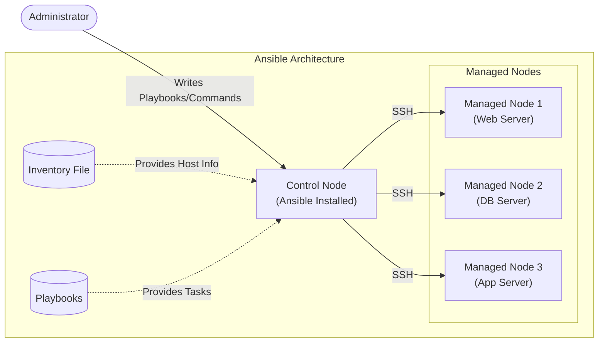
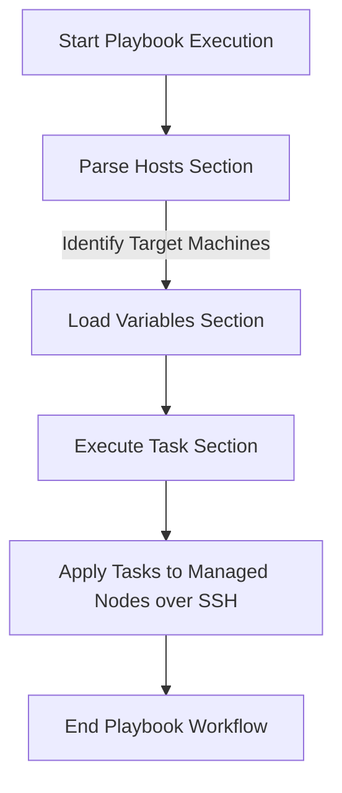

# Comprehensive Guide to Ansible

## 1. Introduction to Ansible
**Configuration As a Code (CAAC)**
Ansible is an open-source automation tool used primarily for:
- **Configuration Management**
- **Application Deployment**
- **File Transfer** (copying files from one machine to another)

*Examples of Configuration Management tools:* Chef, Puppet, and Ansible.

---

## 2. Basic Architecture

At its core, Ansible relies on a straightforward, agentless architecture.



### Core Components:
- **Control Node:** The machine where Ansible is installed and from which commands/playbooks are run.
- **Managed Nodes:** The target remote machines that Ansible configures and manages.
- **Inventory:** A file (typically `/etc/ansible/hosts`) listing the target machines, organized into groups (e.g., `webservers`, `dbservers`).
- **Playbooks:** YAML (`.yml`) files containing automation instructions and tasks.

---

## 3. How to Configure Ansible

### Step 1: VM Provisioning & Basic Setup
*Example:* Create 3 Amazon Linux `t2.micro` instances in AWS (1 Control Node, 2 Managed Nodes).

On **ALL** 3 machines, configure a dedicated user:
```bash
# Create user
sudo useradd ansible
sudo passwd ansible

# Grant sudo privileges without password
sudo visudo
# Add line: ansible ALL=(ALL) NOPASSWD: ALL

# Update SSH configuration to allow password auth (Note: PermitEmptyPasswords 'yes' based on notes, but generally PasswordAuthentication 'yes' is standard for key copy)
sudo vi /etc/ssh/sshd_config
# Set PasswordAuthentication "yes"

# Restart SSH service
sudo service sshd restart
```

### Step 2: Install Ansible (on Control Node ONLY)
Switch to the `ansible` user and install Python and Ansible:
```bash
sudo su ansible
cd ~

# Install Python & PIP
sudo yum install python3 -y
sudo yum -y install python3-pip

# Install Ansible
pip3 install ansible --user

# Verify Installation
ansible --version

# Create ansible configuration directory
sudo mkdir /etc/ansible
```

### Step 3: Configure SSH Key-Based Authentication
Generate an SSH key on the Control Node and copy it to all Managed Nodes:
```bash
# On Control Node (as ansible user)
ssh-keygen

# Copy key to Managed Nodes
ssh-copy-id ansible@<ManagedNode-Private-IP-address>
```

### Step 4: Update Host Inventory
Add the managed node details to the Ansible inventory file on the Control Node:
```bash
sudo vi /etc/ansible/hosts
```
*Example Inventory content:*
```ini
[webservers]
192.31.0.247

[dbservers]
192.31.0.17
```

### Step 5: Test Connectivity
Verify that the Control Node can reach all managed nodes:
```bash
ansible all -m ping
```

---

## 4. Ansible Ad-Hoc Commands

Ad-hoc commands allow you to run one-time tasks on remote machines without writing a full playbook.

### Basic Syntax:
```bash
ansible [all/group-name/host] -m <module> -a "<arguments>"
```
- `all / group-name / host`: Targets all hosts, a specific group, or a specific IP.
- `-m`: Specifies the Ansible module.
- `-a`: Passes arguments to the module.

### Common Examples:
1. **Test Connectivity (Ping Module):**
   ```bash
   ansible all -m ping
   ansible webservers -m ping
   ```
2. **Run Shell Commands:**
   ```bash
   ansible all -m shell -a "date"
   ansible dbservers -m shell -a "df -h"
   ```
3. **Install Packages (Yum/Apt):**
   ```bash
   # RHEL/CentOS
   ansible all -m yum -a "name=git state=present" -b
   
   # Ubuntu/Debian
   ansible all -m apt -a "name=nginx state=latest update_cache=yes"
   ```
4. **Manage Services:**
   ```bash
   ansible webservers -m service -a "name=httpd state=started"
   ansible dbservers -m service -a "name=mysql state=stopped"
   ```
5. **Copy Files:**
   ```bash
   ansible all -m copy -a "src=/home/user/local.conf dest=/etc/config.conf mode=0644"
   ```

---

## 5. Ansible Playbooks

Playbooks are the core of Ansible's configuration management. They define operations using **YAML** (YAML Ain't Markup Language), a human-readable data serialization format.



### Playbook Structure
A standard playbook consists of three main sections:
1. **Host Section:** Defines the target machines where tasks will be executed.
2. **Variable Section:** Declares variables to avoid hardcoding values.
3. **Task Section:** Defines the list of operations to perform using Ansible modules.

### Useful Playbook Execution Commands
```bash
# Run the playbook
ansible-playbook <file.yml>

# Check syntax before running
ansible-playbook <file.yml> --syntax-check

# See which hosts will be affected
ansible-playbook <file.yml> --list-hosts

# Execute interactively (confirm each task with y/n/c)
ansible-playbook <file.yml> --step

# Run in verbose mode for debugging
ansible-playbook <file.yml> -vvv
```

### Playbook Examples

**Example 1: Ping all managed nodes**
```yaml
---
- hosts: all
  tasks:
    - name: ping all managed nodes
      ping:
...
```

**Example 2: Create a new file**
```yaml
---
- hosts: all
  tasks:
    - name: create a file
      file: 
        path: /home/ansible/t1.txt
        state: touch
...
```

**Example 3: Copy content to a file**
```yaml
---
- hosts: all
  tasks: 
    - name: copy content to file
      copy: 
        content: "Hello world\n" 
        dest: "/home/ansible/t1.txt"
...
```

**Example 4: Complete Web Server Setup**
```yaml
---
- hosts: webservers
  become: true  # use it if you need sudo privileges
  tasks:
    - name: install httpd package
      yum:
        name: httpd
        state: latest
        
    - name: copy index.html file
      copy:
        src: index.html
        dest: /var/www/html/index.html
        
    - name: start httpd service
      service: 
        name: httpd
        state: started
...
```
