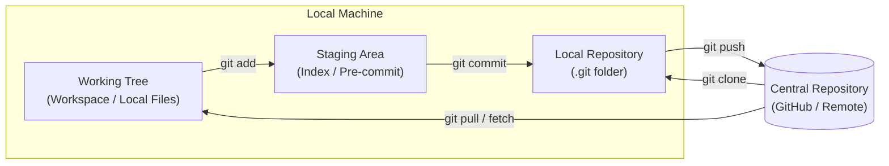
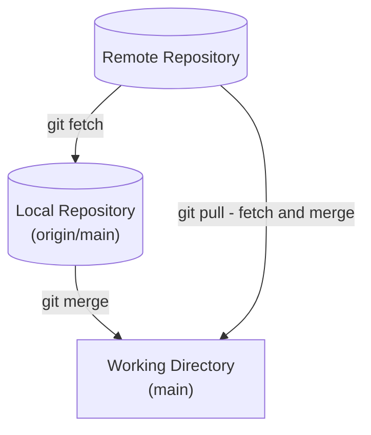
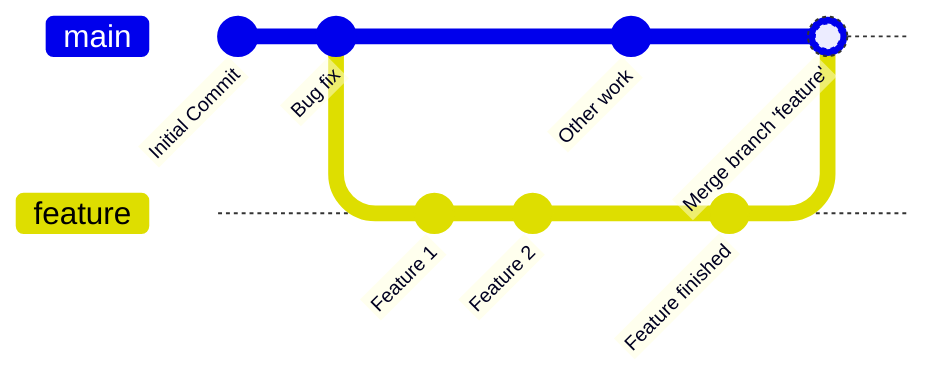

# Comprehensive Guide to Git & GitHub

## 1. What is a Source Code Management Tool?

Source Code Management (SCM) systems are essential for modern software development. They provide:
- **Version Control:** Keeps track of all changes made to the codebase over time.
- **Collaboration:** Enables multiple developers to work together on the same project seamlessly.
- **CI/CD Integration:** Integrates with tools (like GitHub Actions, Jenkins, Travis CI) to automate testing, building, and deploying code.

*Examples of SCM Tools:* GitHub, Bitbucket, ClearCase, SVN.

---

## 2. Getting Started with Git & GitHub

### Initial Setup (One-Time Configuration)
1. Create a GitHub account online.
2. Install Git on your local system.
3. Configure your name and email globally using the terminal:

```bash
git config --global user.name "Your Name"
git config --global user.email "your.email@example.com"
```

---

## 3. Git Architecture Explained

Understanding how Git manages files across different areas is crucial.



### The 4 Core Areas:
1. **Working Tree (Workspace):** Where your actual project files are stored on your local machine. You edit your files here.
2. **Staging Area (Index):** A "pre-commit" holding area. Before committing to the repository, you gather the snapshot of your modifications here using `git add`.
3. **Local Repository:** Where Git stores your project’s history on your local machine (inside the hidden `.git` folder). Commits are recorded here allowing you to browse history or revert changes.
4. **Central Repository (Remote):** Hosted on platforms like GitHub or GitLab. It serves as the main truth source shared among multiple contributors. Developers `push` and `pull` from here.

---

## 4. Essential Git Commands

Here are the most common Git commands you will use daily.

| Command | Purpose | Example Usage |
|---|---|---|
| `git init` | Initializes a new Git repository in the current directory (creates the `.git` folder). | `git init` |
| `git clone` | Downloads a complete copy of an existing remote repository to your local system. | `git clone https://github.com/user/repo.git` |
| `git status` | Shows the current state of your working directory (untracked, modified, or staged files). | `git status` |
| `git add` | Adds files to the Staging Area in preparation for a commit. | `git add .` (Adds all files) <br> `git add test.txt` |
| `git commit` | Saves the staged files into the local repository with a descriptive message. | `git commit -m "Fixed bug"` |
| `git push` | Pushes your local committed changes to the central remote repository. | `git push origin main` |
| `git pull` | Fetches AND merges changes from the remote repository directly into your working branch. | `git pull origin main` |
| `git log` | Displays the commit history (IDs, author, dates, messages). | `git log`<br>`git log --oneline` |
| `git restore` | Undoes changes. Used to discard local changes or unstage a staged file. | `git restore test.txt`<br>`git restore --staged test.txt` |
| `git rm` | Removes a file from both the working directory and the staging area (schedules it for deletion). | `git rm old_file.txt` |
| `git gui` | Opens a Graphical User Interface (GUI) tool for users who prefer visual interaction over CLI. | `git gui` |

---

## 5. Advanced Git Operations & Interview Concepts

### `git pull` vs `git fetch`



- **`git pull`:** Downloads changes from the remote and *automatically merges* them into your current working branch. Fast, but can cause merge conflicts.
- **`git fetch`:** Only downloads the changes from the remote repository (stored in hidden branches like `origin/main`), but *does not merge them*. It's safer because you can review the fetched changes before running `git merge` manually.

### `git stash`
Temporarily saves changes that are not yet ready to be committed, allowing you to switch branches safely without losing your modifications.
- Store changes: `git stash`
- Retrieve changes: `git stash apply`

### `git cherry-pick`
Used to apply a *specific* commit from one branch to another without merging the entire branch history.

**Common Interview Question:** 
> *You made 5 commits today, but you only want to move the 3rd commit to the main branch. How do you do it?*
> **Answer:** Use `git cherry-pick <commit-id>`. (Where `git merge` would bring in all 5 commits, cherry-pick specifically targets just that one).

---

## 6. Git Branching & Merging

Branching allows you to diverge from the main line of development and continue to do work without messing with that main line. This is heavily used for features, bug fixes, and experiments.

### Basic Branching Commands

| Command | Purpose |
|---|---|
| `git branch` | Lists all your local branches. The active branch has an asterisk `*`. |
| `git branch <branch-name>` | Creates a new branch based on your current commit. |
| `git checkout <branch-name>` | Switches to the specified branch. |
| `git checkout -b <branch-name>` | Creates a new branch and switches to it in one command. |
| `git branch -d <branch-name>` | Safely deletes a branch (prevents deletion if it has unmerged changes). |

### Merging vs. Rebasing

When you are done with a feature branch and want to integrate those changes back into `main`, you typically have two options: **Merge** or **Rebase**.

#### 1. Git Merge (`git merge <feature-branch>`)
Merges the specified branch's history into the current branch. It creates a new "Merge Commit" that ties the histories together.

**Pros:** It is a non-destructive operation. The existing branches are not changed in any way.
**Cons:** If the `main` branch is very active, doing this can create a cluttered, messy history.

#### 2. Git Rebase (`git rebase main`)
Rebasing compresses all the commits from your feature branch and reapplies them on top of the `main` branch. 

**Pros:** Creates a perfectly clean, linear project history without extra merge commits.
**Cons:** It rewrites history. **Never rebase public branches** that other developers are working on!



*The diagram above illustrates a standard merge workflow where a feature branch diverges and later merges back into the main timeline.*
