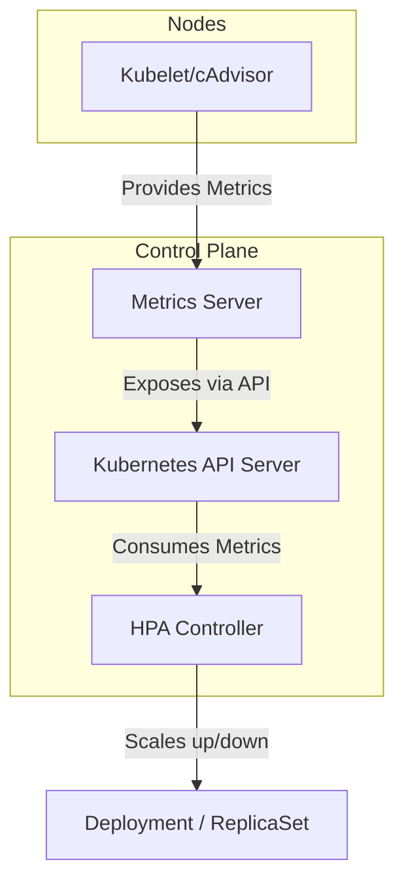

# Comprehensive Guide to Kubernetes HPA & Metrics Server

Horizontal Pod Autoscaler (HPA) automatically scales the number of Pods in a replication controller, deployment, replica set, or stateful set based on observed CPU utilization (or, with custom metrics support, on some other application-provided metrics).

To achieve this, the HPA controller relies on the **Metrics Server** to fetch resource metrics from the Kubelets and expose them via the Kubernetes API.

---

## 1. Kubernetes Metrics Server Overview

The Metrics Server is a scalable, efficient source of container resource metrics for Kubernetes built-in autoscaling pipelines. It collects resource metrics from Kubelets and exposes them via the `metrics.k8s.io` API, making them available for tools like HPA to monitor and act upon.

### The Autoscaling Workflow



### 1.1 Metrics Server Installation Components

The deployment of the Metrics Server requires several Kubernetes resources. Here is a breakdown of the standard deployment files used:

- `metrics-apiservice.yaml`: Registers the `metrics.k8s.io` API.
- `metrics-rbac.yaml`: Configures Roles and ClusterRoles to allow the Metrics Server to read pod/node metrics.
- `metrics-server-deployment.yaml`: The actual deployment running the Metrics Server pod (runs in the `kube-system` namespace).
- `metrics-server-service.yaml`: Exposes the Metrics Server internally to the cluster.
- `metrics-serviceaccount.yaml`: Defines the ServiceAccount used by the Metrics Server.

#### Example: `metrics-server-deployment.yaml` highlighting key arguments
```yaml
      containers:
      - args:
        - --cert-dir=/tmp
        - --secure-port=443
        - --kubelet-preferred-address-types=InternalIP,ExternalIP,Hostname
        - --kubelet-use-node-status-port
        - --metric-resolution=15s
        - --kubelet-insecure-tls # Important for local/testing environments
        image: k8s.gcr.io/metrics-server/metrics-server:v0.5.0
```

---

## 2. Horizontal Pod Autoscaler (HPA)

Once the Metrics Server is running, you can configure the HPA to watch your deployments. 

### Prerequisites for HPA

For HPA to work correctly on a Deployment, the target Deployment **MUST** have resource requests defined. Without `requests` defined, the HPA cannot calculate the percentage of resource utilization.

#### Example Deployment with Resource Requests (`Deployment.yml`)
```yaml
apiVersion: apps/v1
kind: Deployment
metadata:
  name: hpa-demo-deployment
spec:
  replicas: 1
  selector:
    matchLabels:
      run: hpa-demo-deployment
  template:
    metadata:
      labels:
        run: hpa-demo-deployment
    spec:
      containers:
      - name: hpa-demo-deployment
        image: k8s.gcr.io/hpa-example
        ports:
        - containerPort: 80
        resources:
          limits:
            cpu: 500m
          requests:   # <--- CRITICAL FOR HPA
            cpu: 200m
```

### 2.1 HPA Configuration (`HPA.yml`)

The HPA manifest targets the deployment and defines the scaling boundaries and thresholds.

```yaml
apiVersion: autoscaling/v1
kind: HorizontalPodAutoscaler
metadata:
  name: hpa-demo-deployment
spec:
  scaleTargetRef:
    apiVersion: apps/v1
    kind: Deployment
    name: hpa-demo-deployment # The deployment to scale
  minReplicas: 1 # Minimum number of pods
  maxReplicas: 10 # Maximum number of pods
  targetCPUUtilizationPercentage: 50 # Target average CPU utilization
```

### How HPA Calculates Scaling:

The HPA controller pulls the CPU utilization of all pods in the targeted deployment. It then calculates the target number of replicas using the ratio between the current metric value and the desired metric value:

**Formula:**
```
desiredReplicas = ceil[currentReplicas * ( currentMetricValue / desiredMetricValue )]
```

If the CPU utilization goes above `50%` of the requested `200m` CPU (so, > `100m` used on average), the HPA will begin to scale up the replicas linearly up to a maximum of `10`.

---

## 3. Implementation Steps

To implement this locally or in your cluster:

1. **Deploy Metrics Server:** Apply all files in your `Metric server` directory.
   ```bash
   kubectl apply -f metrics-server-deployment.yaml
   kubectl apply -f metrics-rbac.yaml
   # apply others...
   ```
2. **Verify Metrics Server:** Check if nodes are reporting metrics.
   ```bash
   kubectl top nodes
   kubectl top pods
   ```
3. **Deploy Target Application:** Apply your Deployment and Service.
   ```bash
   kubectl apply -f Deployment.yml
   kubectl apply -f Service.yml
   ```
4. **Deploy HPA:** Create the autoscaler targeting your deployment.
   ```bash
   kubectl apply -f HPA.yml
   ```
5. **Monitor HPA:** Watch the status of the HPA as it monitors the app.
   ```bash
   kubectl get hpa -w
   ```
