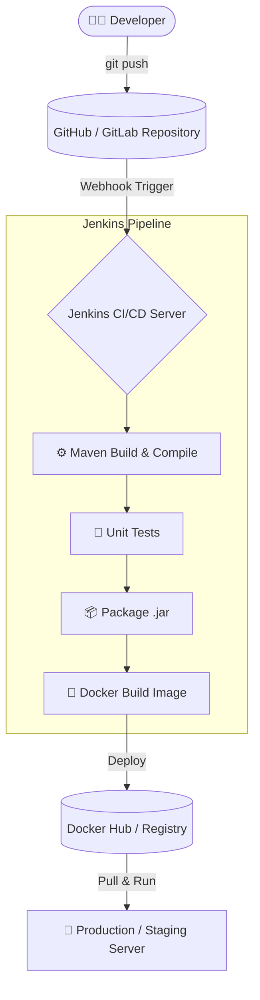

# Comprehensive Guide to Jenkins CI/CD

## 1. Introduction to Jenkins

Modern software development requires automating the build and deployment process to ensure applications iterate quickly and reliably across different environments (Dev, QA, Staging, UAT, Production).

### The Manual Process vs Automation
Traditionally, a developer would manually:
1. Pull source code from GitHub.
2. Compile the code.
3. Run Unit Testing.
4. Package the code (e.g., into a `.jar` file).
5. Create a Docker image.
6. Run the Docker image inside a container.

**Jenkins** is a popular open-source automation server that automates all these repetitive tasks. It is the heart of Continuous Integration (CI) and Continuous Deployment (CD).

### Key Features of Jenkins:
- **Automation:** Eliminates manual errors by automating code compilation, testing, and deployment.
- **Plugins:** Boasts over 1,800+ plugins integrating with GitHub, Docker, Kubernetes, Maven, SonarQube, and more.
- **Pipeline as Code:** Allows you to define your entire build process in a `Jenkinsfile` written in Groovy syntax.

---

## 2. Jenkins CI/CD Workflow Architecture



1. **Push:** Developers push code to a repository.
2. **Trigger:** Jenkins pulls the latest code (often triggered via a Webhook).
3. **Build:** Jenkins compiles the code using build tools like Maven.
4. **Artifact Generation:** An artifact is created (e.g., a `.jar` file or a Docker image).
5. **Deployment:** Jenkins deploys the artifact to the designated environment.

---

## 3. Setting Up Jenkins on a Linux VM (Ubuntu)

Jenkins requires a minimum of **4GB RAM** to run efficiently (e.g., AWS EC2 `t2.medium`). 

### Prerequisites:
Enable port **8080** in your AWS Security Group Inbound Rules.

### Installation Steps:
```bash
# Step 1: Install Java (Jenkins is a Java application)
sudo apt update
sudo apt install fontconfig openjdk-17-jre -y
java -version

# Step 2: Add Jenkins Repository & Keys
sudo wget -O /usr/share/keyrings/jenkins-keyring.asc https://pkg.jenkins.io/debian-stable/jenkins.io-2023.key
echo deb [signed-by=/usr/share/keyrings/jenkins-keyring.asc] https://pkg.jenkins.io/debian-stable binary/ | sudo tee /etc/apt/sources.list.d/jenkins.list > /dev/null

# Step 3: Install Jenkins
sudo apt-get update
sudo apt-get install jenkins -y

# Step 4: Start & Enable Jenkins Service
sudo systemctl enable jenkins
sudo systemctl start jenkins

# Step 5: Verify Status
sudo systemctl status jenkins
```

### Initial Configuration:
1. Open Jenkins in your browser: `http://<public-ip>:8080/`
2. Fetch the initial Admin Password:
   ```bash
   sudo cat /var/lib/jenkins/secrets/initialAdminPassword
   ```
3. Create your Admin Account and install the suggested plugins.

### Configuring Global Tools & Docker
1. **Maven Configuration:** Go to `Manage Jenkins -> Tools -> Maven Installation -> Add Maven`.
2. **Docker Configuration:** Jenkins needs permission to run Docker commands during pipelines.
   ```bash
   curl -fsSL get.docker.com | /bin/bash
   sudo usermod -aG docker jenkins
   sudo usermod -aG docker ubuntu
   sudo systemctl restart jenkins
   sudo docker version
   ```

---

## 4. Jenkins Pipelines

You can create Jenkins pipelines in two ways:
1. **Declarative Pipeline (Recommended):** A newer, more structured, and easier-to-read syntax.
2. **Scripted Pipeline:** Older, highly flexible Groovy code.

### Declarative Pipeline Architecture

```groovy
pipeline {  
    agent any  // Runs the pipeline on any available agent (Jenkins node)

    stages {  // Defines the sequential stages of the pipeline
        stage('git clone') {  // Stage 1
            steps {  
                // Logic to clone the repo
            }
        }
        stage('mvn build') {  // Stage 2
            steps {  
                // Logic to compile/build
            }
        }
        stage('build image') {  // Stage 3
            steps {  
                // Logic to build Docker image
            }
        }
    }
}
```

- `pipeline {}` - The root block defining the CI/CD pipeline.
- `agent any` - Tells Jenkins it can execute this pipeline on any available worker node. *(Can be restricted via `agent { label 'my-node' }`)*.
- `stages {}` - Contains all work. Divided into individual `stage('Name')` blocks.
- `steps {}` - The actual commands executed within a stage (e.g., `sh` for shell commands).

---

## 5. Practical Pipeline Examples

### Example 1: Standard Build & Deploy Pipeline

This pipeline clones the code, builds it using Maven, creates a Docker image, and runs it on port 9090.

```groovy
pipeline {
    agent any
    
    tools {
        maven 'x-3.9.9'  // References Maven setup in Global Tool Configuration
    }

    stages {
        stage('git clone') {
            steps {
                git branch: 'main', url: 'https://github.com/user/docker-test.git'
            }
        }
        stage('mvn') {
            steps {
                // 'sh' executes bash shell commands
                sh 'mvn clean test package'
            }
        }
        stage('build image') {
            steps {
                sh 'docker build -t psait/test1 .'
            }
        }
        stage('deployment'){
            steps {
                // Stop/Remove existing container logic to prevent port conflicts
                sh 'docker stop psait || true'
                sh 'docker rm psait || true'
                
                // Run new container
                sh 'docker run -d -p 9090:8080 --name psait psait/test1'
            }
        }
    }
}
```

---

## 6. Upstream and Downstream Pipelines (Pipeline Chaining)

Sometimes, it is best practice to separate Continuous Integration (CI) and Continuous Deployment (CD) into two distinct pipelines.

- **Upstream Job:** The job that triggers another job (The CI Job).
- **Downstream Job:** The job that gets triggered (The CD Job).

### Upstream (CI Pipeline)
Handles cloning, testing, and building the Docker image, then triggers the CD pipeline.

```groovy
pipeline {
    agent any
    tools { maven 'x-3.9.9' }

    stages {
        stage('git clone') {
            steps { git branch: 'main', url: 'https://github.com/user/docker-test.git' }
        }
        stage('mvn') {
            steps{ sh 'mvn clean test package' }
        }
        stage('build image') {
            steps{ sh 'docker build -t psait/test1 .' }
        }
        stage('Trigger CD') {
            steps{
                // Triggers the downstream pipeline named 'test-pipeline-CD'
                build 'test-pipeline-CD'
            }
        }
    }
}
```

### Downstream (CD Pipeline)
Triggered by the Upstream job. Responsible purely for handling deployment logic securely.

```groovy
pipeline {
    agent any

    stages {
        stage('Deployment') {
            steps {
                script {
                    sh '''
                    # Stop and remove the existing container if running
                    docker stop psait || true
                    docker rm psait || true

                    # Pull the latest image (optional if distributed nodes are used)
                    docker pull psait/test1 || true

                    # Run the new container
                    docker run -d -p 9090:8080 --name psait psait/test1
                    '''
                }
            }
        }
    }
}
```

---

## 7. Additional Jenkins Concepts 

### Jenkins Master/Slave (Controller/Agent) Architecture
Jenkins uses a distributed architecture to handle heavy workloads:
- **Master (Controller):** Handles scheduling, dispatching builds to nodes, monitoring nodes, and recording build results. It should *not* run heavy builds itself.
- **Slave (Agent/Node):** Execution environments (Linux, Windows, Docker containers) that actually run the pipeline jobs designated to them by the Master.

### Webhooks
Instead of polling GitHub on a timer to check for new code (which wastes resources), Jenkins can use GitHub Webhooks. When a developer pushes code to GitHub, GitHub automatically sends an HTTP POST payload to Jenkins, instantly triggering the Pipeline.
