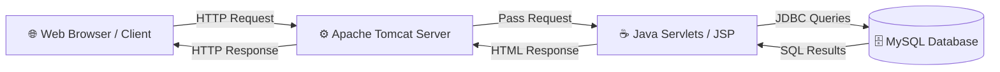
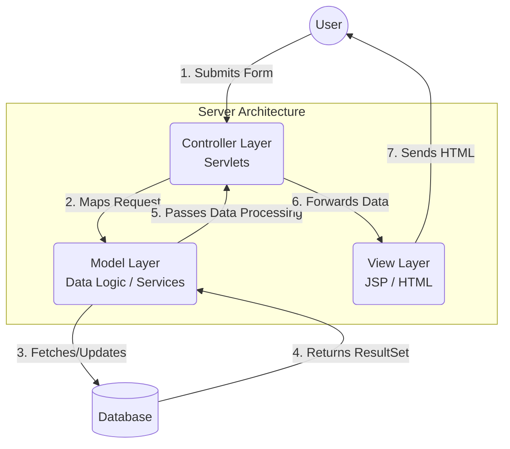

# Advanced Java Guide: Servlets, JSP, and JDBC

This guide forms the foundation for building dynamic web applications using Core Java technologies. By integrating Servlets, Java Server Pages (JSP), and JDBC (Java Database Connectivity), you will learn how to build applications capable of performing CRUD (Create, Read, Update, Delete) operations.

---

## 1. Web Application Architecture

Before diving into code, it's essential to understand how a web application routes traffic from the user's browser to the database.



### Pre-requisites & Setup
1. **Application Server (Apache Tomcat):** Responsible for executing Java web technologies (Servlets/JSPs). You must install Tomcat (e.g., version 10.x) and configure it via Eclipse under `Servers`.
2. **IDE:** Eclipse IDE for Enterprise Java (Java EE).
3. **Project Type:** Dynamic Web Project. HTML/JSP files go into the `src/main/webapp` folder, while Java classes go into `src/main/java`.

---

## 2. Introduction to Servlets

A **Servlet** is a Java class that extends `HttpServlet`. Servlets are used to read data submitted by frontend technologies (like HTML forms) and write data back as responses.

### Key Lifecycle Methods:
- **`doGet(request, response)`**: Executes when a client requests data (e.g., simply loading a URL or clicking a link).
- **`doPost(request, response)`**: Executes when a client submits secure data (e.g., submitting a `<form method="post">`).

### Example: Reading Form Data in a Servlet

**HTML Form (`index.html`)**
```html
<form action="saveReg" method="post">
    Name: <input type="text" name="name"/>
    Email: <input type="text" name="emailId"/>
    <input type="submit" value="Save"/>
</form>
```

**Servlet Handling the Post (`RegistrationServlet.java`)**
```java
@WebServlet("/saveReg")
public class RegistrationServlet extends HttpServlet {
    protected void doPost(HttpServletRequest request, HttpServletResponse response) throws ServletException, IOException {
        // request.getParameter() extracts data by the 'name' attribute in the HTML form
        String name = request.getParameter("name");
        String email = request.getParameter("emailId");
        
        System.out.println("Processing User: " + name);
    }
}
```

---

## 3. Java Database Connectivity (JDBC)

JDBC acts as the bridge allowing your Java backend to communicate with a relational database (like MySQL) to perform CRUD operations.

### Standard JDBC Steps:
1. Load the Driver: `Class.forName("com.mysql.cj.jdbc.Driver");`
2. Establish Connection: `DriverManager.getConnection(...)`
3. Create a Statement: `con.createStatement()`
4. Execute Query: `stmnt.executeUpdate()` for Insert/Update/Delete, or `stmnt.executeQuery()` for Select.
5. Close Connection.

### Example: Inserting Data into MySQL
```java
try {
    Class.forName("com.mysql.cj.jdbc.Driver");
    Connection con = DriverManager.getConnection("jdbc:mysql://localhost:3306/psadb", "root", "password");
    
    Statement stmnt = con.createStatement();
    stmnt.executeUpdate("INSERT INTO student VALUES ('" + name + "', '" + email + "')");
    
    con.close();
} catch (Exception e) {
    e.printStackTrace();
}
```

---

## 4. Java Server Pages (JSP)

Writing raw HTML inside a Java Servlet using `out.println("<html>")` becomes tedious. **JSP** solves this by allowing developers to write normal HTML, and embed partial Java logic *within* the HTML document.

### Core JSP Tags

| Tag Type | Syntax | Description |
|---|---|---|
| **Scriptlet Tag** | `<% java_code %>` | Executes blocks of Java code. You cannot create methods or static variables here. |
| **Declaration Tag** | `<%! java_code %>` | Used to declare class-level variables (static/non-static) and create methods. |
| **Expression Tag** | `<%= variable %>` | Evaluates a single statement and prints it directly to the HTML webpage (no semicolon needed). |
| **Directive Tag** | `<%@ directive %>` | Provides global instructions to the JSP container (e.g., importing Java classes or including other files). |

### Example demonstrating all tags:
```jsp
<%@ page import="java.util.Date" %> <!-- Directive (Import) -->
<html>
<body>
    <%! int hitCount = 0; %> <!-- Declaration (Global variable) -->
    
    <% hitCount++; %> <!-- Scriptlet (Logic) -->
    
    <h1>Page loaded at: <%= new Date() %></h1> <!-- Expression (Printing output) -->
    <p>Total Hits: <%= hitCount %></p>
</body>
</html>
```

---

## 5. Session Management (`HttpSession`)

HTTP is stateless. To persist data across multiple pages for a specific user (like a logged-in user's profile), we use the implicit `session` object.

**Creating/Setting a Session (Login Servlet):**
```java
HttpSession session = request.getSession(true);
session.setAttribute("email", "mike@gmail.com");
```

**Retrieving Session Data (Other Servlets):**
```java
HttpSession session = request.getSession(false);
String userEmail = (String) session.getAttribute("email");
```

---

## 6. MVC Architecture (Model-View-Controller)

**MVC** is a 3-layered architectural pattern designed to separate concerns in modern application development.



1. **View (UI Layer):** Handles the frontend user interface. Kept strictly for HTML/JSP containing minimal logic. *(Inside `src/main/webapp`)*.
2. **Model (Business Layer):** Contains all the pure Java classes where logic, calculations, and DB connectivity (JDBC) happen. The Model does not care about HTTP requests or HTML.
3. **Controller (Routing Layer):** Servlets! The Controller receives the HTTP request from the View, asks the Model to perform the logic, and then routes the result back to another View using a `RequestDispatcher`.

### Summary of Inter-Servlet Communication (Routing)
To securely forward data from a Controller Servlet to a JSP View, use the `RequestDispatcher`:

```java
// 1. Attach Data
request.setAttribute("resultMessage", "Login Successful!");

// 2. Forward Request
RequestDispatcher rd = request.getRequestDispatcher("/WEB-INF/views/dashboard.jsp");
rd.forward(request, response);
```
*(Note: Hiding JSPs inside `/WEB-INF/` secures them from direct user URL access—they can ONLY be accessed via Servlet forwarding).*
