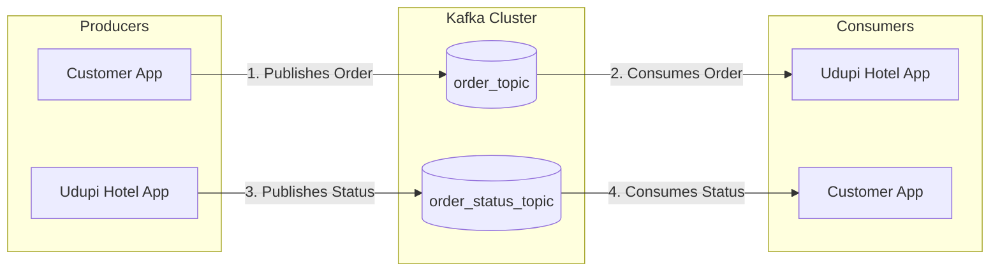

# Comprehensive Guide to Apache Kafka

Apache Kafka acts as a **message broker** that facilitates real-time data exchange between different applications. Designed initially by LinkedIn, it operates on a **Publisher-Subscriber (Pub/Sub)** model, where a Publisher (Producer) publishes messages to a topic, and a Subscriber (Consumer) reads those messages. Kafka is highly scalable, fault-tolerant, and exceptionally fast.

---

## 1. Kafka Architecture & Flow

Kafka's architecture revolves around decoupling the data producers from the data consumers. 

### Core Components:
1. **Zookeeper:** Provides the environment and coordination to run the Kafka server. *(Note: Newer versions of Kafka are shifting towards KRaft mode, removing the dependency on Zookeeper).*
2. **Kafka Broker (Server):** A single Kafka node. A cluster consists of multiple brokers to maintain load balance. The core message broker receives, stores, and distributes messages.
3. **Kafka Topic:** A designated channel or category used to store and queue messages. Think of it as a folder in a filesystem.
4. **Publisher (Producer):** An application that pushes messages to a Kafka Topic.
5. **Subscriber (Consumer):** An application that pulls/fetches messages from a Kafka Topic.

### Advanced Concepts:
- **Partitions:** To scale, a single Topic is broken down into **Partitions** hosted on different Brokers. This allows multiple consumers to read from a single topic simultaneously.
- **Offsets:** Every message in a partition is assigned a unique, sequential ID called an **Offset**. Consumers use offsets to track their reading position.
- **Consumer Groups:** A group of consumers that work together to read from a topic. Each partition connects to exactly *one* consumer in a group, ensuring a message is processed only once per group.
- **Replication Factor:** Kafka replicates data across multiple brokers. If the replication factor is 3, three brokers have a copy of the data. If one broker fails, no data is lost.
- **Retention Policy:** Unlike standard message queues (like RabbitMQ) that delete messages once read, Kafka **persists** messages for a configurable amount of time (default 7 days), allowing consumers to accurately "replay" past events.

### Real-World Scenario: Restaurant Order Flow



**When to use Kafka vs Database?**
- **Use Database:** When storing steady-state data (e.g., saving an order receipt, or keeping the final status of an order).
- **Use Kafka:** For real-time event updates, activity tracking, and microservice communication (e.g., broadcasting to inventory, billing, and the kitchen simultaneously when an order is received).

---

## 2. Setting Up Kafka on Windows

### Step 1: Download Dependencies
1. **Download Zookeeper:** `apache-zookeeper-3.9.2-bin.tar.gz` (or `3.8.4`)
2. **Download Kafka:** `kafka_2.12-3.8.0.tgz`

### Step 2: Configuration
1. Set the **Environment Variable** `PATH` for Zookeeper up to the `bin` folder.
2. Copy `zookeeper.properties` and `server.properties` from `kafka/config` and paste them into your `kafka/bin/windows` folder.

### Step 3: Start the Servers
Open a terminal in the `kafka/bin/windows` root folder and run the following commands sequentially:

**1. Start Zookeeper Server:**
```cmd
zookeeper-server-start.bat zookeeper.properties
```

**2. Start Kafka Server:**
```cmd
kafka-server-start.bat server.properties
```
> **Note:** If the Kafka server fails to start due to corruption, delete the Kafka logs from the Windows `temp` folder (`c:\tmp\kafka-logs` usually) and try starting it again.

### Step 4: Manage Topics using CLI
From the `kafka/bin/windows` folder:

**Create a Topic:**
```cmd
kafka-topics.bat --create --bootstrap-server localhost:9092 --replication-factor 1 --partitions 3 --topic order_topic
```

**List all Topics:**
```cmd
kafka-topics.bat --list --bootstrap-server localhost:9092
```

*(Default Kafka Bootstrap Server URL: `localhost:9092`)*

---

## 3. Spring Boot: Kafka Producer (Publisher)

This section demonstrates how to build a Spring Boot application that produces (publishes) messages to a Kafka topic.

### Step 1: Add Dependencies (pom.xml)
Make sure you include the Spring Boot Kafka starter:
```xml
<dependency>
    <groupId>org.springframework.kafka</groupId>
    <artifactId>spring-kafka</artifactId>
</dependency>
```

### Step 2: App Constants
```java
package com.kafkalectures.constants;

public class AppConstants {
	public static final String TOPIC = "order_topic";
	public static final String KAFKA_HOST = "localhost:9092";
}
```

### Step 3: The Entity (Model)
```java
package com.kafkalectures.entity;

public class Order {
	private String id;
	private String name;
	private Double price;
	private String email;
    // Getters, Setters, and toString() omitted for brevity
}
```

### Step 4: Kafka Producer Configuration
Configures the `KafkaTemplate` to serialize Java objects into JSON.

```java
package com.kafkalectures.config;

import java.util.HashMap;
import java.util.Map;
import org.apache.kafka.clients.producer.ProducerConfig;
import org.apache.kafka.common.serialization.StringSerializer;
import org.springframework.context.annotation.Bean;
import org.springframework.context.annotation.Configuration;
import org.springframework.kafka.core.DefaultKafkaProducerFactory;
import org.springframework.kafka.core.KafkaTemplate;
import org.springframework.kafka.core.ProducerFactory;
import org.springframework.kafka.support.serializer.JsonSerializer;

@Configuration
public class KafkaProduceConfiguration {

	@Bean
	public ProducerFactory<String, Order> producerFactory() {
		Map<String, Object> kafkaProps = new HashMap<>();
		kafkaProps.put(ProducerConfig.BOOTSTRAP_SERVERS_CONFIG, AppConstants.KAFKA_HOST);
		
        // Critical: Defining how keys and values are serialized before hitting the network.
		kafkaProps.put(ProducerConfig.KEY_SERIALIZER_CLASS_CONFIG, StringSerializer.class);
		kafkaProps.put(ProducerConfig.VALUE_SERIALIZER_CLASS_CONFIG, JsonSerializer.class);
		return new DefaultKafkaProducerFactory<>(kafkaProps);
	}

	@Bean
	public KafkaTemplate<String, Order> kafkaTemplate() {
		return new KafkaTemplate<>(producerFactory());
	}
}
```

### Step 5: Producer Service & REST Controller
```java
@Service
public class OrderService {
	@Autowired
	private KafkaTemplate<String, Order> kafkaTemplate;

	public String addMsg(Order order) {
        // Send the payload to the specific topic
		kafkaTemplate.send(AppConstants.TOPIC, order);
		return "Msg Published To Kafka Topic";
	}
}

@RestController
@RequestMapping("/api/v1/order")
public class OrderRestController {
	@Autowired
	private OrderService service;

	@PostMapping("/create")
	public String createOrder(@RequestBody Order order) {
		return service.addMsg(order);
	}
}
```

---

## 4. Spring Boot: Kafka Consumer (Subscriber)

This section demonstrates how to build a Spring Boot application that continuously listens to a topic and consumes the messages.

### Step 1: Kafka Consumer Configuration
Configures the factory to deserialize incoming JSON byte arrays back into Java `Order` objects.

```java
package com.kafkalectures.config;

import java.util.HashMap;
import java.util.Map;
import org.apache.kafka.clients.consumer.ConsumerConfig;
import org.apache.kafka.common.serialization.StringDeserializer;
import org.springframework.context.annotation.Bean;
import org.springframework.context.annotation.Configuration;
import org.springframework.kafka.config.ConcurrentKafkaListenerContainerFactory;
import org.springframework.kafka.core.ConsumerFactory;
import org.springframework.kafka.core.DefaultKafkaConsumerFactory;
import org.springframework.kafka.support.serializer.JsonDeserializer;
import com.kafkalectures.constants.AppConstants;
import com.kafkalectures.entity.Order;

@Configuration
public class KafkaConsumerConfig {

	@Bean
	public ConsumerFactory<String, Order> consumerFactory() {
		Map<String, Object> kafkaConfigProps = new HashMap<>();
		kafkaConfigProps.put(ConsumerConfig.BOOTSTRAP_SERVERS_CONFIG, AppConstants.KAFKA_HOST);
		
        // Critical: Reverse of the serialization done by the producer
		kafkaConfigProps.put(ConsumerConfig.KEY_DESERIALIZER_CLASS_CONFIG, StringDeserializer.class);
		kafkaConfigProps.put(ConsumerConfig.VALUE_DESERIALIZER_CLASS_CONFIG, JsonDeserializer.class);
		
        // Specifying explicit Target Type 'Order.class' prevents deserialization spoofing attacks.
		return new DefaultKafkaConsumerFactory<>(kafkaConfigProps, new StringDeserializer(), new JsonDeserializer<>(Order.class));
	}

	@Bean
	public ConcurrentKafkaListenerContainerFactory<String, Order> kafkaListenerFactory() {
		ConcurrentKafkaListenerContainerFactory<String, Order> factory = new ConcurrentKafkaListenerContainerFactory<>();
		factory.setConsumerFactory(consumerFactory());
		return factory;
	}
}
```

### Step 2: The Consumer Listener Service & Controller
Uses `@KafkaListener` to actively listen for incoming messages in real-time.

```java
import org.springframework.kafka.annotation.KafkaListener;
import org.springframework.stereotype.Service;

@Service
public class KafkaConsumerService {

    private String latestMessage;

    // Listens to messages published to TOPIC for this specific consumer group
    @KafkaListener(topics = AppConstants.TOPIC, groupId = "group_customer_order")
    public void consumeMessage(String order) {
        System.out.println("_____________ Msg fetched from Kafka _________________");
        System.out.println(order);
        this.latestMessage = order; // Store the message for retrieval
    }

    public String getLatestMessage() {
        return latestMessage;
    }
}

@RestController
@RequestMapping("/kafka")
public class KafkaMessageController {
    private final KafkaConsumerService kafkaConsumerService;

    public KafkaMessageController(KafkaConsumerService kafkaConsumerService) {
        this.kafkaConsumerService = kafkaConsumerService;
    }

    @GetMapping("/latest-message")
    public String getLatestKafkaMessage() {
        return kafkaConsumerService.getLatestMessage();
    }
}
```
