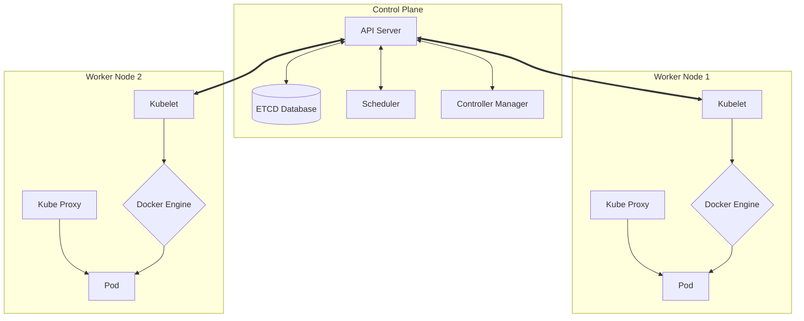

# Comprehensive Guide to Kubernetes (K8s) & CI/CD Integration

Kubernetes (K8s) is a powerful, open-source container orchestration tool originally developed by Google. It manages containerized applications across a cluster of machines, ensuring high availability, scalability, and automated deployments. 

Before diving into K8s, it's essential to understand that **Docker** simplifies packaging applications into portable containers, but **Kubernetes** ensures these containers are orchestrated, scalable, and reliable.

---

## 1. Kubernetes Architecture

A Kubernetes Cluster consists of a **Control Plane** (Master Node) managing multiple **Worker Nodes** (Slave Nodes).



### Control Plane Components
1. **API Server:** The gateway that receives requests from `kubectl` and exposes the Kubernetes API.
2. **ETCD:** A distributed key-value store containing the cluster state (acting as its internal database).
3. **Scheduler:** Assigns pending tasks (like new Pods) to available worker nodes based on resources.
4. **Controller Manager:** Continuously monitors the cluster state, ensuring the desired state matches the actual state.

### Worker Node Components
1. **Kubelet:** A node agent that listens to the API Server, managing containers on its machine.
2. **Kube Proxy:** Manages internal networking, ensuring seamless communication within the cluster.
3. **Container Engine:** Runs the containers (e.g., Docker Engine, containerd).
4. **Pod:** The smallest deployable computing unit mapped exactly to a running container.

---

## 2. Setting Up Kubernetes Clusters

A Kubernetes Cluster = Control Plane + Worker Nodes + Pods + Resources + Networking + Storage

### A. Local Setup: MiniKube (Single Node)
MiniKube is strictly for local development and learning purposes. It is not suitable for production as it lacks high availability.

**Steps to configure MiniKube on an Ubuntu VM (t2.medium / 50GB storage):**
1. **Install Docker:**
   ```bash
   sudo apt update
   curl -fsSL get.docker.com | /bin/bash
   sudo usermod -aG docker ubuntu
   exit
   ```
2. **Install Minikube & Kubectl Components:**
   ```bash
   sudo apt update
   sudo apt install -y curl wget apt-transport-https
   
   # Install Minikube
   curl -LO https://storage.googleapis.com/minikube/releases/latest/minikube-linux-amd64
   sudo install minikube-linux-amd64 /usr/local/bin/minikube
   
   # Install Kubectl
   curl -LO https://storage.googleapis.com/kubernetes-release/release/$(curl -s https://storage.googleapis.com/kubernetes-release/release/stable.txt)/bin/linux/amd64/kubectl
   chmod +x kubectl
   sudo mv kubectl /usr/local/bin/
   ```
3. **Start & Minikube Operations:**
   ```bash
   minikube start --driver=docker
   kubectl get nodes
   minikube status
   minikube cluster-info
   minikube stop
   minikube delete
   ```

### B. Cloud Setup: AWS EKS (Elastic Kubernetes Service)
Cloud providers offer fully managed Kubernetes services handling maintenance and updates. Worker nodes in EKS are individual EC2 instances launched under the hood.

**Steps to configure EKS:**
1. **Install AWS CLI & `eksctl`:** Download using standard cURL configs.
2. **Configure IAM Roles:** Create an IAM role with AdministratorAccess and attach it to your management host EC2.
3. **Create the Cluster:**
   ```bash
   # Basic setup
   eksctl create cluster --name psait-cluster --region ap-south-1 --node-type t2.medium --zones ap-south-1a,ap-south-1b
   
   # Advanced setup with auto-scaling definitions using CLI flags
   eksctl create cluster \
     --name psait-cluster4 \
     --region ap-south-1 \
     --node-type t2.medium \
     --zones ap-south-1a,ap-south-1b \
     --nodes 4 \
     --nodes-min 2 \
     --nodes-max 6
     
   # Verify nodes
   kubectl get nodes
   ```
   *(Be sure to run `eksctl delete cluster --name psait-cluster --region ap-south-1` when finished to prevent heavy AWS billing).*

---

## 3. Core Kubernetes Resources

### 3.1 Namespaces
They help logically group and isolate resources. Just like how we create folders to isolate our work in computers.

If you do not specify a namespace, K8s automatically utilizes the `default` namespace.

- Create Namespace using CLI: `kubectl create namespace backend-ns`
- Query a specific namespace: `kubectl get pods -n backend-ns`
- Fetch everything in a namespace: `kubectl get all -n backend-ns`
- Show all namespaces: `kubectl get ns`
- Delete namespace and all contents: `kubectl delete ns backend-ns`

```yaml
# namespace.yml
apiVersion: v1
kind: Namespace
metadata:
  name: backend-ns
```

### 3.2 Pods
Applications will be deployed as PODs. Your app will be containerized using Docker and that container is wrapped inside a Pod.

Direct pods deployed via `kind: Pod` do not self-heal. If deleted, they are gone forever.

**Pod CLI Actions:**
- Apply manifest: `kubectl apply -f manifest.yml`
- Check pods: `kubectl get pods`
- Describe pod details: `kubectl describe pod <pod-name>`
- View logs: `kubectl logs <pod-name>`
- Delete a pod: `kubectl delete pod <pod-name>`

### 3.3 Replication Controller (RC) & ReplicaSet (RS)
Because naked Pods do not self-heal, **Controllers** manage them.

- **ReplicationController (RC):** Ensures a specified number of identical Pods are running. Self-heals if a pod crashes, but lacks advanced filtering labels.
- **ReplicaSet (RS):** The modern replacement for RC containing richer selectors (`matchExpressions`). 

**Scaling Commands:**
```bash
# This modifies the running number of replicas seamlessly
kubectl scale rc dempapp --replicas=5
kubectl scale rc dempapp --replicas=1
```

```yaml
# replica-set.yml
apiVersion: apps/v1
kind: ReplicaSet
metadata:
  name: webapp
spec:
  replicas: 3
  selector:
    matchLabels:
      app: dempapp
  template:         # This is the actual Pod specification injected into the ReplicaSet
    metadata:
      labels:
        app: dempapp
    spec:
      containers:
        - name: webappcontainer
          image: psait/pankajsiracademy:latest
          ports:
            - containerPort: 9090
```

### 3.4 Deployments 
While ReplicaSets ensure x-amount of pods are running, **Deployments** manage the *ReplicaSets* automatically to provide deployment safety properties.

- **Zero Downtime:** Through `RollingUpdate` strategy. You can release new frontend code without your users losing connectivity during the swap.
- **Recreate Strategy:** Purges all nodes prior to spawning new ones. Causes mild connectivity loss but prevents version overlap problems.
- **Rollbacks:** Reverting to safe, previous image states.

```yaml
# deployment.yml
apiVersion: apps/v1
kind: Deployment
metadata:
  name: webapp
spec:
  replicas: 3
  strategy: 
    type: RollingUpdate
  selector:
    matchLabels:
      app: javawebapp
  template:
    metadata:
      labels:
        app: javawebapp
    spec:
      containers:
        - name: webappcontainer
          image: psait/pankajsiracademy:latest
          ports:
            - containerPort: 9090
```

### 3.5 Services
Because Pods are ephemeral and constantly die/respawn, hitting them via IP is impossible. Services give a group of Pods a permanent static network identity.

1. **ClusterIP (Default):** Internal access only. E.g., You don’t want to expose a database Pod to the internet, so you use a ClusterIP service to allow access only from other backend API Pods.
2. **NodePort:** Exposes your Pods outside the cluster using a static port (between 30000-32767) across every Node. Accessed via `http://<NodeIP>:<NodePort>`. Cannot Load Balance reliably.
3. **LoadBalancer:** Hooks into cloud providers (AWS/GCP/Azure). It not only provides external access but handles automatic traffic distribution across the backend Pods.

```yaml
# service.yml
apiVersion: v1
kind: Service
metadata:
  name: websvc
spec:
  type: LoadBalancer # For Cloud. Using Minikube? Swap to 'type: NodePort'
  selector:
    app: javawebapp
  ports:
    - port: 80
      targetPort: 9090
```

**Testing NodePort Services Locally with Minikube:**
```bash
# Opens an active tunnel route out of Minikube to access NodePort endpoints
minikube service websvc

# Test internal routing via curl using the minikube IP map
curl http://192.168.49.2:30080/
```

### 3.6 Autoscaling (HPA / VPA)
- **HPA - Horizontal Pod Autoscaler:** Adds or removes duplicate pods based on CPU/Memory loads, custom metrics, or external metrics. For example, if CPU hits > 80%, a deployment of 2 pods can balloon to 5.
- **VPA - Vertical Pod Autoscaler:** Adjusts CPU/Memory request resources explicitly for individual pods seamlessly.

**HPA commands & Load Testing:**
```bash
# Spin up dummy load generation via busybox interacting with a Service
kubectl run -i --tty load-generator --rm \
  --image=busybox --restart=Never \
  -- /bin/sh -c "while true; do wget -q -O- http://hpa-demo-deployment; sleep 0.01; done"

# Monitor Horizontal Autoscaling explicitly (using Watch flag)
kubectl get hpa -w
kubectl get events
```

---

## 4. CI/CD Integration: Jenkins + AWS EKS

By combining Maven, Git, Jenkins, Docker, and Kubernetes, we can create a complete delivery pipeline.

**Prerequisites:** 
A Jenkins VM (`t2.medium`) running Ubuntu containing Java, Maven, Docker Engine, AWS CLI, and `kubectl`. The `.kube/config` mapping data must be copied from your EKS management node over to the Jenkins home directory (`/var/lib/jenkins/.kube/config`). Ensure Jenkins has IAM privileges to interface with AWS CloudFormation / EC2.

### Complete Jenkins Declarative Pipeline Script

```groovy
pipeline {
    agent any
    
    tools{
        maven "maven-3.9.9"
    }

    stages {
        stage('Clone Repo') {
            steps {
                git branch: 'main', url: 'https://github.com/pankajmutha14/docker-test.git'
            }
        }
        stage('Maven Build') {
            steps {
                sh 'mvn clean package'
            }
        }
        stage('Docker Image') {
            steps {
                // Compiles image based on the Dockerfile located in the repository
                sh 'docker build -t psait/pankajsiracademy:latest .'
            }
        }
        stage('K8s Deployment') {
            steps {
                // Deploys the built image to EKS using the manifest files in the repository
                sh 'kubectl apply -f k8s-deploy.yml'
            }
        }
    }
}
```

Once the pipeline successfully finishes, you can query your LoadBalancer service using `kubectl get svc` and hit the external IP assigned by AWS to view your production application at `http://LBR/context-path/`!
