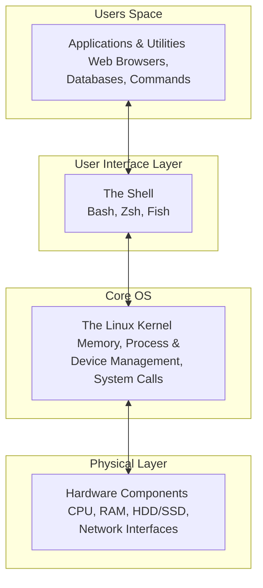
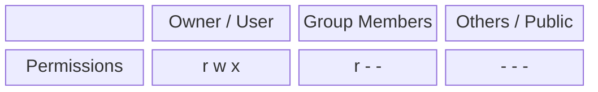

# Comprehensive Guide to the Linux Operating System

Linux is the backbone of modern IT infrastructure. With enterprise-grade security, lightweight resource requirements, and high customizability, it serves as the underlying framework for modern DevOps tools like Docker, Kubernetes, Ansible, and Terraform.

This guide explores the foundational layers of Linux, system administration, file permissions, and essential CLI commands.

---

## 1. What is Linux?

Linux is a free, open-source, community-driven Operating System (OS).
- **Secure:** Linux robustly manages user permissions, largely eliminating the need for traditional antivirus software.
- **CLI-Centric:** While Linux has Graphical User Interfaces (GUIs), it is primarily administered through a powerful Command Line Interface (CLI).
- **Cloud Standard:** Major cloud providers (AWS, Azure, GCP) extensively utilize Linux-based Virtual Machines and managed services.

### History of Linux
- Developed by **Linus Torvalds**.
- Torvalds wanted to address the limitations of the Unix OS.
- He used the **Minix OS** as a reference, rewrote the kernel from scratch, and created Linux.
- The name is a combination of his name and the system it was modeled after: **(Li)nus + Mi(nux) = Linux**.

### Linux Distributions (Flavors)
Because the Linux source code is open-source, different communities and companies have modified it to create their own tailored operating systems known as **Distributions** or **Flavors**. There are over 600 active distributions today.

**Popular Distributions:**
1. Ubuntu (Debian-based)
2. Amazon Linux (Red Hat-based)
3. Red Hat Enterprise Linux (RHEL)
4. CentOS / Fedora
5. Kali Linux (Security/Penetration Testing)

---

## 2. Linux Architecture

The Linux OS uses a modular architecture built into four primary layers:



1. **Hardware:** The physical components (CPU, RAM, Disks) of the system.
2. **Kernel:** The core of Linux. It directly interfaces with the hardware and manages memory, processes, and device drivers.
3. **Shell:** The CLI interpreter. It takes human commands (like `ls` or `mkdir`), translates them into Kernel system calls, and returns the output. Common shells include `Bash`, `Zsh`, and `Fish`.
4. **Applications:** The user-facing software, programs, and utility commands running in user-space.

---

## 3. Setting Up a Linux Environment

There are three main approaches to gaining access to a Linux terminal:
1. **Direct Installation (Bare Metal):** Create a bootable USB drive and install Linux (e.g., Ubuntu) directly onto your laptop/PC hardware.
2. **Virtual Machines (Hypervisors):** Install **Oracle VirtualBox** or **VMware** on your Windows/Mac host, and deploy Linux as a guest OS.
3. **Cloud Instances:** Deploy a free Linux VM in the cloud (e.g., AWS EC2 Free Tier). This gives you a lightweight, instantly accessible Amazon Linux or Ubuntu server.

---

## 4. User and Group Management

Linux is a multi-user, multi-tasking OS. Managing access boundaries is critical for system security.
*(Note: In AWS EC2 VMs, the default administrative user is usually `ec2-user` or `ubuntu`).*

### User Management
When a user is created, a dedicated `/home/<username>` directory is automatically provisioned for them.

| Action | Command |
| :--- | :--- |
| **Create a new user** | `sudo useradd <username>` |
| **Set/Update user password** | `sudo passwd <username>` |
| **Delete user account** | `sudo userdel <username>` |
| **Delete user + home directory** | `sudo userdel --remove <username>` |
| **Rename a user** | `sudo usermod -l <new-username> <old-username>` |
| **Switch to a user** | `su <username>` |
| **View all users** | `cat /etc/passwd` |

**Critical Security Files:**
- `/etc/passwd`: Stores generic user configurations and directories.
- `/etc/shadow`: Stores highly encrypted user passwords.

### Group Management
Groups allow administrators to assign permissions to a collection of users simultaneously (e.g., `developers`, `finance`, `designers`). When a user is created, a default group with their exact username is also created.

| Action | Command |
| :--- | :--- |
| **Create new group** | `sudo groupadd <group-name>` |
| **Add user to group** | `sudo usermod -aG <group-name> <username>` |
| **Remove user from group** | `sudo gpasswd -d <username> <group-name>` |
| **Check user's groups** | `id <username>` |
| **List users in a group** | `getent group <group-name>` |

---

## 5. Enabling Password-Based SSH Authentication

By default, password authentication is often disabled on Cloud VMs (like AWS) for security purposes; you must use a `.pem` key. To enable password logins:

**1. Modify `sshd_config`:**
```bash
sudo vi /etc/ssh/sshd_config
```
Locate the line `PasswordAuthentication no` and change it to `PasswordAuthentication yes`. Save and exit (`:wq`).

**2. Restart the SSH Daemon to apply changes:**
```bash
sudo systemctl restart sshd
```

**3. Set `sudo` privileges via the Sudoers file (Optional for Admins):**
```bash
sudo visudo
# Add the following line to the end of the file
<username> ALL=(ALL:ALL) ALL
```

---

## 6. Linux Permissions & Ownership

Linux tightly controls who can Read (`r`), Write (`w`), and Execute (`x`) files.



Permissions are displayed as a 9-character string (e.g., `rwxrwxrwx` or `rwx r-- r--`).
- **First 3 Context:** The Owner (`u`).
- **Middle 3 Context:** The Group (`g`).
- **Last 3 Context:** The Public / Others (`o`).

### Changing Permissions (`chmod`)
**1. Symbolic Format:** Uses `+` to add and `-` to remove permissions.
```bash
chmod u+x f1.txt   # Grants the owner execute permissions
chmod g+w f1.txt   # Grants the group write permissions
chmod o-rwx f1.txt # Strips all permissions from the public
chmod g+rwx f1.txt # Grants full permissions to the group
```

**2. Numeric Format:** Highly efficient way of setting permissions using octal values.
- `4` = Read
- `2` = Write
- `1` = Execute
- `0` = No Access

Combine numbers for hybrid permissions (e.g., 4 + 2 = 6 for Read/Write).
```bash
chmod 777 f1.txt # 7-7-7 = Full Access for Owner, Group, and Others
chmod 755 f1.txt # Owner: rwx (7), Group: rx (5), Others: rx (5)
chmod 400 f1.txt # Owner: r (4), Group/Others: Null (0)
```

### Changing Ownership (`chown`)
To change who owns a file or which group the file belongs to:
```bash
sudo chown user1 file.txt            # Change owner
sudo chown :group1 file.txt          # Change group (keep current owner)
sudo chown user1:group1 file.txt     # Change both owner and group simultaneously
```

---

## 7. Essential Linux Commands Mastery

### Navigation and System Queries
- `whoami`: Displays currently logged-in user.
- `pwd`: Outputs the Present Working Directory (where you are currently located).
- `date`: Displays current server date and time.
- `cal`: Shows the calendar (e.g., `cal 2025` for the whole year).
- `clear`: Purges the terminal screen.

### Directory / Folder Management
- `mkdir <name>`: Create a new directory.
- `rmdir <name>`: Deletes an *empty* directory.
- `rm -rf <name>`: Force deletes a directory and all of its recursive contents.
- `cd <path>`: Navigates into a directory. `cd ..` backs out one level. `cd ~` goes to the home directory.

### Listing Files (`ls`)
- `ls`: Standard directory listing.
- `ls -l`: Detailed long format listing (shows permissions and ownership).
- `ls -a`: Displays hidden files (files starting with a `.`).
- `ls -lt`: Sorts the list by the newest modified files first.
- `ls -ltr`: Sorts by newest modified files at the bottom.

### File Manipulation
- `touch <file.txt>`: Creates a blank file.
- `rm <file.txt>`: Deletes a file.
- `cp <source> <destination>`: Copies a file.
- `mv <source> <destination>`: Moves (or renames) a file.

### Reading and Writing Text Files
- `cat > f1.txt`: Creates a new file and allows you to type into it. Press `Ctrl+D` to exit.
- `cat >> f1.txt`: Appends data to an existing file.
- `cat f1.txt`: Echoes the contents of a file to the screen.
- `tac f1.txt`: Echoes contents from the bottom line going up.
- `head -n 20 f1.txt`: Outputs the top 20 lines of the file.
- `tail -n 25 f1.txt`: Outputs the bottom 25 lines. Very useful for monitoring active logs.

### The Vi Editor
The standard CLI text editor.
- Open file: `vi file.txt`
- Enter Insert Mode (Type data): Press `i`.
- Escape Insert Mode: Press `ESC`.
- Save and Quit: `:wq`
- Quit without saving: `:q!`

### Text Searching & Processing (`grep` & `wc`)
- `grep 'hello' test.txt`: Finds and prints all lines containing "hello".
- `grep -i 'hello' test.txt`: Search case-insensitively.
- `grep -v 'hello' test.txt`: Prints all lines that do *not* contain "hello".
- `grep 'error' *`: Searches all files in the current directory for "error".
- `wc test.txt`: Word count. Prints the number of lines, words, and characters. Use `-l` for lines only.

### Stream Editor (`sed`)
A powerful inline text manipulator that processes files without explicitly opening them in a UI.
- `sed 's/linux/unix/g' data.txt`: Temporarily replaces *all* occurrences of "linux" with "unix".
- `sed -i 's/linux/unix/g' data.txt`: The `-i` flag irreversibly saves the change to the file.
- `sed -i '4d' data.txt`: Deletes the 4th line securely.
- `sed '$a\I am from PSA' data.txt`: Appends the sentence to the absolute bottom of the file.

### Searching for Files in the OS (`find`)
Instead of searching within files (like `grep`), `find` locates the files themselves across the OS.
- `sudo find /home -name "f1.txt"`: Hunts for `f1.txt` originating from the home directory.
- `sudo find /home -type f -empty`: Locates all empty files.
- `sudo find /var/logs -mtime 30`: Finds files modified exactly 30 days ago.
- `sudo find /var/logs -mtime +30 -delete`: Auto-deletes logs older than 30 days.

### Compression (`zip` & `unzip`)
- `zip archive.zip *.txt`: Compresses all `.txt` files into an archive.
- `zip -r folder.zip /folder`: Compresses a directory recursively.
- `unzip archive.zip`: Inflates the ZIP in the current directory.
- `zip -e secure.zip data.txt`: Requires a password to open the zipped archive.

### Networking
- `ping <ip>`: Pings an IP to verify packet connectivity.
- `ifconfig`: Displays the NIC IP routing for your machine.
- `wget <url>`: CLI tool to download massive files from the internet passively.
- `curl <url>`: Used to send or fetch HTTP requests/API payloads directly in the terminal.

### Package Managers
Libraries that dynamically install and update software on your Linux OS. Think of them as the native App Store.
- **Debian/Ubuntu System:** `apt` (e.g., `sudo apt install git`)
- **RHEL/Amazon System:** `yum` (e.g., `sudo yum install git`)
- **Uninstall Package:** `sudo apt remove git` or `sudo yum remove git`
