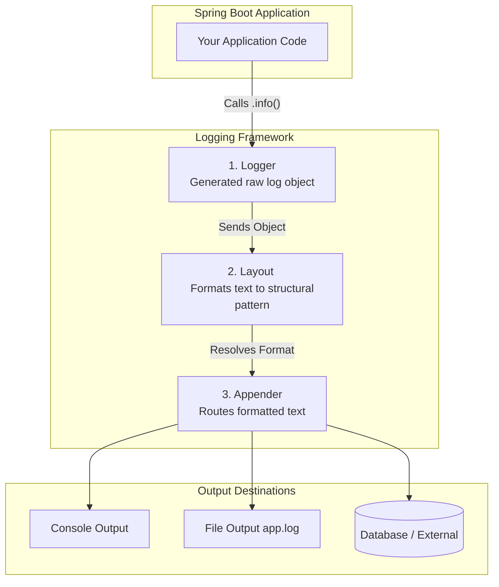
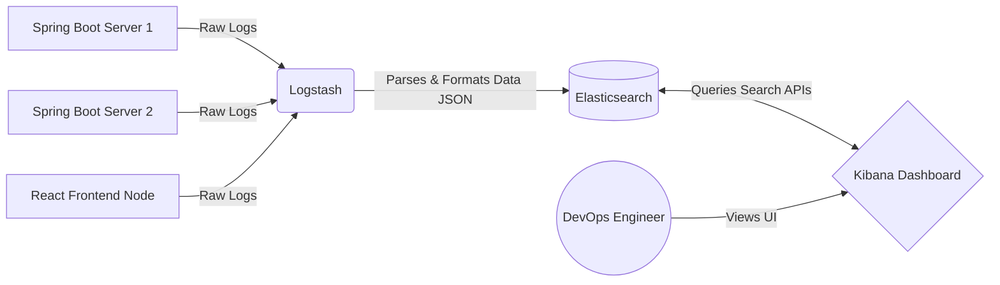

# Comprehensive Guide to Application Logging & ELK Stack

Logging is the fundamental process of recording application activities, errors, and system events into a file or console. These historical records, known as log messages, are invaluable for debugging and monitoring application health.

---

## 1. Why is Logging Important?

Imagine running a delivery business. You maintain a structured diary recording when orders are taken, packed, and delivered, alongside customer complaints. If a customer says *“I never got my package,”* you reference the diary to trace exactly what happened. **Application logs are the software equivalent of this diary.**

1. **Understand Application Behavior:** Logs provide a real-time narrative of what the app is doing (e.g., `Server started`, `User logged in`, `Order placed`).
2. **Find the Root Cause of Errors:** If an app crashes, the logs show the exact point of failure (e.g., `NullPointerException at line 52`).
3. **Debugging in Production:** You cannot attach a live IDE debugger to a production application serving millions of users. Logs allow you to monitor behavior safely.
4. **Security & Auditing:** Track user access and actions to maintain compliance and detect malicious activity.

---

## 2. Core Logging Architecture

Every mature logging framework is built around three core architectural components: Logger, Layout, and Appender.



### 1) Logger
- **What is it?** The main class/object instantiated in your code used to trigger messages.
- **Action:** Exposes methods like `.info()`, `.debug()`, and `.error()`.

### 2) Layout
- **What is it?** The formatting engine. It decides exactly how the log text will linearly look on the screen/file.
- **Example Pattern:** `[DATE] [LEVEL] - [MESSAGE]` $\rightarrow$ `2025-04-03 10:45:12 INFO - Server started successfully`

### 3) Appender
- **What is it?** The delivery mechanism. It dictates *where* the logs actually go.
- **Common Types:**
  - `ConsoleAppender`: Writes to the terminal output (Standard Out).
  - `FileAppender`: Writes to a static file (e.g., `app.log`). Most widely used in standard projects.
  - `RollingFileAppender`: Advanced variant that archives log files once they hit a size limit (e.g., `app-2025.log`).
  - `SMTPAppender`: Formats critical error logs into an email and dispatches it to Admins.

---

## 3. Java Logging Frameworks & SLF4J

Historically, the Java ecosystem suffered from competing logging tools. 

| Framework | Used by Default in Spring Boot? | Description |
| :--- | :--- | :--- |
| **Log4j** | ❌ | Older, legacy logging framework. |
| **Log4j2** | ❌ | Modern, highly performant successor to Log4j. |
| **Logback** | ✅ | The modern default embedded into the Spring Framework ecosystem. |
| **Logstash** | ❌ | Not a framework; an external data processing tool (part of ELK). |

### 🌟 SLF4J (Simple Logging Facade for Java)
Pronounced *"fuh-saad"*. It acts as an **Interface (Wrapper)** over whichever standard framework you use (Log4j2, Logback, etc.). 
- **Benefit:** Developers write code using SLF4J methods. Under the hood, they can blindly switch from Log4j2 to Logback without needing to rewrite thousands of lines of code.

---

## 4. Log Levels in Depth

Logging frameworks filter output based on severity "levels."

| Log Level | Purpose & Severity |
| :--- | :--- |
| **TRACE** | The most granular detail possible. Used for debugging extremely deep method flows. Exceedingly noisy; rarely enabled outside of extreme developer debugging. |
| **DEBUG** | Insightful information for developers to track program variable states and conditional logic paths. |
| **INFO** | General application health and operational milestones (e.g., *"Database connected"*). **This is the default setting in Spring Boot.** |
| **WARN** | Non-fatal anomalies or indications of impending issues (e.g., *"Disk Space is 90% full"* or *"User submission was empty"*). |
| **ERROR** | Severe, critical exceptions that break application functionality. |

---

## 5. Implementing Logging in Spring Boot

### Step 1: `application.properties`
Define global configurations, root levels, and target file outputs.

```properties
# Sets the default logging level for the entire application (Usually INFO by default)
logging.level.root=DEBUG

# Overrides the level specifically for your service package to log TRACE metrics
logging.level.com.example.demo.service=TRACE

# Instructs the FileAppender to write logs to this disk location
logging.file.name=app.log
```

### Step 2: Service Layer Implementation

Spring Boot combined with Lombok makes utilizing SLF4J effortless using the `@Slf4j` annotation, which automatically injects a `log` object into the class context.

```java
package com.example.demo.service;

import lombok.extern.slf4j.Slf4j;
import org.springframework.stereotype.Service;

@Service
@Slf4j // Lombok annotation autogenerates: private Logger log = LoggerFactory.getLogger(UserService.class);
public class UserService {

    public void registerUser(String username) {
        log.trace("Entering registerUser method API boundary.");
        
        if (username == null || username.isEmpty()) {
            log.warn("Form validation failed: Username is empty or null!");
            return;
        }

        log.debug("Querying database to check if username {} is already taken...", username);
        if ("admin".equalsIgnoreCase(username)) {
            log.error("Security Violation: Registration failed! Username '{}' is a reserved system keyword.", username);
            return;
        }

        // Simulating success
        log.info("Business transaction complete. User '{}' registered successfully!", username);
        log.trace("Exiting registerUser method boundary cleanly.");
    }
}
```

---

## 6. The ELK Stack Integration

Reading raw `app.log` files on a server terminal using `cat` or `tail` is inefficient at an enterprise scale. To analyze gigabytes of distributed logs gracefully, the industry uses the **ELK Stack**.



1. **Logstash (L):** An active data processing pipeline. It reads log files from multiple servers concurrently, parses them, formats them, and forwards the structured output to the database.
2. **Elasticsearch (E):** A highly scalable, NoSQL JSON search-analytics engine that acts as the database. It stores the parsed logs and allows sub-second querying across millions of records.
3. **Kibana (K):** The graphical web UI. It fetches queried data from Elasticsearch to build beautiful visual dashboards, pie charts, timeline graphs, and triggered alert thresholds.

### Running ELK Locally (Windows)
1. **Download:** Navigate to [elastic.co/downloads](https://www.elastic.co/downloads) to fetch Elasticsearch, Logstash, and Kibana manually.
2. **Start Elasticsearch:** Execute `/bin/elasticsearch.bat`.
3. **Start Kibana:** Execute `/bin/kibana.bat`.
4. **Start Logstash:** Hook Logstash into your Spring Boot `app.log` file by running:
   ```cmd
   bin/logstash -f logstash.conf
   ```
