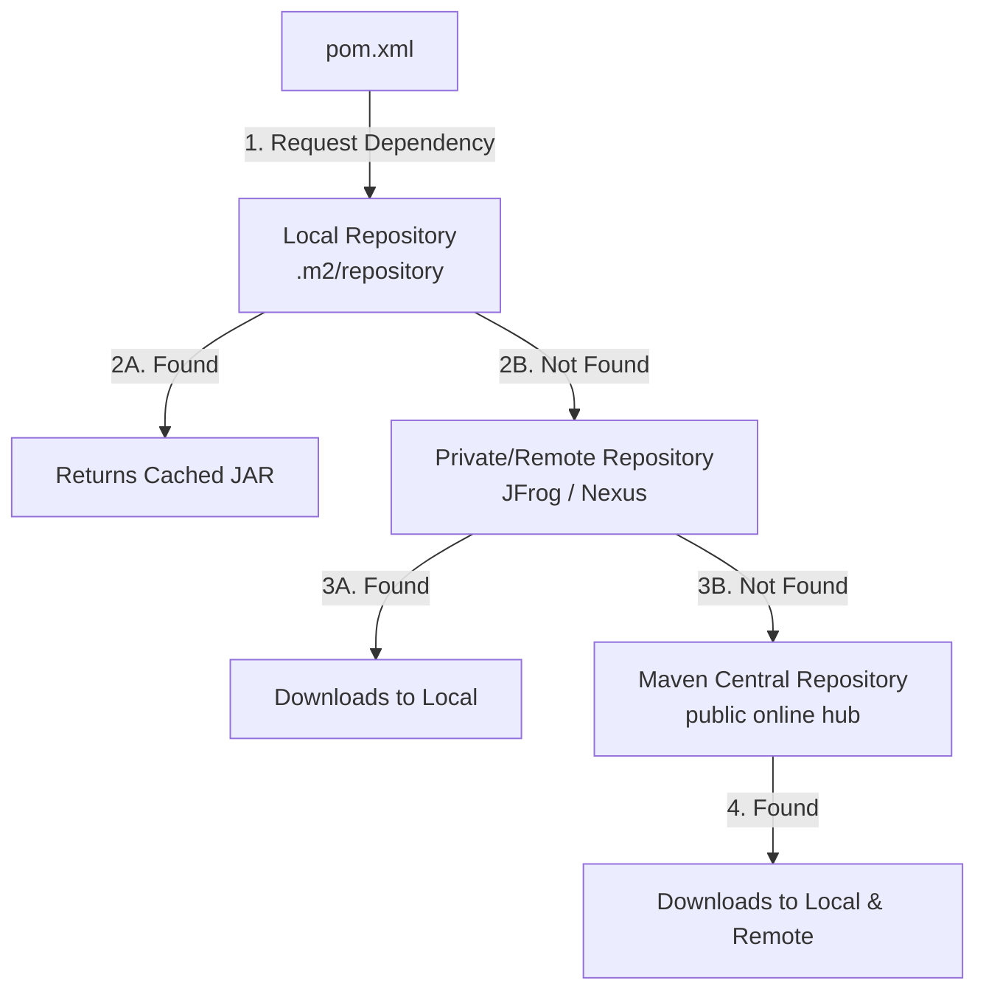

# Comprehensive Guide to Apache Maven

Apache Maven is a powerful project management and comprehension tool widely used in the Java ecosystem. Based on the concept of a **Project Object Model (POM)**, Maven manages a project's build, reporting, and documentation from a central piece of information.

---

## 1. What is Maven?

Maven simplifies and standardizes the project build process. It excels in the following areas:

1. **Build Management:** Automates compiling, testing, packaging (into JARs/WARs), and deploying code.
2. **Dependency Management:** Automatically downloads and manages external libraries/dependencies that a project needs entirely autonomously, reducing bloated file sizes.
3. **Project Structure:** Enforces a standard directory architecture (`src/main/java`, `src/test/java`). This forces developers to understand how a project is organized instantly, regardless of who originally wrote the code.
4. **Plugins Directory:** Extensively uses plugins to perform various build tasks like unit testing, static code analysis, and compiling.
5. **POM (pom.xml):** The absolute core heart of a Maven project. It holds all project configuration information, like dependencies, build settings, and plugin definitions.

---

## 2. Maven Architecture & Artifacts

### What is an Artifact?
In Maven terminology, an **artifact** refers to a file—typically a compiled `JAR` (Java Archive), `WAR` (Web Archive), or other types of compiled code produced by a Maven project.

An artifact is uniquely identified by three definitive coordinates:

1. **Group ID (`groupId`):** A unique identifier for the organization creating the artifact. It typically represents the domain name of the company reversed (e.g., `com.cisco`, `in.amazon`, `com.hcl`).
2. **Artifact ID (`artifactId`):** The exact, unique name of the project or module artifact.
3. **Version (`version`):** Indicates the maturity and current deployment stage of the project.
   - `SNAPSHOT`: Indicates the project is still under active development and is not finalized. It is a work-in-progress version.
   - `RELEASE`: Indicates this version has been completely finalized and is ready for production/delivery. It is stable and heavily immutable.

### What is an Archetype?
An **Archetype** in Maven represents a foundational template used for generating a project. It is heavily utilized to scaffold identical project structures rapidly.

- *Example 1:* `quick-start` $\rightarrow$ A basic template for a simple console application. Includes a single class hierarchy `App.java`.
- *Example 2:* `web-app` $\rightarrow$ Used to instantly scaffold a web application. Generates `WEB-INF`, configurations for Servlets, JSPs, and public `HTML` directories.

---

## 3. Maven Repositories System

When you add a dependency to your `pom.xml`, Maven follows a strict sequential pipeline flow to find and download it:



1. **Local Repository:** Your personal local repository on your physical machine. Cached dependencies reside here to avoid repetitive downloads. The default location is `~/.m2/repository`.
2. **Remote Repository (Private):** Companies often erect internal private repositories (via Sonatype Nexus or JFrog Artifactory) to store proprietary internal libraries that should never touch the public internet.
3. **Central Repository (Public):** The default massive public repository provided by Maven containing a huge, globally accessible collection of popular open-source libraries and frameworks.

---

## 4. Local Installation & Setup (Windows)

**Step 1:** Download and install a compatible version of the Java JDK. 

**Step 2:** Configure the overarching Environment Variables for Java.
- `JAVA_HOME` = `C:\Program Files\Java\jdk-17` *(Notice: Explicitly Exclude `bin` folder)*
- `Path` $\rightarrow$ Append string `C:\Program Files\Java\jdk-17\bin` *(Include `bin` folder)*

**Step 3:** Download Apache Maven binaries online and unzip the files into your root directory (e.g., `C:\apache-maven-3.9.9`).

**Step 4:** Define the Environment Variables for Maven.
- `MAVEN_HOME` = `C:\apache-maven-3.9.9` *(Exclude `bin` folder)*
- `Path` $\rightarrow$ Append string `C:\apache-maven-3.9.9\bin` *(Include `bin` folder)*

**Step 5:** Verify the installation configuration by launching a Command Prompt.
```cmd
mvn -version
```

---

## 5. Maven Build Lifecycles & Goals

Maven defines specific modular tasks called **Goals**. Goals are directly used to build, test, package, and orchestrate the build lifecycle.

| Goal Phase | Description & Action Executed |
| :--- | :--- |
| `clean` | Violently deletes the `target` directory alongside any compiled `.class` files inherited from previous builds. Ensuring a completely blank/fresh state. |
| `compile` | Converts all raw `.java` textual source code into `.class` machine bytecode interpretative by the overarching JVM runtime. |
| `test` | Autonomously executes Unit Tests mapped via testing frameworks (e.g., JUnit / Mockito) to ensure logical robustness. |
| `package` | Packages the thoroughly compiled and tested code into a localized output artifact `.jar` or `.war` ready for structural DEV/QA/UAT deployment. |

### Common CLI Command Execution Pipelines
You can chain individual goals rapidly to create robust build scripts:
```bash
# Force wipes the target folder, compiles fresh code, tests it, and packages it
mvn clean package

# Force wipes the target folder, compiles fresh code, skips all unit testing logic, and packages it
mvn clean package -DskipTests=true
```

---

## 6. Dependency Exclusion Architecture

When you demand an external core library (like `spring-context`), Maven intuitively parses that library and downloads the library's required dependencies (like `spring-core`, `spring-aop`, `spring-expression`). 

These secondary libraries are fundamentally known as **Transitive Dependencies**.

Occasionally, transitive dependencies cause catastrophic version conflicts across teams, or merely massively bloat your deployment ZIP payload with redundant classes.

### The Advantage of Excluding Dependencies
- Radically Reduced Project Size File Footprints
- Vastly Improved Build and Compile Read Time Configurations
- Halts Transitive Version Conflicts Automatically

### Example 1: Standard POM Injection (Includes Transitive JARs)
By adding `spring-context`, Maven forces the download of the transitively demanded `spring-aop` `.jar` file implicitly into the system.

```xml
<dependency>
    <groupId>org.springframework</groupId>
    <artifactId>spring-context</artifactId>
    <version>6.2.0</version>
</dependency>
```

### Example 2: Advanced POM Injection (Excluding Transitive JARs)
Using the `<exclusions>` metadata tag block instructs Maven explicitly to **never load** `spring-aop` internally, bypassing the recursive resolution entirely.

```xml
<dependency>
    <groupId>org.springframework</groupId>
    <artifactId>spring-context</artifactId>
    <version>6.2.0</version>
    <exclusions>
        <exclusion>
            <groupId>org.springframework</groupId>
            <artifactId>spring-aop</artifactId>
        </exclusion>
    </exclusions>
</dependency>
```

> **A Note on Spring Boot Starters:** Modern heavy-weight frameworks utilize specialized structures known as "Starter Dependencies". Starters (`spring-boot-starter-data-jpa`) are colossal bundles heavily curated by maintaining developers grouping several related transitive dependencies harmoniously, significantly eliminating manual curation tracking!
