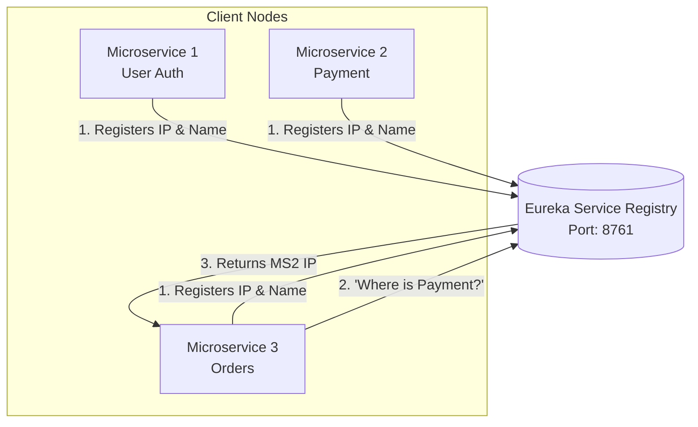
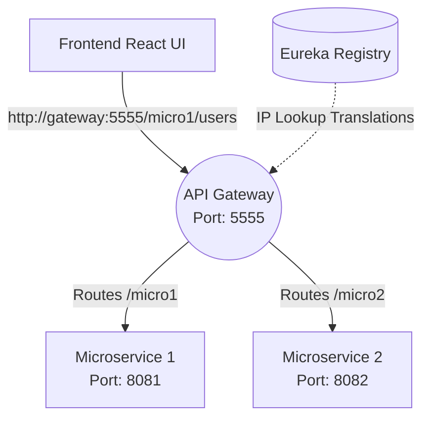

# Comprehensive Guide to Spring Boot Microservices

## 1. What are Microservices?
Microservices is an architectural style engineered to break down a massive, monolithic application into small, independent services that communicate over a network (usually HTTP REST). 

Each service focuses strictly on a **single business function** (e.g., an `Order Service`, a `Payment Service`, a `User Service`).

### Why Use Spring Boot?
Spring Boot provides an entire ecosystem of pre-configured tools (Eureka, Config Server, API Gateways) to build robust, production-ready microservices rapidly.

**Core Benefits:**
1. **Loose Coupling:** Services are entirely isolated from one another.
2. **Independent Scaling:** If the `Payment Service` is experiencing heavy load, you can duplicate it 10x without needing to duplicate the `User Service`.
3. **Technology Agnostic:** Service A can be written in Java/Spring Boot, while Service B is strictly written in Python/Django.
4. **Resiliency:** If one microservice crashes, the entire platform does not go offline.

---

## 2. The Service Registry (Eureka)

In a microservices ecosystem, services spin up and die dynamically based on load, meaning their IP addresses constantly change. 

A **Service Registry** is a central phonebook directory where all microservices register themselves so they can be discovered and communicated with using names instead of hardcoded IPs.

The industry standard is **Netflix Eureka Server** (Running default on port `8761`).



### Creating an Eureka Server
**Dependencies:** `spring-cloud-starter-netflix-eureka-server`

**Main Class Annotation:**
```java
@SpringBootApplication
@EnableEurekaServer // Marks this application as the Registry Hub
public class EurekaServerApplication {}
```

**application.properties:**
```properties
server.port=8761
# Tells Eureka NOT to register itself recursively in its own phonebook
eureka.client.register-with-eureka=false
eureka.client.fetch-registry=false
```

---

## 3. Spring Boot Admin Server

The **Spring Boot Admin Server** is a web-based UI dashboard that lets you visually monitor the health of all registered Spring Boot applications in real time. It hooks directly into the **Spring Actuator** endpoints hidden inside your microservices.

**Key Monitoring Metrics:** Node up/down status, JVM Memory limits, active thread dumps, live environment properties.

### Setup Instructions
**Dependencies:** `spring-boot-admin-starter-server`, `spring-boot-starter-web`

**Main Class Annotation:**
```java
@SpringBootApplication
@EnableAdminServer // Enables the UI Dashboard
public class AdminServerApplication {}
```

**application.properties:**
```properties
server.port=8080
spring.boot.admin.ui.title=Global Microservices Dashboard
```

---

## 4. Distributed Tracing (Zipkin & Sleuth)

When a user clicks "Checkout", that single HTTP request might bounce between 5 different microservices. If it takes 10 seconds to load, how do you know *which* service is the bottleneck?

**Zipkin Server:** A distributed tracing system that visualizes request flow latencies.
**Spring Cloud Sleuth:** Generates the unique `traceId` injected into the headers of the request as it travels across networks.

- **Installation:** Download the Zipkin executable JAR from `zipkin.io`.
- **Execution:** `java -jar zipkin.jar` (Runs on port `9411`).

---

## 5. Building the First Microservice

To wire a standard application into this entire ecosystem, scaffold a new Spring Boot project.

### Core Dependencies Checklist
| Dependency Name | Purpose |
| :--- | :--- |
| `spring-cloud-starter-netflix-eureka-client` | Injects code to register with Eureka |
| `spring-boot-admin-starter-client` | Exposes data to the Admin UI Server |
| `spring-boot-starter-actuator` | Exposes internal health metrics endpoints |
| `spring-cloud-starter-zipkin` / `sleuth` | Autogenerates and dispatches trace timings |
| `spring-boot-starter-web` | Required for base REST controllers |

### Setup Client Configurations
**Main Class Annotation:**
```java
@SpringBootApplication
@EnableDiscoveryClient // Locates Eureka
public class MyServiceApplication {}
```

**application.properties:**
```properties
spring.application.name=MICROSERVICE-1
server.port=8081

# Route to Eureka Phonebook
eureka.client.service-url.defaultZone=http://localhost:8761/eureka

# Route to Admin Dashboard
spring.boot.admin.client.url=http://localhost:8080
management.endpoints.web.exposure.include=*

# Route to Zipkin Profiler
spring.zipkin.base-url=http://localhost:9411
spring.sleuth.sampler.probability=1.0
```

---

## 6. Inter-Service Communication Strategies

Wait, standard Browsers/Postman cannot read string names like `http://MICROSERVICE-1/api`.
To communicate between Spring Boot services autonomously utilizing string aliases pushed from Eureka, you MUST use internal routing clients.

| Tool | Requires Eureka + Config Setup | Note |
| :--- | :--- | :--- |
| **RestTemplate** | Yes (`@LoadBalanced`) | Legacy standard. Medium setup effort. |
| **WebClient** | Yes (`@LoadBalanced`) | Modern reactive standard. |
| **Feign Client** | **No (Automatic)** | **The industry standard.** Low effort. |
| Browser/Postman | Fail | Needs the actual raw IP address. |

### Implementing OpenFeign (The Best Approach)

**Dependencies:** `spring-cloud-starter-openfeign`

**Create the Feign Interface:**
This interface acts as a remote proxy. Spring Boot writes the internal IP fetching logic automatically.
```java
import org.springframework.cloud.openfeign.FeignClient;
import org.springframework.web.bind.annotation.GetMapping;

// Directly queries Eureka for any nodes named "MICROSERVICES-1"
@FeignClient(name = "MICROSERVICES-1") 
public interface Client {
    @GetMapping("/message")
    public String getData();
}
```

**Controller Execution:**
```java
@RestController
public class SecondController {
    
    @Autowired
    private Client feignProxy;
    
    @GetMapping("/fromsecondcontroller")
    public String getMessageFromMicroservices1() {
        return feignProxy.getData(); // Executes the cross-network jump seamlessly!
    }
}
```
*(Ensure you add `@EnableFeignClients` to the calling application's main class).*

---

## 7. The API Gateway

Instead of forcing your Frontend (React/Angular) to memorize the IP addresses of 50 different microservices, you utilize an **API Gateway**. 

1. **Simplified Client:** The React Frontend only talks to 1 single port (The Gateway).
2. **Dynamic Routing:** The Gateway reads the URL path and routes traffic to the correct backend microservice using Eureka lookups.
3. **Centralized Security:** Used to inject global JWT Authentication Filters.



### Gateway Configurations

**Dependencies:** `spring-cloud-starter-gateway`, `spring-cloud-starter-netflix-eureka-client`

**application.yml Setup:**
```yaml
server:
  port: 5555
  
spring:
  application:
    name: API-Gateway
  cloud:
    gateway:
      routes:
        # Route logic for Microservice 1
        - id: microservice-api-1
          uri: lb://MICROSERVICES-1 # LB = Load Balancer lookup via Eureka
          predicates:
            - Path=/micro1/**
          filters:
            - RewritePath=/micro1/(?<segment>.*), /${segment} # Strips the /micro1 prefix before hitting the server
```
Test the final gateway architecture dynamically by hitting `http://localhost:5555/micro1/test-endpoint`.

---

## 8. Spring Cloud Config Server

As environments grow, maintaining 50 different `application.properties` files becomes a nightmare.

The **Config Server** is a centralized management node that pulls ALL property configurations for ALL microservices remotely from a unified GitHub repository. When properties demand changing (like a database password), you update the Git repository, and the Config Server broadcasts the changes to all nodes instantly without requiring manual restarts.
