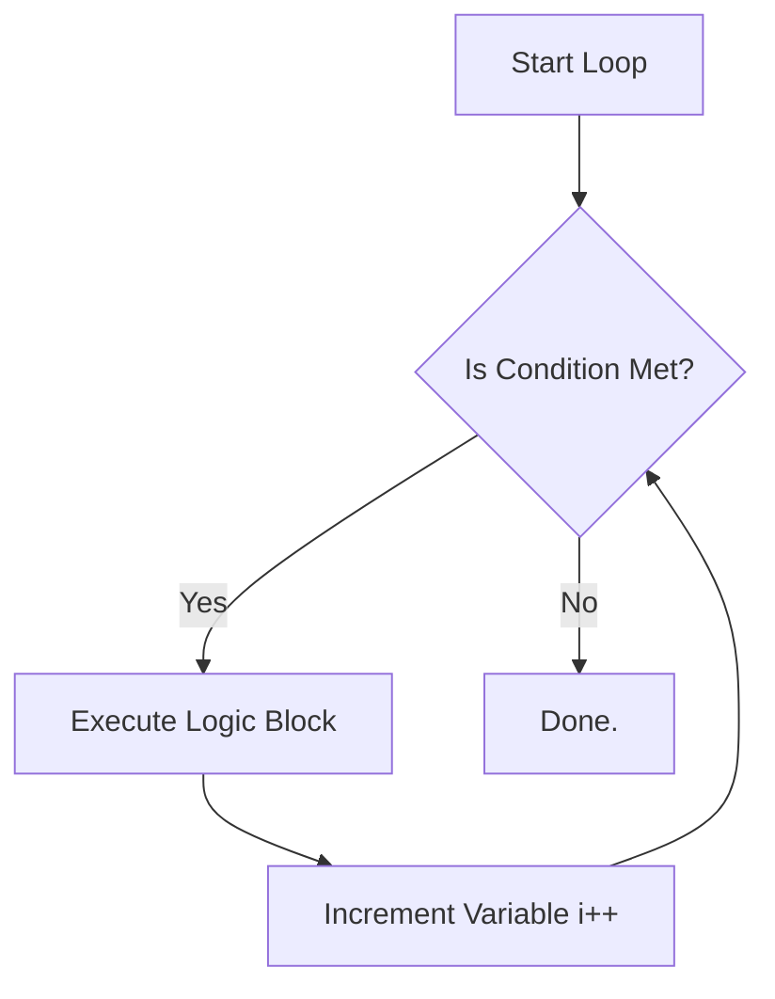

# Exhaustive Guide to Linux Shell Scripting

A shell script is a master text file containing a sequence of chained UNIX commands. Instead of manually typing commands (`whoami`, `pwd`, `date`) one by one every day, a DevOps engineer creates a script (`.sh` file) to automate repetitive infrastructure operations, backups, and log analyses.

---

## 1. The Shebang (`#!`)

The **Shebang** (Hash-Bang) is the very first line in any script. It strictly dictates which command-line interpreter the operating system should use to parse the file.

```bash
#!/bin/bash    # Executes via the standard Bourne Again Shell
#!/bin/sh      # Executes via the legacy Bourne Shell
#!/bin/zsh     # Executes via the Z Shell
```

### Execution Strategy
If your file is named `task.sh`, you must first grant execution permissions:
```bash
chmod +x task.sh
./task.sh        # Executes locally
```

---

## 2. Global vs. Local Variable Scopes

Variables store temporary data in memory. In Shell, everything is implicitly treated as a String unless wrapped in arithmetic logic.

### Naming Conventions
- 🔴 **Invalid:** `123name="Bob"`, `my name="Bob"`
- 🟢 **Valid:** `USER_NAME="Bob"`, `max_retries=5`
- 🚫 **Critical Warning:** Never place spaces around the `=` sign! (`name = "Bob"` will cause a fatal syntax error).

### Types of Variables

**1. System/Environment Variables (UPPERCASE):**
Predefined by Linux globally (e.g., `$USER`, `$PATH`, `$SHELL`). View them all by typing `env`.

**2. User-Defined Variables (lowercase):**
Local to the script unless successfully exported.

### The `export` Keyword Flow

If `Script A` calls `Script B`, `Script B` cannot read `Script A`'s variables unless they are **exported**.


To permanently lock a variable (make it immutable), use `readonly MAX_LIMIT=100`. To delete a variable from memory, use `unset MAX_LIMIT`.

### Persistent Global Variables (`.bashrc` vs `/etc/profile`)
- **`~/.bashrc`:** Variables appended here exist forever, but ONLY for your specific User.
- **`/etc/profile`:** Variables appended here exist forever, globally across ALL Users on the Linux Server.
*(Always run `source ~/.bashrc` to live-reload changes without rebooting).*

---

## 3. Arithmetic & Operators

To perform standard math, you must wrap the logic inside a double-parentheses block `$(( ... ))`.

```bash
FNUM=10
SNUM=5

echo $((FNUM + SNUM))  # Output: 15
echo $((FNUM % SNUM))  # Output: 0 (Modulus/Remainder)
```
*Note: Shell cannot calculate decimals/floating-points natively. You must pipe it to the Basic Calculator (`bc`):*
```bash
echo "10.5 + 2.3" | bc  # Output: 12.8
```

---

## 4. Conditional Logic Architectures

Shell scripting heavily relies on Strict Syntax spacing when writing IF statements. 

### The Classic `[ ... ]` Strategy
Used primarily for strings and strict UNIX logic. **Spaces inside the brackets are 100% mandatory.**

| Operator | Meaning | Example |
| :--- | :--- | :--- |
| `-eq` | Equal | `[ "$A" -eq "$B" ]` |
| `-ne` | Not Equal | `[ "$A" -ne "$B" ]` |
| `-gt` | Greater Than | `[ "$A" -gt 5 ]` |
| `-lt` | Less Than | `[ "$A" -lt 5 ]` |

```bash
# Correct Spacing Architecture
if [ "$NUM" -gt 0 ]; then
    echo "Positive"
elif [ "$NUM" -lt 0 ]; then
    echo "Negative"
else
    echo "Zero"
fi
```

### The Modern `(( ... ))` Strategy
Designed explicitly for modern Math/Arithmetic (Similar to C/Java syntax).

```bash
x=5
# No '$' required inside the double parenthesis!
if (( x > 1 )); then
    echo "x is heavily greater than 1"
fi
```

### String Comparison `[[ ... ]]`
When comparing raw text strings alphabetically or explicitly, use double brackets.
- `[[ "$str1" == "$str2" ]]` (Equality)
- `[[ "$str1" != "$str2" ]]` (Inequality)

---

## 5. Loop Architectures

Loops automate sequential, repetitive checks. 



### 1. The `for` Loop (Range Based)
```bash
# Prints multiples of 5, from 1 to 50
for (( i=1; i<=50; i++ ))
do
  if (( i%5 == 0 )); then
    echo $i
  fi
done
```

### 2. The `while` Loop (Condition Based)
```bash
# Summing numbers from 1 to 10
i=1
sum=0

while [ $i -le 10 ]
do
  sum=$((sum + i))
  ((i++))
done

echo "Total Sum is: $sum"
```

---

## 6. Functional Programming in Shell

Functions allow you to compartmentalize logic to be reused cleanly.

**Declaration & Passing Parameters:**
```bash
#!/bin/bash

# $1 corresponds to the first passed argument, $2 is the second.
greet_user() {
    echo "Hello, $1! You are legally learning $2."
}

calculate_sum() {
    echo "The Sum is: $(($1 + $2))"
}

# Firing the functions with hardcoded Arguments
greet_user "Pankaj" "DevOps"
calculate_sum 10 25
```

---

## 7. CRON Jobs: The Task Scheduler

When you don't want to type `./task.sh` manually, you schedule a **Cron Job** to run the script autonomously in the background at a specific calendar date/time.

### Managing Cron
- Append a job: `crontab -e`
- List all your active jobs: `crontab -l`

### The 5-Star Date Architecture
A Cron command follows a strict 5-part `* * * * *` format:

1. **Minute:** `0 - 59`
2. **Hour:** `0 - 23`
3. **Day of Month:** `1 - 31`
4. **Month:** `1 - 12`
5. **Day of Week:** `0 - 7` (Sunday is 0 or 7)

### Practical DevOps Examples

```bash
# Execute health-check script every single minute
* * * * * /path/to/health-check.sh

# Run taking a database backup exactly at 9:00 AM every single day
0 9 * * * /path/to/database-backup.sh

# Target execution every 2 Hours
0 */2 * * * /etc/purge-logs.sh

# Target exactly 4:15 PM, strictly Monday through Friday (Business Hours Only)
15 16 * * 1-5 /path/to/sync-files.sh
```
