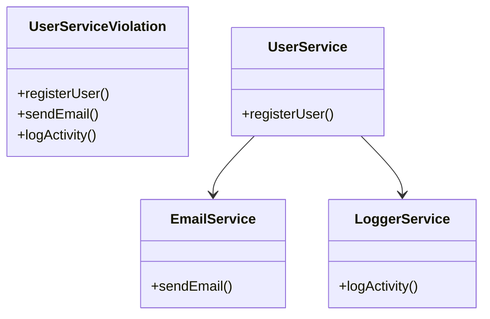
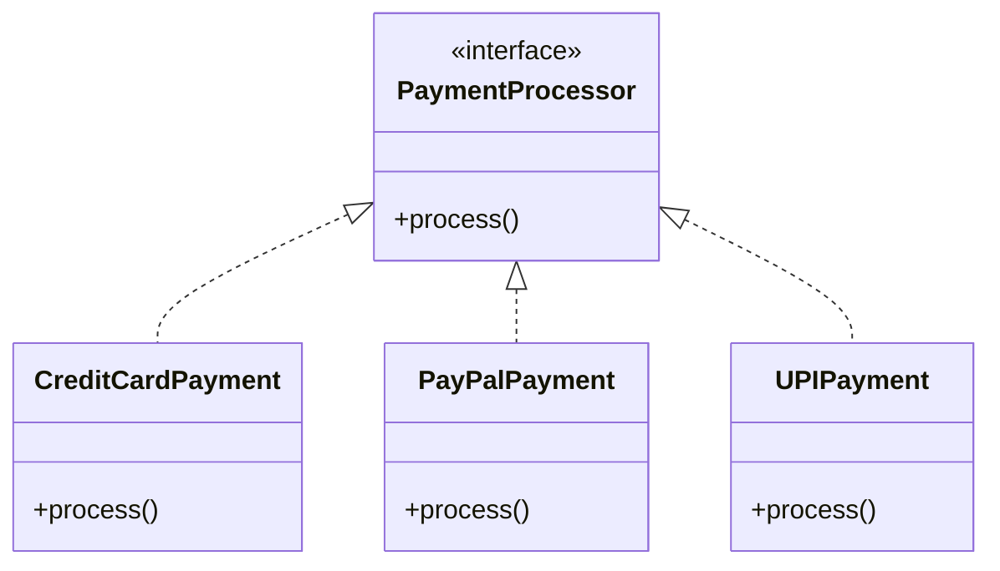
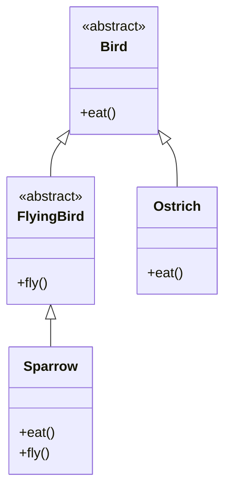
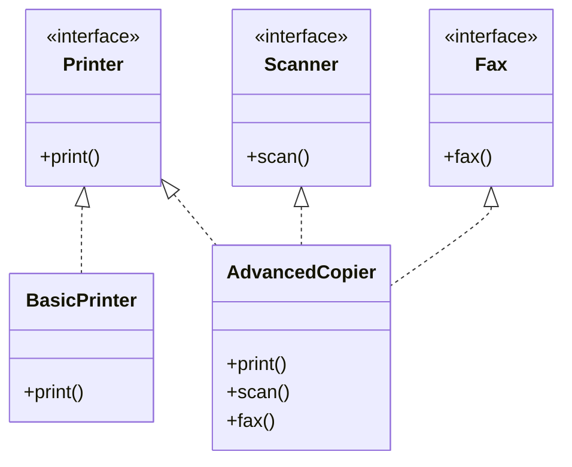
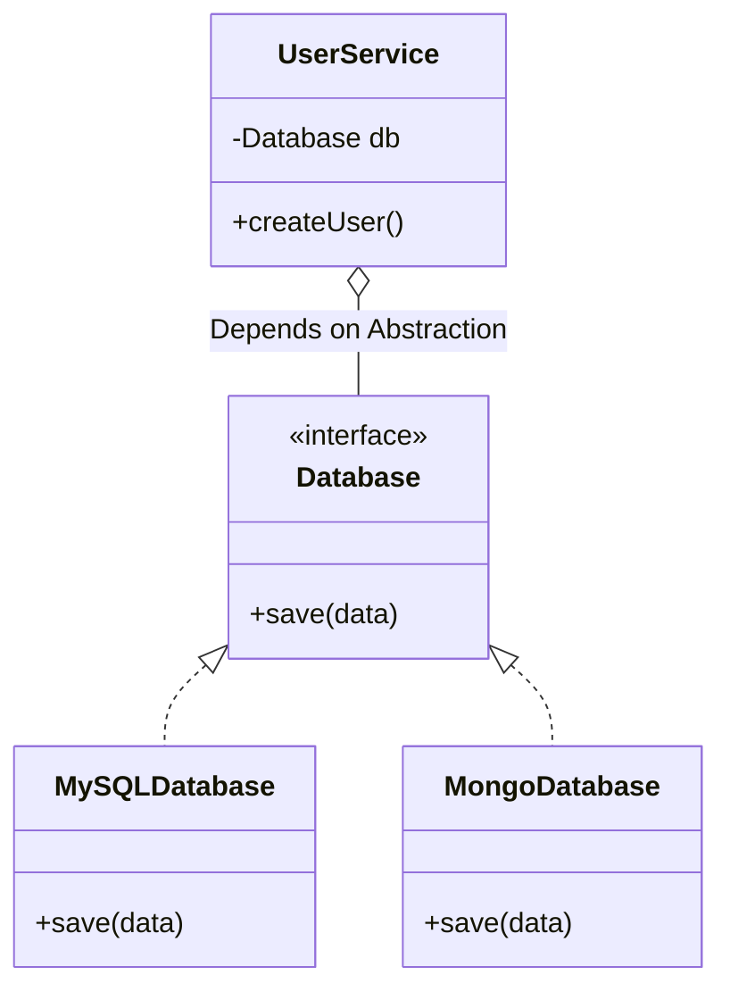

# SOLID Principles in Java

**SOLID** is an acronym representing five fundamental object-oriented design principles. When applied together, these principles help developers create software architectures that are maintainable, understandable, flexible, and scalable.

---

## 1. Single Responsibility Principle (SRP)
**"A class should have one, and only one, reason to change."**

**Explanation:** 
Every class or module should have a single, well-defined responsibility. If a class is doing too many things (like handling UI, database connections, and business logic), a change in one area forces modifications that might unknowingly break another area.

**Mermaid Diagram:**


**Real-time Example (Java):**
```java
// ❌ VIOLATION: Class handling formatting, database, and email
class Invoice {
    public void calculateTotal() { /* business logic */ }
    public void saveToDatabase() { /* database logic */ }
    public void printInvoice() { /* printing logic */ }
}

// ✅ GOOD DESIGN: Separate classes for separate responsibilities
class Invoice {
    public void calculateTotal() { /* business logic focused */ }
}

class InvoiceRepository {
    public void save(Invoice invoice) { /* handles only database */ }
}

class InvoicePrinter {
    public void print(Invoice invoice) { /* handles only UI/Printing */ }
}
```

**Pros & Cons:**
- **Pros:** Classes are smaller, cleaner, much easier to test, and have lower coupling.
- **Cons:** It can lead to an increased number of small files/classes that you have to navigate.

---

## 2. Open/Closed Principle (OCP)
**"Software entities (classes, modules, functions, etc.) should be open for extension, but closed for modification."**

**Explanation:** 
You should be able to add new features or behaviors to a system without altering existing, tested code. This is predominantly achieved using inheritance or, ideally, interfaces.

**Mermaid Diagram:**


**Real-time Example (Java):**
```java
// ❌ VIOLATION: Modifying the existing class for every new payment method
class PaymentService {
    public void processPayment(String method) {
        if (method.equals("CREDIT_CARD")) { /* process card */ }
        else if (method.equals("PAYPAL")) { /* process paypal */ }
        // Adding UPI requires MODIFICATION of this class
    }
}

// ✅ GOOD DESIGN: Interface-based extension
interface PaymentProcessor {
    void process();
}

class CreditCardPayment implements PaymentProcessor {
    public void process() { System.out.println("Processing Card"); }
}

class PayPalPayment implements PaymentProcessor {
    public void process() { System.out.println("Processing PayPal"); }
}

class PaymentService {
    // We can pass any new payment method here WITHOUT modifying PaymentService
    public void executePayment(PaymentProcessor processor) {
        processor.process(); 
    }
}
```

**Pros & Cons:**
- **Pros:** Existing code remains untouched. Minimal risk of introducing new bugs to old features.
- **Cons:** Can lead to over-engineering if abstractions are created for features that "might" happen but never actually do.

---

## 3. Liskov Substitution Principle (LSP)
**"Derived classes must be substitutable for their base classes without altering the correct behavior of the program."**

**Explanation:** 
If class `B` inherits from class `A`, you should be able to replace `A` with `B` without breaking the application. Subclasses should add to a base class's behavior, not completely diverge or throw unexpected exceptions.

**Mermaid Diagram:**


**Real-time Example (Java):**
```java
// ❌ VIOLATION: Ostrich breaks the expected behavior of Bird
class Bird {
    public void fly() { System.out.println("Flying..."); }
}

class Ostrich extends Bird {
    @Override
    public void fly() {
        throw new RuntimeException("Ostriches can't fly!"); // Breaks Liskov!
    }
}

// ✅ GOOD DESIGN: Rethink the hierarchy
abstract class Bird {
    public abstract void eat();
}

abstract class FlyingBird extends Bird {
    public abstract void fly();
}

class Sparrow extends FlyingBird {
    public void eat() { /* eat */ }
    public void fly() { /* fly */ }
}

class Ostrich extends Bird {
    public void eat() { /* eat */ }
    // Ostrich safely exists without a fly() method to break
}
```

**Pros & Cons:**
- **Pros:** Extremely predictable behaviors and assures the safe use of polymorphism.
- **Cons:** Requires rigorous architectural planning and sometimes splitting up inheritance hierarchies.

---

## 4. Interface Segregation Principle (ISP)
**"Clients should not be forced to depend upon interfaces that they do not use."**

**Explanation:** 
It is much better to have many small, highly-specific interfaces than one large "fat" interface. This prevents implementing classes from being forced to provide empty methods or throw exceptions for behaviors they don't support.

**Mermaid Diagram:**


**Real-time Example (Java):**
```java
// ❌ VIOLATION: A single, fat interface
interface Machine {
    void print();
    void scan();
    void fax();
}

class BasicPrinter implements Machine {
    public void print() { /* print */ }
    public void scan() { throw new UnsupportedOperationException(); } // Unwanted
    public void fax() { throw new UnsupportedOperationException(); }  // Unwanted
}

// ✅ GOOD DESIGN: Segregated, specific interfaces
interface Printer { void print(); }
interface Scanner { void scan(); }
interface Fax { void fax(); }

// Now BasicPrinter only implements what it actually needs
class BasicPrinter implements Printer {
    public void print() { /* print logic */ }
}

class SmartCopier implements Printer, Scanner, Fax {
    public void print() { /* print logic */ }
    public void scan()  { /* scan logic */ }
    public void fax()   { /* fax logic */ }
}
```

**Pros & Cons:**
- **Pros:** Highly cohesive code; changes to an interface rarely affect classes that do not use the changed method.
- **Cons:** Developers might have to inject or implement multiple interfaces rather than just one.

---

## 5. Dependency Inversion Principle (DIP)
**"High-level modules should not depend on low-level modules. Both should depend on abstractions. Abstractions should not depend on details. Details should depend on abstractions."**

**Explanation:** 
Core business logic (high-level) should be independent of external details like specific databases, APIs, or libraries (low-level). They should interact through interfaces. Dependency Injection (DI) frameworks like Spring usually facilitate this.

**Mermaid Diagram:**


**Real-time Example (Java):**
```java
// ❌ VIOLATION: High-level class tightly coupled to low-level implementation
class MySQLDatabase {
    public void save(String data) { /* save to MySQL */ }
}

class UserService {
    // Tightly coupled! Hard to switch to MongoDB.
    private MySQLDatabase database = new MySQLDatabase(); 

    public void createUser(String user) {
        database.save(user);
    }
}

// ✅ GOOD DESIGN: Both depend on an abstraction
interface Database {
    void save(String data);
}

class MySQLDatabase implements Database {
    public void save(String data) { System.out.println("Saved in MySQL"); }
}

class MongoDatabase implements Database {
    public void save(String data) { System.out.println("Saved in MongoDB"); }
}

class UserService {
    private Database database;

    // Dependency Injection: User service works with ANY database
    public UserService(Database database) {
        this.database = database;
    }

    public void createUser(String user) {
        database.save(user); // Delegation via abstraction
    }
}
```

**Pros & Cons:**
- **Pros:** Dramatically reduces coupling. Swapping underlying technologies (like databases, APIs) becomes effortless. Greatly improves testability via mocking.
- **Cons:** Tricky to set up dependencies manually without a DI framework. Increases the initial complexity of the code.

---

### Overall Takeaway
Adopting the **SOLID** principles moves software design from rigid and fragile to flexible and robust. While it introduces more interfaces and boilerplate classes up front, the cost of long-term maintenance is significantly lowered, leaving developers with a scalable codebase. 
